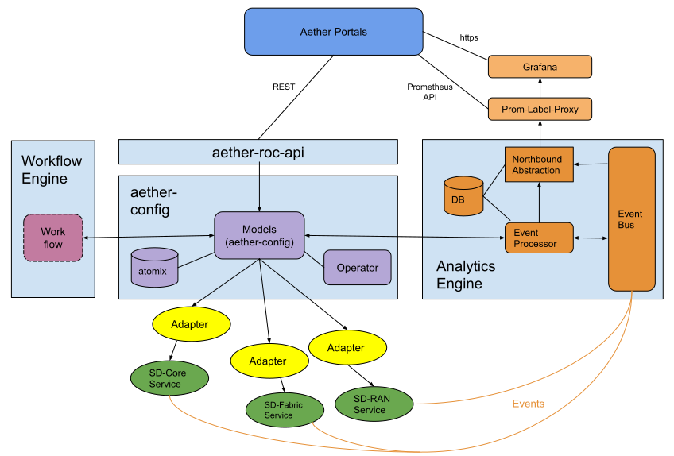
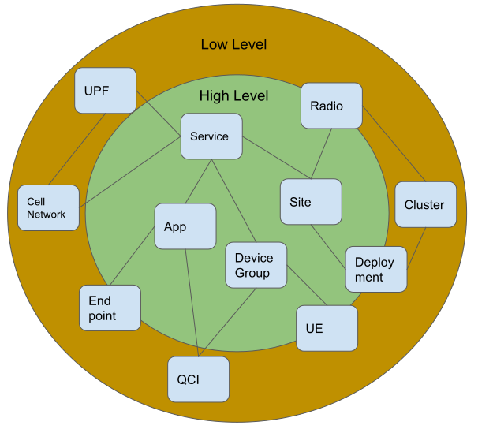

..
   SPDX-FileCopyrightText: © 2020 Open Networking Foundation <support@opennetworking.org>
   SPDX-License-Identifier: Apache-2.0

Runtime Operational Control (ROC)
=================================

Purpose
-------

The Aether Runtime Operation Control (ROC) is a component designed with the primary purpose of managing the
Aether Connectivity Service (ACS), including facilitating the integration of edge services with the ACS.
The Aether ROC allows enterprises to configure subscribers and profiles, as well as implement policies related
to those profiles. It also allows the Aether operations team to configure the parameters of those policies.
The ROC is one of many subsystems that make up the Aether Management Platform (AMP).

What the ROC *does* do:

-  Add/Update/Delete/Query configuration

-  Persist configuration

-  Push configuration to services and devices

-  Make observations actionable, either manually or automatically

What the ROC *does not* do:

-  The ROC does not directly deploy or manage the lifecycle of containers.
   This is done using the Terraform/Rancher/Helm/Kubernetes stack.

-  The ROC does not directly collect or store logging or metric information.
   This is done using the ElasticStack and Grafana/Prometheus components.

-  The ROC is not a message bus used for component-to-component communication.
   If a message bus is required, then a suitable service such as Kafka could be used.

-  The ROC does not implement a service dependency graph.
   This can be done through helm charts, which are typically hierarchical in nature.

-  The ROC is not a formal service mesh.
   Other tools, such as Istio, could be leveraged to provide service meshes.

-  The ROC does not configure *Edge Services*.
   While the ROC's modeling support is general and could be leveraged to support an edge service, and an
   adapter could be written to configure an edge service, promoting an edge service to ROC management would
   be the exception rather than the rule. Edge services have their own GUIs and APIs, perhaps belonging to
   a 3rd-party service provider.

Although we call out the tasks that ROC doesn't do itself, it's often still necessary for the ROC to be aware
of the actions these other components have taken.
For example, while the ROC doesn't implement a service dependency graph, it is the case that the ROC is aware
of how services are related. This is necessary because some of the actions it takes affect multiple services
(e.g., a ROC-supported operation on a subscriber profile might result in the ROC making calls to SD-Core,
SD-RAN, and SD-Fabric).

Throughout the design process, the ROC design team has taken lessons learned from prior systems, such as XOS,
and applied them to create a next generation design that focuses on solving the configuration problem in a
focused and lightweight manner.

Design and Requirements
-----------------------

-  The ROC must offer an *API* that may be used by administrators, as well as external services, to configure
   Aether.

-  This ROC API must support new end-to-end abstractions that cross multiple subsystems of Aether.
   For example, "give subscriber X running application Y QoS guarantee Z" is an abstraction that potentially
   spans SD-RAN, SD-Fabric.
   The ROC defines and implements such end-to-end abstractions.

-  The ROC must offer an *Operations GUI* to Operations Personnel, so they may configure the Aether Connectivity
   service.

-  The ROC must offer an *Enterprise GUI* to Enterprise Personnel, so they may configure the connectivity aspects
   of their particular edge site.
   It's possible this GUI shares implementation with the Operations GUI, but the presentation, content, and
   workflow may differ.

-  The ROC must support *versioning* of configuration, so changes can be rolled back as necessary, and an audit
   history may be retrieved of previous configurations.

-  The ROC must support best practices of *performance*, *high availability*, *reliability*, and *security*.

-  The ROC must support *role-based access controls (RBAC)*, so that different parties have different visibility
   into the data model.

-  The ROC must be extensible.
   Aether will incorporate new services over time, and existing services will evolve.

Data Model
----------

An important aspect of the ROC is that it maintains a data model that represents all the abstractions, such as
subscribers and profiles, it is responsible for.
The ROC's data model is based on YANG specifications.
YANG is a rich language for data modeling, with support for strong validation of the data stored in the models.
YANG allows relations between objects to be specified, adding a relational aspect that our previous approaches
(for example, protobuf) did not directly support.
YANG is agnostic as to how the data is stored, and is not directly tied to SQL/RDBMS or NoSQL paradigms.

ROC uses tooling built around aether-config (an ONOS-based microservice) to maintain a set of YANG models.
Among other things, aether-config implements model versioning.
Migration from one version of the data model to another is supported, as is simultaneous operation of
different versions.

Architecture
------------

Below is a high-level architectural diagram of the ROC:

The following walks through the main stack of ROC components in a top-down manner, starting with the GUI(s) and
ending with the devices/services.

Aether Portals
""""""""""""""

One or more portals may reside above the ROC, providing a convenient user interface.
These will include an *Operations Portal* that will have a high level of technical
detail for Aether staff, as well as an *Enterprise Portal* that will have a presentation
aimed at customers.
These different perspectives can be enforced through the following:

-  RBAC controls, to limit access to information that might be unsuitable for a particular party.

-  Dashboards, to aggregate/present information in an intuitive manner

-  Multi-step workflows (aka Wizards) to break a complex task into smaller guided steps.

The *Portal* is an angular-based typescript GUI.
The GUI uses REST API to communicate with the ``aether-roc-api`` layer, which in turn communicates with aether-config
via gNMI.
The GUI implementation is consistent with modern GUI design, implemented as a single-page application and includes
a "commit list" that allows several changes to be atomically submitted together.
Views within the GUI are handcrafted, and as new models are added to Aether, the GUI must be adapted to incorporate
the new models.

The Portal is a combination of control and observation.
The control aspect relates to pushing configuration, and the observation aspect relates to viewing metrics,
logging, and alerts.
The Portal will leverage other components to do some of the heavy lifting.
For example, it would make no sense for us to implement our own graph-drawing tool or our own metrics querying
language when Grafana and Prometheus are already able to do that and we can leverage them.
GUI pages can be constructed that embed the Grafana renderer.

``aether-roc-api``
""""""""""""""""""

``aether-roc-api`` a REST API layer that sits between the portals and aether-config.
The southbound layer of ``aether-roc-api`` is gNMI.
This is how ``aether-roc-api`` talks to aether-config.
``aether-roc-api`` at this time is entirely auto-generated; developers need not spend time manually creating REST APIs
for their models.
The API layer serves multiple purposes:

-  gNMI is an inconvenient interface to use for GUI design, and REST is expected for GUI development.

-  The API layer is a potential location for early validation and early security checking, allowing errors to be caught
   closer to the user.
   This allows error messages to be generated in a more customary way than gNMI.

-  The API layer is yet another place for semantic translation to take place.
   Although the API layer is currently auto-generated, it is possible that additional methods could be added.
   gNMI supports only "GET" and "SET", whereas the ``aether-roc-api`` natively supports "GET", "PUT", "POST", "PATCH",
   and "DELETE".

aether-config stack
"""""""""""""""""""

*Aether-config* (a Aether-specific deployment of the "\ *onos-config*\ " microservice) is the core of the ROC's
configuration system.
Aether-config is a component that other teams may use in other contexts.
It's possible that an Aether deployment might have multiple instances of aether-config used for independent purposes.
The job of aether-config is to store and version configuration data.
Configuration is pushed to aether-config through the northbound gNMI interface, stored in an Atomix database,
then pushed to services and devices using a southbound gNMI interface.
An operator is part of the aether-config stack and assists in configuring onos-topo (not pictured),
a topology management component.

Adapters
""""""""

Not every device or service beneath the ROC supports gNMI, and in the case where it is not supported, an adapter is
written to translate between gNMI and the device's or service's native API.
For example, a gNMI → REST adapter exists to translate between the ROC's modeling and the Aether Connectivity
Control (SD-Core) components. The adapter is not necessarily only a syntactic translation, but may also be a
semantic translation.
[1]_ This supports a logical decoupling of the models stored in the ROC and the interface used by the southbound
device/service, allowing the  southbound device/service and the ROC to evolve independently.
It also allows for southbound devices/services to be replaced without affecting the northbound interface.

Workflow Engine
"""""""""""""""

The workflow engine, to the left of the aether-config stack, is where multi-step workflows may be implemented.
The workflow engine is a placeholder where workflows may be implemented in Aether as they are required.
It is expected that a workflow engine would both read and write the aether-config data model, as well as respond to
external events.

Analytics Engine
""""""""""""""""

The analytics engine, to the right of the aether-config stack, is where enrichment of analytics will be performed.
Raw metrics and events are pushed to the analytics engine through an event bus such as Kafka.
The events are processed by an event processor that enriches the event with context from multiple sources, including
from the configuration system.
The enriched events are then stored in a local database.
Aether-config can query the enriched events as part of gNMI operational state.
The enriched events are also pushed through a northbound abstraction, where they may be utilized by
Grafana, or utilized directly by the Aether portals.

The analytics engine also provides an opportunity to implement access control from the telemetry API.
For example, if Prometheus is chosen as the northbound abstraction, then a solution such as
prom-label-proxy may be used for access control.

Aether Modeling
---------------

There is no fixed distinction between high-level and low-level modeling in the ROC.
There is one set of Aether modeling that might have customer-facing and internal-facing aspects.

The above diagram is an example of how a single set of models could serve both high-level and low-level needs and
is not necessarily identical to the current implementation.
For example, *App* and *Service* are concepts that are necessarily enterprise-facing.
*UPF*\ s are concepts that are operator-facing.
A UPF might be used by a Service, but the customer need not be aware of this detail.
Similarly, some objects might be partially customer-facing and partially operator-facing.
For example, a *Radio* is a piece of hardware the customer has deployed on his premises, so he must know of it, but
the configuration details of the radio (signal strength, IP address, etc) are operator-facing.

For further information on the set of models used in this Aether release, consult :ref:`roc-developer-guide`.

Identity Management
-------------------

The ROC leverages an external identity database (i.e.
LDAP server) to store user data such as account names and passwords for users who are able to log in to the ROC.
This LDAP server also has the capability to associate users with groups, for example adding ROC administrators to
ONFAetherAdmin would be a way to grant those people administrative privileges within the ROC.

An external authentication service (DEX) is used to authenticate the user, handling the mechanics of accepting the
password, validating it, and securely returning the group the user belongs to.
The group identifier is then used to grant access to resources within the ROC.

The ROC leverages Open Policy Agent (OPA) as a framework for writing access control policies.

Securing Machine-to-Machine Communications
------------------------------------------

gNMI naturally lends itself to mutual TLS for authentication, and that is the recommended way to secure
communications between components that speak gNMI.
For example, the communication between aether-config and its adapters uses gNMI and therefore uses mutual TLS.
Distributing certificates between components is a problem outside the scope of the ROC.
It's assumed that another tool will be responsible for distribution, renewing certificates before they expire, etc.

For components that speak REST, HTTPS is used to secure the connection, and authentication can take place using
mechanisms within the HTTPS protocol (basic auth, tokens, etc).
Oath2 and OpenID Connect are leveraged as an authorization provider when using these REST APIs.

.. [1]
   Adapters are an ad hoc approach to implementing the workflow engine,
   where they map models onto models, including the appropriate semantic
   translation. This is what we originally did in XOS, but we prefer a
   more structured approach for ROC.

Operations Portal Usage
-----------------------

The Operations Portal is available as a web application, at a location defined in the Ingress of the Cluster.

It is secured by SSL and an authentication system based on OpenID Connect. The implementation of this is through
Keycloak, with users and groups defined in LDAP. It has a Role Based Access Control (RBAC) implementation based
on Open Policy Agent (OPA).

The Operations Portal is built on Angular 12 framework, and is compatible with the latest versions of:

.. list-table:: Browser Compatibility
   :widths: 40 60
   :header-rows: 0

   * - Google Chrome
     - latest
   * - Mozilla Firefox
     - latest and extended support release (ESR)
   * - Microsoft Edge
     - 2 most recent major versions
   * - Apple Safari
     - 2 most recent major versions
   * - Apple iOS
     - 2 most recent major versions
   * - Google Android
     - 2 most recent major versions

