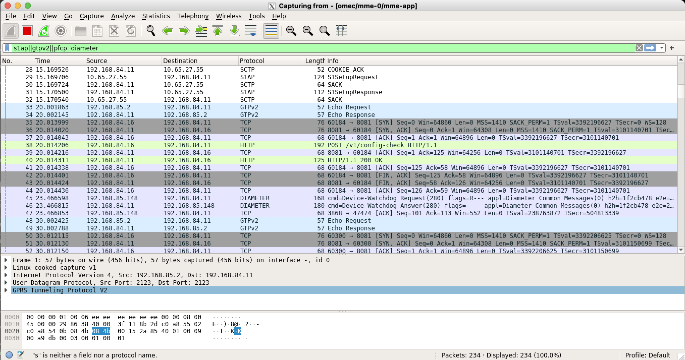
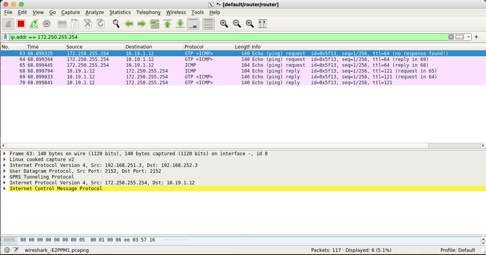

.. vim: syntax=rst

Aether-in-a-Box for Developers
==============================

Aether-in-a-Box (AiaB) provides an easy way to deploy Aether's SD-CORE and ROC
components, and then run basic tests to validate the installation.
This guide describes the steps to set up AiaB.

AiaB can be set up with a 4G or 5G SD-CORE.  In either case, SD-CORE configuration
can be done with or without the ROC.  The ROC
provides an interactive GUI for examining and changing the configuration, and is used to
manage the production Aether; it can be deployed to test the integration between
ROC and SD-CORE.  If the ROC is not deployed, a simple tool called SimApp
is used to configure the required state in SD-CORE for testing core functionality.

Helm charts are the primary method of installing the SD-CORE and ROC resources.
AiaB offers a great deal of flexibility regarding which Helm chart versions to install:

* Local definitions of charts (for testing Helm chart changes)
* Latest published charts (for deploying a development version of Aether)
* Specified versions of charts (for deploying a specific Aether release)

AiaB can be run on a bare metal machine or VM.  System prerequisites:

* Ubuntu 18.04 clean install
* Kernel 4.15 or later
* Haswell CPU or newer
* At least 4 CPUs and 12GB RAM
* Ability to run "sudo" without a password.  Due to this requirement, AiaB is most suited to disposable environments like a VM or a `CloudLab <https://cloudlab.us>`_ machine.

Clone Repositories
------------------

To initialize the AiaB environment, first clone the following repository::

    cd ~
    git clone "https://gerrit.opencord.org/aether-in-a-box"

If you are going to install AiaB using published Helm charts, you can proceed to the
next section.

If you wish to install from local Helm charts, clone these additional repositories::

    mkdir -p ~/cord
    cd ~/cord
    git clone "https://gerrit.opencord.org/sdcore-helm-charts"
    git clone "https://gerrit.opencord.org/roc-helm-charts"

Now change to *~/aether-in-a-box* directory.

RKE2 vs. Kubespray Install
--------------------------

The AiaB installer will bring up Kubernetes on the server where it is run.  By default it
uses `RKE2 <https://docs.rke2.io>`_ as the Kubernetes platform.  However, older versions of AiaB
used `Kubespray <https://kubernetes.io/docs/setup/production-environment/tools/kubespray/>`_
and that is still an option.  To switch to Kubespray as the Kubernetes platform, edit the
Makefile and replace *rke2* with *kubespray* on this line::

    K8S_INSTALL ?= rke2

You may wish to use Kubespray instead of RKE2 if you want to use locally-built images with AiaB
(e.g., if you are developing SD-CORE services).  The reason is that RKE2 uses containerd instead of
Docker and so cannot access images in the local Docker registry.  More details can be found in
the **Developer Loop** section below.

Installing the ROC
------------------

Note that you must install the ROC *before* installing SD-CORE.
If you are not using the ROC to configure SD-CORE, you can skip this step.

First choose whether you will install the 4G or 5G SD-CORE.  To install the ROC to
configure the 4G SD-CORE::

    make roc-4g-models

To install the ROC to configure the 5G SD-CORE::

    make roc-5g-models

By default the above commands install the ROC from the local charts in the Git repos cloned
earlier.  In order to install the ROC using the latest published charts, add *CHARTS=latest*
to the command, e.g.,::

    CHARTS=latest make roc-4g-models

To install the Aether 2.0 release, add *CHARTS=release-2.0*::

    CHARTS=release-2.0 make roc-4g-models

The ROC has successfully initialized when you see output like this::

    echo "ONOS CLI pod: pod/onos-cli-5b947f8f6-4r5nm"
    ONOS CLI pod: pod/onos-cli-5b947f8f6-4r5nm
    until kubectl -n aether-roc exec pod/onos-cli-5b947f8f6-4r5nm -- \
        curl -s -f -L -X PATCH "http://aether-roc-api:8181/aether-roc-api" \
        --header 'Content-Type: application/json' \
        --data-raw "$(cat /root/aether-in-a-box//roc-5g-models.json)"; do sleep 5; done
    command terminated with exit code 22
    command terminated with exit code 22
    command terminated with exit code 22
    "9513ea10-883d-11ec-84bf-721e388172cd"

Don't worry if you see a few lines of *command terminated with exit code 22*; that command is trying to
load the ROC models, and the message appears if the ROC isn't ready yet.  However if you see that message
more than 10 times then something is probably wrong with the ROC or its models.

Start the 4G SD-CORE
--------------------

If you are installing the 5G SD-CORE, you can skip this step.

To deploy the 4G SD-CORE and run a simple ping test::

    make test

By default the above commands install the 4G SD-CORE from the local charts in the Git repos cloned
earlier.  In order to install the SD-CORE using the latest published charts, add *CHARTS=latest*
to the command, e.g.,::

    CHARTS=latest make test

To install the Aether 2.0 release, add *CHARTS=release-2.0*::

    CHARTS=release-2.0 make test

Getting Started with 4G AiaB
^^^^^^^^^^^^^^^^^^^^^^^^^^^^
4G SD-CORE deploys the following core components to provide mobile connectivity:

* SPGW (Serving/PDN Gateway): Combined Serving Gateway and Packet Data Network (PDN) Gateway
* UPF (User Plane Function): The interconnect between the mobile infrastructure and the Data Network (DN).
* PCRF (Policy and Charging Rules Function): Data flow detection, policy enforcement, and flow-based charging.
* MME (Mobility Management Entity): Manages UE access network and mobility, and establishing the bearer path for UE.
* HSS (Home Subscriber Server): The main subscriber database.

.. figure:: images/4g-call-flow.png
    :align: center
    :width: 80 %

    *Communication between 4G SD-CORE Components*

The eNB (evolved Node B) is the Radio Access Network (RAN) of the 4G architecture and allows
the UEs to connect to the Mobile network.
It passes UE's attach request to MME via S1AP interface to be identified and authenticated through HSS.
MME sends the session request to SPGW to create the GTP tunnel and request the default bearer. SPGW sends back the UPF
address to establish the connectivity (GTP tunnel) to the DN through the user plane.

When the AiaB is up, by configuring the routing table you
can route traffic to arbitrary destinations through the AiaB user plane::

    ip route add <Destination-Network-Address> dev oip1

Or you can explicitly specify the *oip1* interface within the command, such as::

    curl --interface oip1 google.com
    ping -I oip1 google.com

AiaB deploys a router pod in the "default" namespace with four interfaces: *ran-gw* for the radio network,
*access-gw* for access network, *core-gw* for core network, and *eth0* for the external network.
When a UE starts sending traffics to the data network through the user plane (access network),
the outgoing data packets traverse the following path across the pods::

    (oip1) enb-0 (enb) ==GTP==> (ran-gw) router (access-gw) ==GTP==> (access) upf-0 (core)
    ----> (core-gw) router (NAT,eth0)

And the incoming packets follow as::

    (NAT,eth0) router (core-gw) ----> (core) upf-0 (access) ==GTP==> (access-gw) router (ran-gw)
    ==GTP==> (enb) enb-0 (oip1)

**Notes:** In the above notations, network interfaces within each pod are shown in parenthesis.
The IP packets sent/received between the UE and external host via the user plane are GTP-encapsulated
and tunneled between the eNB and UPF.

Ksniff
~~~~~~
Ksniff is a Kubernetes-integrated packet sniffer shipped as a kubectl plugin.
Ksniff uses tcpdump and Wireshark (Wireshark 3.x) to capture traffic on a specific pod within the cluster.
After installing Ksniff using Krew and Wireshark, by running the following command
you can see the communications between the components. Ksniff uses kubectl to upload
the tcpdump binary into the target container (e.g. mme, upf, ...), and redirects the output to Wireshark::

    kubectl ksniff -n omec mme-0

You can see the packets sent/received between the core components from the moment an
UE initiates the attach procedure through eNB until
the dedicated bearer (uplink and downlink) has been established (see figure below).
After the bearer has been established, traffic sent from UE's interface (*oip1*) will go through the eNB and UPF.

   *Wireshark output of ksniff on mme pod*

Using Ksniff on the router pod you can see all the packets exchanged between the UE and external hosts
(e.g. ping an external host from the UE interface)::

   kubectl ksniff -n default router

    *Data Flow from UE to an external host through the User Plane (filtered on UE's IP address)*

Looking at the packet's details, the first and second packets are from *enb* to *router*
and then to *upf* in a GTP tunnel. And the third packet is sent from *router* to the external network via NAT.
The rest are the reply packets from the external host to the UE.

By default, Ksniff runs *tcpdump* on all interfaces (i.e. *-i any*). To retrieve more details
of packets (e.g. ethernet header information) on a specific interface,
you can explicitly specify the interface along with options (e.g. *-e*). e.g.::

    kubectl sniff -n default router -i access-gw -f "-e"

For more information, please visit the links below:

* `Ksniff <https://github.com/eldadru/ksniff>`_
* `3gpp Spec <https://www.etsi.org/deliver/etsi_ts/136100_136199/136101/14.05.00_60/ts_136101v140500p.pdf>`_
* `4G LTE Concepts and Call Flow <https://www.udemy.com/course/4g-lte-evolved-packet-core-deep-dive-and-call-flows/>`_

Start the 5G SD-CORE
--------------------

If you have already installed the 4G SD-CORE, you must skip this step.  Only one version of
the SD-CORE can be installed at a time.

To deploy the 5G SD-CORE and run a test with gNBSim that performs Registration + UE-initiated
PDU Session Establishment + sends User Data packets::

    make 5g-test

By default the above commands install the 5G SD-CORE from the local charts in the Git repos cloned
earlier.  In order to install the SD-CORE using the latest published charts, add *CHARTS=latest*
to the command, e.g.,::

    CHARTS=latest make 5g-test

To install the Aether 2.0 release, add *CHARTS=release-2.0*::

    CHARTS=release-2.0 make 5g-test

To change the behavior of the test run by gNBSim, change the contents of *gnb.conf*
in *sd-core-5g-values.yaml*.  Consult the
`gNBSim documentation <https://docs.sd-core.opennetworking.org/master/developer/gnbsim.html>`_ for more information.

Exploring AiaB
--------------

The *kubectl* tool is the best way to get familiar with the pods and other Kubernetes objects installed by AiaB.
The SD-CORE services, UPF, and simulated edge devices run in the *omec* namespace, while the ROC is running
in the *aether-roc* namespace.

The ROC GUI is available on port 31194 on the host running AiaB.

Cleanup
-------

The first time you build AiaB, it takes a while because it sets up the Kubernetes cluster.
Subsequent builds will be much faster if you follow these steps to clean up the Helm charts without
destroying the Kubernetes cluster.

* Clean up the 4G SD-CORE: *make reset-test*
* Reset the 4G UE / eNB in order to re-run the 4G test: *make reset-ue*
* Clean up the 5G SD-CORE: *make reset-5g-test*
* Clean up the ROC: *make roc-clean*

It's normal for the above commands to take a minute or two to complete.

As an example, suppose that you want to test the 4G SD-CORE with the ROC, and then the 5G SD-CORE
with the ROC.  You could run these commands::

    CHARTS=latest make roc-4g-models   # Install ROC with 4G configuration
    CHARTS=latest make test            # Install 4G SD-CORE and run ping test
    make reset-test
    make roc-clean
    CHARTS=latest make roc-5g-models   # Install ROC with 5G configuration
    CHARTS=latest make 5g-test         # Install 5G SD-CORE and run gNB Sim test
    make reset-5g-test
    make roc-clean

To completely remove AiaB by tearing down the Kubernetes cluster, run *make clean*.

Developer Loop
--------------

Suppose you wish to test a new build of a 5G SD-CORE services. You can deploy custom images
by editing `~/aether-in-a-box/sd-core-5g-values.yaml`, for example::

    omec-control-plane:
        images:
            tags:
                webui: registry.aetherproject.org/omecproject/5gc-webui:onf-release3.0.5-roc-935305f
            pullPolicy: IfNotPresent

To upgrade a running 5G SD-CORE with the new image, or to deploy the 5G SD-CORE with the image::

    make reset-5g-test; make 5g-test

Note that RKE2 (the default Kubernetes installer) is based on containerd rather than Docker.
Containerd has its own local image registry that is separate from the local Docker Registry.  With RKE2,
if you have used `docker build` to build a local image, it is only in the Docker registry and so is not
available to run in AiaB without some additional steps.  An easy workaround
is to use `docker push` to push the image to a remote repository (e.g., Docker Hub) and then modify your
Helm values file to pull in that remote image.  Another option is to save the local Docker image
into a file and push the file to the containerd registry like this::

    docker save -o /tmp/lte-uesoftmodem.tar omecproject/lte-uesoftmodem:1.1.0
    sudo /var/lib/rancher/rke2/bin/ctr --address /run/k3s/containerd/containerd.sock --namespace k8s.io \
        images import /tmp/lte-uesoftmodem.tar

The above commands save the local Docker image `omecproject/lte-uesoftmodem:1.1.0` in a tarball, and then upload
the tarball into the containerd registry where it is available for use by RKE2.

If you know that you are going to be using AiaB to test locally-built images, probably the easiest thing to do is to
use the Kubespray installer.  If you have already installed using RKE2 and you want to switch to Kubespray, first
run `make clean` before following the steps in the **RKE2 vs. Kubespray Install** section above.

Troubleshooting / Known Issues
------------------------------

If you suspect a problem, first verify that all pods are in Running state::

    kubectl -n omec get pods
    kubectl -n aether-roc get pods

4G Test Fails
^^^^^^^^^^^^^
Occasionally *make test* (for 4G) fails for unknown reasons; this is true regardless of which Helm charts are used.
If this happens, first try recreating the simulated UE / eNB and re-running the test as follows::

    make reset-ue
    make test

If that does not work, try cleaning up AiaB as described above and re-building it.

If *make test* fails consistently, check whether the configuration has been pushed to the SD-CORE::

    kubectl -n omec logs config4g-0 | grep "Successfully"

You should see that a device group and slice has been pushed::

    [INFO][WebUI][CONFIG] Successfully posted message for device group 4g-oaisim-user to main config thread
    [INFO][WebUI][CONFIG] Successfully posted message for slice default to main config thread

Then tail the *config4g-0* log and make sure that the configuration has been successfully pushed to all
SD-CORE components.

5G Test Fails
^^^^^^^^^^^^^

If the 5G test fails (*make 5g-test*) then you will see output like this::

    2022-04-21T17:59:12Z [INFO][GNBSIM][Summary] Profile Name: profile2 , Profile Type: pdusessest
    2022-04-21T17:59:12Z [INFO][GNBSIM][Summary] Ue's Passed: 2 , Ue's Failed: 3
    2022-04-21T17:59:12Z [INFO][GNBSIM][Summary] Profile Errors:
    2022-04-21T17:59:12Z [ERRO][GNBSIM][Summary] imsi:imsi-208930100007492, procedure:REGISTRATION-PROCEDURE, error:triggering event:REGESTRATION-REQUEST-EVENT, expected event:AUTHENTICATION-REQUEST-EVENT, received event:REGESTRATION-REJECT-EVENT
    2022-04-21T17:59:12Z [ERRO][GNBSIM][Summary] imsi:imsi-208930100007493, procedure:REGISTRATION-PROCEDURE, error:triggering event:REGESTRATION-REQUEST-EVENT, expected event:AUTHENTICATION-REQUEST-EVENT, received event:REGESTRATION-REJECT-EVENT
    2022-04-21T17:59:12Z [ERRO][GNBSIM][Summary] imsi:imsi-208930100007494, procedure:REGISTRATION-PROCEDURE, error:triggering event:REGESTRATION-REQUEST-EVENT, expected event:AUTHENTICATION-REQUEST-EVENT, received event:REGESTRATION-REJECT-EVENT
    2022-04-21T17:59:12Z [INFO][GNBSIM][Summary] Simulation Result: FAIL

In this case check whether the *webui* pod has restarted... this can happen if it times out waiting
for the database to come up::

    $ kubectl -n omec get pod -l app=webui
    NAME                     READY   STATUS    RESTARTS        AGE
    webui-6b9c957565-zjqls   1/1     Running   1 (6m55s ago)   7m56s

If the output shows any restarts, then restart the *simapp* pod to cause it to re-push its subscriber state::

    $ kubectl -n omec delete pod -l app=simapp
    pod "simapp-6c49b87c96-hpf82" deleted

Re-run the 5G test, it should now pass.
