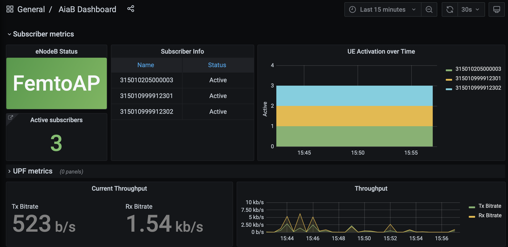

.. vim: syntax=rst

Aether-in-a-Box on Hardware Radios
==================================

This document describes how to set up an Aether-in-a-Box (AiaB) with
a Sercomm eNodeB and connect real devices (e.g., 4G phones).  This
setup is suitable for laboratory experiments and proof-of-concept deployments.
To create this setup you will need the following equipment:

* Server for running AiaB (SD-CORE / UPF / ROC)

  * Haswell CPU family or newer
  * At least 4 CPUs and 12GB RAM
  * Internet connection

* 4G or 5G small cell eNodeB

  * Example: :ref:`Sercomm CBRS LTE small cell eNodeB <edge_deployment/overview:eNB Radio>`

* SIM card writer and blank SIM cards

We assume that the server and the eNodeB are connected to the same
LAN, and the LAN also provides external Internet connectivity.

Preparation
-----------

Create SIM cards by following the instructions for your SIM card writer.
Of course you are free to use any values for IMSI, etc. that you choose,
but these are the values that will work with the rest of the configuration
in this document:

* IMSI: each one is unique, matching pattern ``315010*********`` (15 digits)
* OPc: ``69d5c2eb2e2e624750541d3bbc692ba5``
* Transport Key: ``000102030405060708090a0b0c0d0e0f``

If you choose different values for your SIM cards, you will need to
modify subsequent configuration steps appropriately.

Insert the SIM cards in devices that you wish to be able to connect to the Aether network.

Server setup
------------

The server will run Aether-in-a-Box.  The eNodeB will connect to the server over the local network.
Perform these steps to prepare the server for the AiaB install:

* Connect the server to the local network
* Perform a clean install of Ubuntu 18.04 or Ubuntu 20.04 on the server
* Set up password-less sudo for the user that will install Aether-in-a-Box

After the steps above have been completed, install Aether-in-a-Box as follows::

    sudo apt install git make
    git clone "https://gerrit.opencord.org/aether-in-a-box"
    cd aether-in-a-box

Next, modify the file *sd-core-4g-values.yaml*.  Under ``subscribers``,
add an IMSI range for the SIM cards you created, with the Transport Key
and OPc values you used earlier.  For example, the following will add
IMSIs between 315010999912301 and 315010999912303::

    subscribers:
    - ueId-start: 315010999912301
      ueId-end: 315010999912303
      plmnId: 315010
      opc: 69d5c2eb2e2e624750541d3bbc692ba5
      key: 000102030405060708090a0b0c0d0e0f
      sequenceNumber: 135

Determine which is the interface that has L3 connectivity to the
eNodeB -- this will be ``DATA_IFACE`` in the configuration later.  If
the eNodeB will also be connected to the local network, then this is just the
server’s primary interface.  If the eNodeB will be connected via an
isolated L2/L3 network segment, then ``DATA_IFACE`` refers to the server
interface on that network.   Remember this interface for later.

Option 1: Configure Aether with ROC
^^^^^^^^^^^^^^^^^^^^^^^^^^^^^^^^^^^

The Aether ROC provides a GUI and API for dynamically configuring
Aether.  If you don’t wish to use the ROC to configure AiaB, you
can skip to the next section.

Install AiaB as follows (specifying ``DATA_IFACE`` from above)::

    ENABLE_OAISIM=false DATA_IFACE=<iface> CHARTS=latest make roc-4g-models 4g-core

Next, use the ROC to add information about your SIM cards.
The ROC GUI  is available at `http://<server-ip>:31194`.

Choose ``Configuration > Site`` from the drop-down at top right and edit
the ``AiaB site``.  Change the following values and click ``Update``:

* MCC: 315
* MNC: 010

Choose ``Sim Cards`` from the drop-down at top right.  Edit the
existing entries to reflect the SIM cards you are adding to devices
by replacing their IMSI values.  Click ``Update`` after each edit.
If you want to connect more than two devices, consult the :ref:`ROC
documentation <operations/subscriber:Configure Connectivity Service for a new Device>`.

Finally, click the Basket icon at top right and click the ``Commit`` button.

Now jump to the `Verifying the AiaB installation`_ section.

Option 2: Configure Aether without ROC
^^^^^^^^^^^^^^^^^^^^^^^^^^^^^^^^^^^^^^

It is possible to configure Aether without the ROC,
using static YAML files and the SimApp service.  If you have already
installed the ROC, you should skip this section.

Edit *sd-core-4g-values.yaml*.  Change ``mcc`` and ``mnc`` as follows::

    plmn:
      mcc: "315"
      mnc: "010"

Also add the IMSIs of your devices under ``imsis``, for example::

    device-groups:
    - name:  "4g-oaisim-user"
      imsis:
        - "315010999912301"
        - "315010999912302"
        - "315010999912303"

Install AiaB as follows (specifying ``DATA_IFACE`` from above)::

    ENABLE_OAISIM=false DATA_IFACE=<iface> CHARTS=latest make 4g-core

Verifying the AiaB installation
^^^^^^^^^^^^^^^^^^^^^^^^^^^^^^^

Installing AiaB will take about 20 minutes with a fast Internet
connection.  If you see any errors / timeouts, try running the ``make``
command again.  The build will finish with a message:
“Your MME IP address is… ”  This is just the IP address assigned to
the ``DATA_IFACE``.   Remember this for the eNodeB setup.

When the install is complete, check that the 4G SD-CORE is running
as follows::

    $ kubectl -n omec get pod
    NAME                     READY   STATUS    RESTARTS   AGE
    cassandra-0              1/1     Running   0          7m27s
    config4g-0               1/1     Running   0          7m27s
    hss-0                    1/1     Running   0          7m27s
    mme-0                    4/4     Running   0          7m27s
    pcrf-0                   1/1     Running   0          7m27s
    simapp-65dc44b9d-stx6q   1/1     Running   0          7m27s
    spgwc-0                  2/2     Running   0          7m27s
    upf-0                    5/5     Running   0          7m27s

You should see all pods in Running status.

If you have installed the ROC, check that all its pods are running
as follows::

    $ kubectl -n aether-roc get pod
    NAME                                           READY   STATUS    RESTARTS   AGE
    aether-roc-api-78cc548bb9-7vjs2                1/1     Running   0          4m16s
    aether-roc-gui-v2-6d674fd446-tttb5             1/1     Running   0          4m16s
    aether-roc-umbrella-grafana-74f8489c8f-s9p45   2/2     Running   0          4m16s
    aether-roc-websocket-855d64549b-44fnc          1/1     Running   0          4m16s
    onos-cli-5d448ff6c4-stq5t                      1/1     Running   0          4m16s
    onos-config-7f4df96b88-vtp5s                   6/6     Running   0          4m16s
    onos-consensus-store-0                         1/1     Running   0          4m15s
    onos-topo-585c7c8976-6jq7b                     3/3     Running   0          4m16s
    sdcore-adapter-v2-5646d455b9-2d6zl             1/1     Running   0          4m15s

You should see all pods in Running status.

The UPF pod connects to the ``DATA_IFACE`` specified above using macvlan networks called
``core`` and ``access``.  Next, check that these have been successfully created, e.g. using
``ifconfig``::

    $ ifconfig core
    core: flags=4163<UP,BROADCAST,RUNNING,MULTICAST>  mtu 1500
        inet 192.168.250.1  netmask 255.255.255.0  broadcast 192.168.250.255
        ether 16:9d:c1:0f:19:3a  txqueuelen 1000  (Ethernet)
        RX packets 513797  bytes 48400525 (48.4 MB)
        RX errors 0  dropped 0  overruns 0  frame 0
        TX packets 102996  bytes 26530538 (26.5 MB)
        TX errors 0  dropped 0 overruns 0  carrier 0  collisions 0

    $ ifconfig access
    access: flags=4163<UP,BROADCAST,RUNNING,MULTICAST>  mtu 1500
        inet 192.168.252.1  netmask 255.255.255.0  broadcast 192.168.252.255
        ether 7a:9f:38:c0:18:15  txqueuelen 1000  (Ethernet)
        RX packets 558162  bytes 64064410 (64.0 MB)
        RX errors 0  dropped 0  overruns 0  frame 0
        TX packets 99553  bytes 16646682 (16.6 MB)
        TX errors 0  dropped 0 overruns 0  carrier 0  collisions 0

Manual Sercomm eNodeB setup
---------------------------

The instructions in this section describe a basic configuration of
the eNodeB.  For a more comprehensive guide to
eNodeB configuration see `eNB Installation <https://docs.aetherproject.org/master/edge_deployment/enb_installation.html>`_.

The Sercomm eNodeB has two Ethernet ports: WAN and LAN.  We will use
the LAN port for configuration of the eNodeB and the WAN port for
normal operation.  Connect the eNodeB WAN port to the local network.

Connect the eNodeB LAN port to a free Ethernet port on a Linux machine
(say, a laptop) that will be used for the initial configuration of
the eNodeB.  On that machine run ``dhclient`` on the interface corresponding
to the Ethernet port, for example::

    sudo dhclient eth1

The interface should receive an IP address from the Sercomm eNodeB on
the 11.11.11.0/24 subnet.  Check this using ``ifconfig``::

    $ ifconfig eth1
    eth1: flags=4163<UP,BROADCAST,RUNNING,MULTICAST>  mtu 1500
        inet 11.11.11.100  netmask 255.255.255.0  broadcast 11.11.11.255
        inet6 fe80::2e0:4cff:fe68:2f76  prefixlen 64  scopeid 0x20<link>
        ether 00:e0:4c:68:2f:76  txqueuelen 1000  (Ethernet)
        RX packets 264652  bytes 216094312 (216.0 MB)
        RX errors 0  dropped 0  overruns 0  frame 0
        TX packets 183978  bytes 36528580 (36.5 MB)
        TX errors 0  dropped 0 overruns 0  carrier 0  collisions 0

The eNodeB IP address should be 11.11.11.188 on that link.  Verify
this using ping::

    $ ping 11.11.11.188

To access the Sercomm eNodeB admin page, you can run a Web browser on
the laptop and direct it to `https://11.11.11.188`. Login to the admin
interface as user: ``sc_femto`` and password: ``scHt3pp``.

Click the ``NetWork set`` menu at the top. In the first section
``IP Address``, set *Connect type: DHCP* (assuming this is supported on
your local network, otherwise set up a static IP address).
Click the blue ``Save`` button at the bottom.

Next, click the ``Manage`` menu at the top and then click the
``LTE Basic Setting`` tab. Change these parameters and click ``Save``:

* Carrier Number: 2
* Carrier Aggregation: Unset
* BandWidth: 20
* FrequencyBand: 48,48
* EARFCN: 55440,55640
* CellIdentity: 2,1
* PCI: 100,101
* TxPower: 20
* Tunnel Type: IPv4
* MME IP Address: <MME IP address from AiaB installation>
* PLMNID: 315010
* TAC: 1
* Sync Source: FREE_RUNNING
* Enable CWMP: Unset

Click the ``SAS Configuration`` tab. In the ``Location Configuration``
section, enter these values and click “Save”:

* Location: Indoor
* Location Source: Manual
* Latitude: 0
* Longitude: 0
* Elevation: -18000

Next we need to add a static route to the UPF address, 192.168.252.3,
on the eNodeB.  Click on ``TR098`` menu and then click on ``IP`` tab.
Scroll down to ``Device.Routing.Router.`` section.  Click ``View List``.
Add this info on the blank line:

* Enable: Set
* StaticRoute: Set
* DestIPAddress: 192.168.252.0
* DestSubnetMask: 255.255.255.0
* GatewayIPAddress: <Use MME IP address from AiaB installation>
* Interface: Device.IP.Interface.1.

Then click the ``Add`` button at the far right.

Finally click the ``FAPService`` menu and then go to the ``FAPControl``
tab.  Check the box next to ``AdminState`` in the first section and
click ``Save``.

After these changes are made, reboot the eNodeB by clicking the red
``power button`` square at top right and selecting ``Reboot``.  When the
eNodeB comes back up, it should have an IP address on the network
(via the WAN port), and the admin page should now be available on
`https://<endoeb-ip>`.

Test connectivity from the eNodeB to the MME and the UPF running on
the server as follows.  Login to the eNodeB admin interface, click
the “Manage” menu at the top, and click the ``IP Diagnose`` tab.  Under
``Ping and Traceroute``, select ``ping``, and then type the following IP
addresses into the box to the right and click ``Run``:

* <MME IP address from AiaB installation>
* 192.168.251.1
* 192.168.252.3

If all of these are working, then you are ready to try to connect
devices to the network.

Automated Sercomm eNodeB Setup (experimental)
---------------------------------------------

The eNodeB service is used to provide the automatic configuration of the eNodeB device.
It can be installed by the following command::

    make enodebd

The eNodeBD service will listen on port *31005* and you need to configure the management url of eNodeB device
to make eNodeB connect to the eNodeBD service.
By default, the eNodeBD service will configure the eNodeB with the pre-defined configuration, but you can also add
the customized configuration per serial number in the ``magma_config/serial_number/`` directory. For the example
configuration, please duplicate ``acs_common.yaml`` and rename it as the ``{serial_number}.yaml``.

The automated setup via eNodeBD won't configure the static route to UPF service, please follow
the UPF route setup step describes in **Manual Sercomm eNodeB setup** to add the static route.

Configuration and Validation
^^^^^^^^^^^^^^^^^^^^^^^^^^^^

To configure the Sercomm eNodeB be managed by eNodeBD service, access the TR098 configuration page::

    https://<enodeb_ip_address>/TR098_DevFeature.htm

The configuring path is: TR098 > MgmtServer > Device.ManagementServer.URL

After you fill in the AiaB IP with eNodeBD service port as URL into the field, you need to restart the device.
And you will be able to see the eNodeBD log by the following command (the pod name may be different)::

    kubectl -n aether-apps logs aether-enodebd-b46897745-fj5qj -f

Also, you can install the monitoring dashboard to view the eNodeB status on Grafana.

Connecting Devices
------------------

Documenting how to configure different types of devices to work
with Aether is work-in-progress, but here are some basic guidelines.

The values of IMSI, OPc, and Transport Key you have configured on your SIM cards
must be entered into the ``subscribers`` block under ``omec-sub-provision`` in the
``sd-core-4g-values.yaml`` file.  If you are not using the ROC, the IMSIs must also be
added under ``device-groups``, and the relevant device group added under ``network-slices``.
If you are using the ROC, then your devices must be configured there and the associated
device group added to a slice.  In either case it is necessary to configure the basic info
under ``subscribers``.

Be aware that not all phones support the CBRS frequency bands.  AiaB is known to work
with recent iPhones (11 and greater) and Google Pixel phones (4 and up).  CBRS may also be
supported by recent phones from Samsung, LG Electronics and Motorola Mobility, but these have
not been tested with AiaB.  If you successfully test a phone on AiaB, please post details on
Slack so we can add it to the list.

The APN to configure on your phone is ``internet``.

Enable Monitoring
-----------------

To easily monitor your AiaB deployment, you can run the following command to
deploy the Prometheus/Grafana monitoring stack on your AiaB server::

    make monitoring-4g

After this step, Grafana is available at `http://<server-ip>:30950`.  You will see a number of system dashboards
for monitoring Kubernetes, as well as a simple AiaB dashboard that enables inspection of the local Aether state.

    *4G Grafana AiaB Dashboard*

The dashboard shows whether the eNodeB is connected to the core, how many active UEs there are, and the
uplink (Tx Bitrate) and downlink (Rx Bitrate) throughput at the UPF.

To create a new dashboard for Aether, you can login to Grafana as user `admin` with password `prom-operator`.
You can also modify an existing dashboard by making a copy of the dashboard and editing that.  Note that any
dashboard changes will be lost if Grafana is restarted; if you want to make your dashboard more permanent, you can
save its JSON to a file, add the file to directory `aether-in-a-box/resources/4g-monitoring`, and edit
`kustomization.yaml` in that directory to add the file to the ConfigMapGenerator block.  After these
steps, re-running `make monitoring-4g` should install the dashboard in a ConfigMap and Grafana should
automatically load it.

Troubleshooting
---------------

AiaB connects macvlan networks to ``DATA_IFACE`` so that the UPF can communicate on the network.
To do this it assumes that the *systemd-networkd* service is installed and running, ``DATA_IFACE``
is under its control, and the systemd-networkd configuration file for ``DATA_IFACE`` ends with
``<DATA_IFACE>.network``, where ``<DATA_IFACE>`` stands for the actual interface name.  It
tries to find this configuration file by looking in the standard paths.  If it fails you'll see
a message like::

    FATAL: Could not find systemd-networkd config for interface foobar, exiting now!
    make: *** [Makefile:112: /users/acb/aether-in-a-box//build/milestones/interface-check] Error 1

In this case, you can specify a ``DATA_IFACE_PATH=<path to the config file>`` argument to ``make``
so that AiaB can find the systemd-networkd configuration file for ``DATA_IFACE``.

Restarting the AiaB Server
--------------------------

AiaB should come up in a mostly working state if the AiaB server is rebooted.  If any pods are
stuck in an Error or CrashLoopBackoff state they can be restarted using ``kubectl delete pod``.
It might also be necessary to power cycle the Sercomm eNodeB in order to get it to reconnect to
the SD-CORE.

Getting Help
------------

Please introduce yourself and post your questions to the `#aether-dev` channel on the ONF Community Slack.
Details about how to join this channel can be found on the `ONF Wiki <https://wiki.opennetworking.org/display/COM/Aether>`_.
In your introduction please state your institution and position, and describe why you are interested in Aether
and what is your end goal.

If you need help debugging your setup, please give as much detail as possible about
your environment: the OS version you have installed, are you running on bare metal or in a VM,
how much CPU and memory does your server have, are you installing behind a proxy, and so on.  Also list the steps
you have performed so far, and post any error messages you have received.  These details will aid the community
to understand where you are and how to help you make progress.
