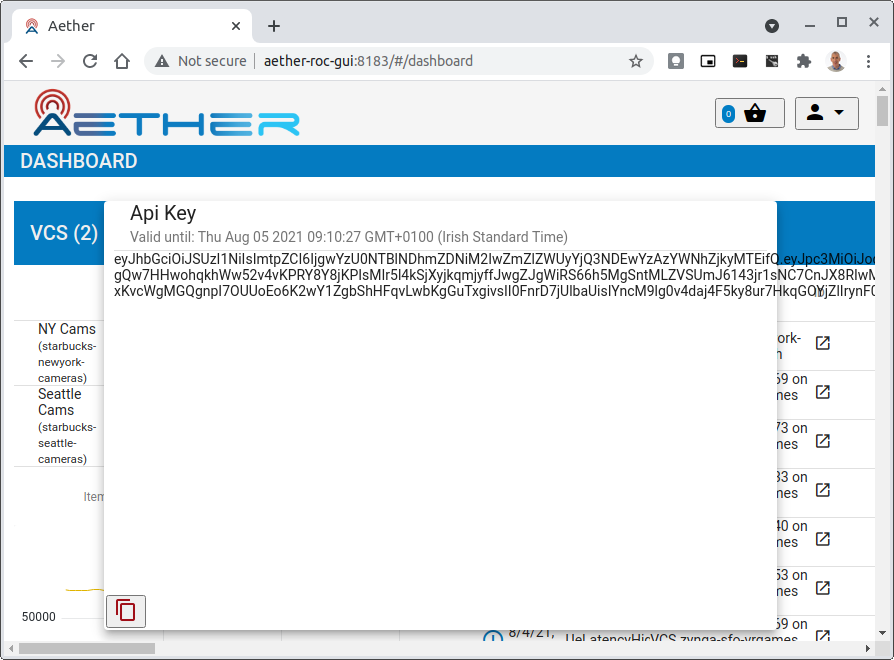
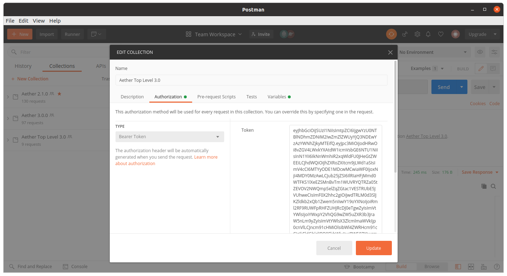
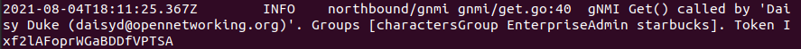
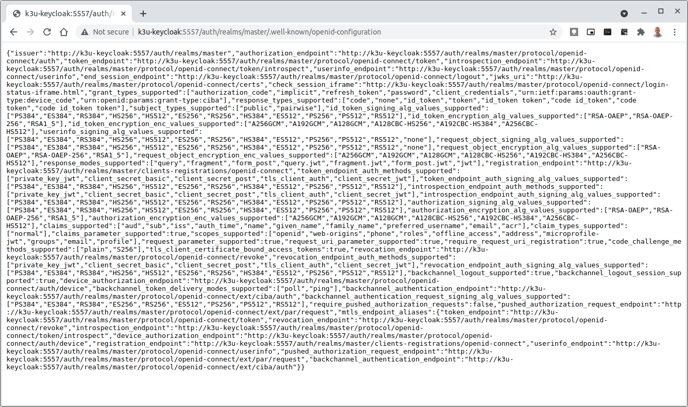
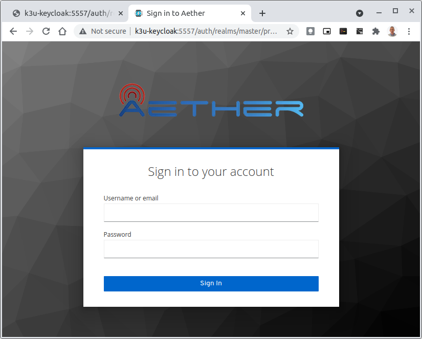
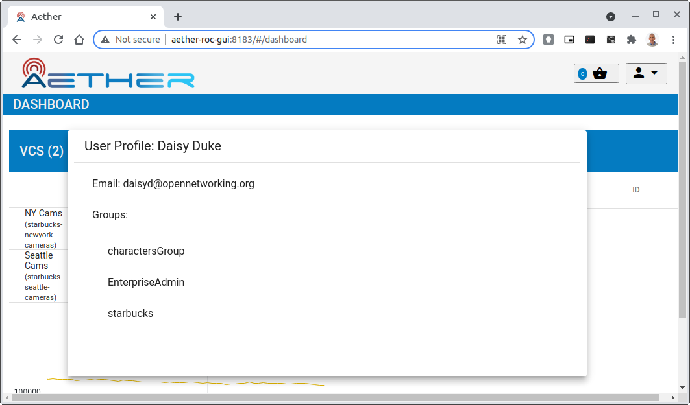
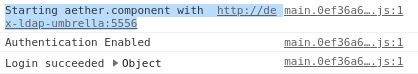
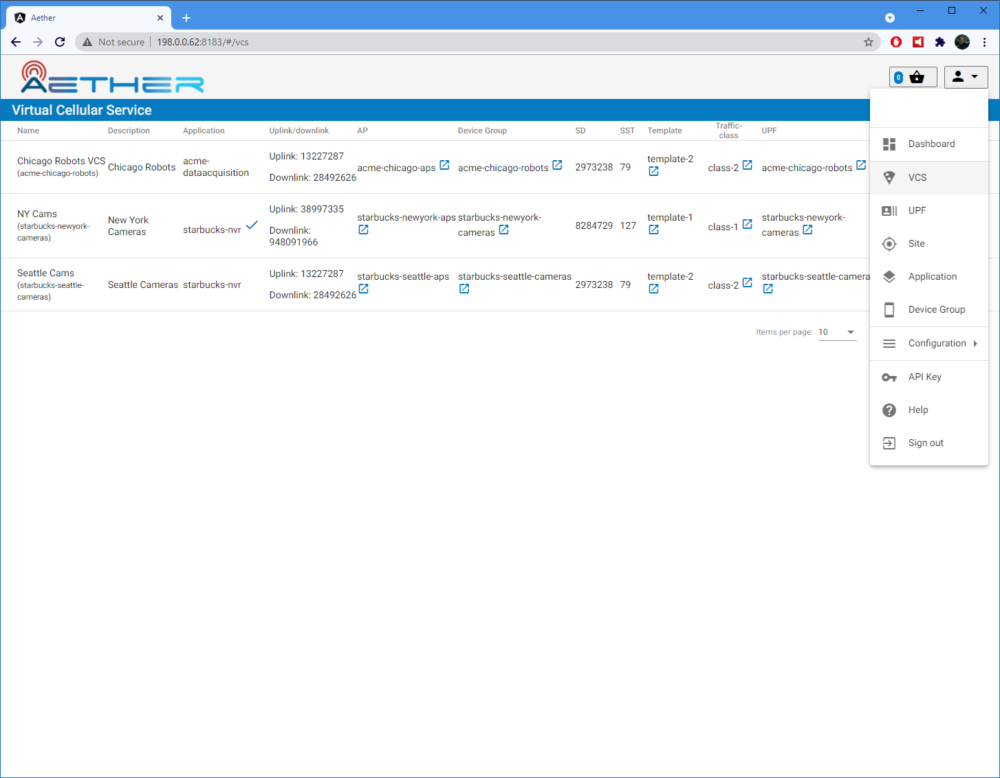

.. vim: syntax=rst

.. _roc-developer-guide:

ROC Development
===============

ROC implements Aether's runtime control API, based on the architecture
described in Sections 6.3.3 and 6.4 of the companion :doc:`Aether book
<sysapproach5g:index>`. (The book refers to ROC as Aether's "Service
Orchestrator").  ROC is implemented on top of `µONOS
<https://github.com/onosproject>`_, a microservices-based redesign of
the original ONOS SDN Controller. Of particular note, ROC generates
the API from a set of YANG models loaded into the `onos-config`
microservice.

This section describes how to develop and contribute to ROC. It
assumes familiarity with Kubernetes and Helm, and that a
Kubernetes/Helm development environment has already been deployed in
the developer’s work environment (for example, using OnRamp).

.. note:: By default, ROC is deployed without security enabled, with no Authentication or Authorization.
    To secure ROC so that the Authentication and Authorization can be tested, follow the Securing ROC
    section below :ref:`securing_roc`.

.. _posting-the-mega-patch:

Posting the Mega-Patch
----------------------

The ROC usually comes up in a blank state; there are no Enterprises,
UEs, or other artifacts present in it.  The Mega-Patch is an example
patch that populates the ROC with some sample enterprises, UEs,
slices, etc.

Execute the following::

   # launch a port-forward for the API
   # this will continue to run in the background

   kubectl -n aether port-forward service/aether-roc-api   --address 0.0.0.0 8181:8181 &

   curl http://localhost:8181/targets
   # It should show a list of the configure enterprises: [{"name":"defaultent"},{"name":"acme"},{"name":"starbucks"}

   git clone https://github.com/onosproject/aether-roc-api.git

   # execute the mega-patch (it will post via CURL to localhost:8181)
   bash ~/path/to/aether-roc-api/examples/MEGA_Patch_20.curl

.. note:: No port-forwarding is necessary to configure Aether
          OnRamp. Use URL *http://<hostname>:31194/aether-roc-api/*.

You may wish to customize the Mega-Patch. For example, by default the
patch configures the ``sdcore-adapter`` to push to
``sdcore-test-dummy``.  You could instead configure it to push to a
live instantiation of Aether by doing something like this::

   sed -i 's^http://aether-roc-umbrella-sdcore-test-dummy/v1/config/5g^http://webui.omec.svc.cluster.local:9089/config^g' MEGA_Patch_21.curl

   #apply the patch
   ./MEGA_Patch_20.curl

Note that if Aether is installed on a different machine, then port-forwarding may be necessary.

Expected CURL output from a successful Mega-Patch post will be a UUID.

You can also verify that the Mega-Patch was successful by going into the
``aether-roc-gui`` in a browser (see the section on useful port-forwards
below). The GUI may open to a dashboard that is unpopulated. You can use the
dropdown menu (upper-right hand corner of the screen) to select an object such
as Slice and you will see a list of slices.

   |ROCGUI|

Adding New Enterprises
----------------------

Enterprises are stored in a second µONOS microservice, `onos-topo`,
outside of `onos-config`. They are usually added by a system
administrator during the onboarding of new customers (tenants) on
Aether.

There is currently no way to add new Enterprises through the ROC GUI
or the API. Instead, it can be done in the two ways described in the
following subsections.

Enterprises are specified as Entities using CRDs, and the
`onos-operator` ensures that these are created as `entitites` inside
`onos-topo`.

To check that the current list of enterprises (as CRDs), the following command may be used::

   kubectl -n aether get entities

and to check that the `onos-operator` does indeed take effect, the ROC
API endpoint `/targets` can be used to list the `enterprises`.

Another option is to use the `onos-cli` pod to query `onos-topo` directly::

    kubectl -n aether exec deployment/onos-cli -- onos topo get entities -v

Adding New Enterprises Through Helm Charts
^^^^^^^^^^^^^^^^^^^^^^^^^^^^^^^^^^^^^^^^^^

To have an entity added at **start up of the cluster** it can be added
through the Helm Chart in the `values.yaml` under
`enterprises`. e.g.::

   enterprises:
   - id: starbucks
     name: Starbucks Enterprise
     lat: 52.5150
     long: 13.3885

This will load the `enterprise` as an Entity CRD through the `onos-operator`.

Adding New Enterprises Through `onos-topo`
^^^^^^^^^^^^^^^^^^^^^^^^^^^^^^^^^^^^^^^^^^

New `enterprises` can be added to a live running system through the
`onos-topo` command line (bypassing the `onos-operator`). For
example::

    kubectl -n aether exec deployment/onos-cli -- \
    onos topo create entity new-enterprise \
    -a onos.topo.Configurable='{"address”:”sdcore-adapter-v2-1:5150”,”version”:”2.1.x”,”type”:”aether”}' \
    -a onos.topo.TLSOptions='{"insecure":true}' \
    -a onos.topo.Asset='{"name”:”New Enterprise”}' \
    -a onos.topo.MastershipState='{}' \
    -k enterprise

Useful Port Forwards
--------------------

Port forwarding is often necessary to allow access to ports inside of
Kubernetes pods that use ClusterIP addressing.  Note that you
typically need to leave a port-forward running (you can put it in the
background).  Also, If you redeploy the ROC and/or if a pod crashes
then you might have to restart a port-forward.

.. note:: No port-forward is necessary with OnRamp. The GUI
    can be accessed at ``http://<hostname>:31194`` and the API at
    ``http://<hostname>:31194/aether-roc-api/``.

The following port-forwards may be useful::

   # aether-roc-api

   kubectl -n aether port-forward service/aether-roc-api --address 0.0.0.0 8181:8181

   # aether-roc-gui

   kubectl -n aether port-forward service/aether-roc-gui-v2-1 --address 0.0.0.0 8183:80

   # grafana

   kubectl -n aether port-forward service/aether-roc-umbrella-grafana --address 0.0.0.0 8187:80

.. note:: Internally, the ``aether-roc-gui`` operates a Reverse Proxy
    on the ``aether-roc-api``. This means that if you have done a
    ``port-forward`` to ``aether-roc-gui``, say on port ``8183``,
    there's no need to do another on the ``aether-roc-api``. Instead,
    you can access the API on ``http://localhost:8183/aether-roc-api``.

Deploying Custom Images
--------------------------

Custom images may be used by editing the values-override.yaml file.
For example, to deploy a custom ``sdcore-adapter``::

   sdcore-adapter-v2-1:
     prometheusEnabled: false
   image:
     repository: my-private-repo/sdcore-adapter
     tag: my-tag
     pullPolicy: Always

The above example assumes you have published a docker images at
``my-private-repo/sdcore-adapter:my-tag``.  One possible workflow is
to deploy a local-docker registry and push images to that.

There are alternatives to using a private docker repository.  For
example, if you are using kubeadm, then you may be able to simply tag
the image locally.  If you’re using KinD, then you can push a local
image to into the kind cluster::

   kind load docker-image sdcore-adapter:my-tag

Developing with a Custom onos-config
-------------------------------------

The `onos-config` Helm Chart is responsible for loading model
plugins at runtime. You can override which plugins it loads, and
optionally override the image for `onos-config` as well. For
example::

    onos-config:
      image:
        tag: mytag
        repository: mydockeraccount/onos-config
      modelPlugins:
      - name: aether-2
        image: onosproject/aether-2.0.x:2.0.16-aether-2.0.x
        endpoint: localhost
        port: 5152
      - name: aether-2-1
        image: onosproject/aether-2.1.x:2.1.16-aether-2.1.x
        endpoint: localhost
        port: 5153

In the above example, the `onos-config` image will be pulled from
`mydockeraccount`, and it will install two plugins for v2 and v4
models, from that same docker account.

Inspecting Logs
---------------

Most of the relevant Kubernetes pods are in the aether namespace.  The
names may change from deployment to deployment, so start by getting a
list of pods::

   kubectl -n aether get pods

Then you can inspect a specific pod/container::

   kubectl -n aether logs deployment/sdcore-adapter-v2-1

.. _securing_roc:

Securing ROC
------------

Running your own Keycloak Server
^^^^^^^^^^^^^^^^^^^^^^^^^^^^^^^^

.. note:: There is no longer a central keycloak server
    for development as there was at `keycloak-dev.onlab.us`, so you
    must run your own own Keycloak server inside of Kubernetes.

See `Keycloak README.md <https://gerrit.opencord.org/plugins/gitiles/roc-helm-charts/+/refs/heads/master/keycloak/>`_ for details.

When running it should be available at
*http://localhost:8080/realms/master/.well-known/openid-configuration*.

.. note:: You can access the Keycloak management page from
    *http://localhost:8080/admin* but you must login as
    `admin`. Because of the SSO feature of Keycloak this will affect
    your Aether ROC GUI login too.  To login as two separate users at
    the same time, use a private browser window for one.

.. note:: Services inside the cluster (e.g. `onos-config`) should set
    the issuer to *https://keycloak/realms/master* on port 80, while
    the aether-roc-gui should use `http://localhost:8080/realms/master`.

Enabling Security
^^^^^^^^^^^^^^^^^^^^^

When deploying ROC with the ``aether-roc-umbrella`` chart, secure mode
can be enabled by specifying an OpenID Connect (OIDC) issuer; for example::

    helm -n aether install aether-roc-umbrella aether/aether-roc-umbrella \
        --set onos-config.openidc.issuer=http://keycloak/realms/master \
        --set onos-config.openpolicyagent.enabled=true \
        --set onos-config.openpolicyagent.regoConfigMap=aether-roc-umbrella-opa-rbac \
        --set aether-roc-api.openidc.issuer=http://keycloak/realms/master \
        --set aether-roc-gui-v2-1.openidc.issuer=http://localhost:8080/realms/master \
        --set prom-label-proxy-acc.config.openidc.issuer=http://keycloak/realms/master \
        --set prom-label-proxy-amp.config.openidc.issuer=http://keycloak/realms/master

The choice of OIDC issuer in this case is the **local** Keycloak
server at *http://keycloak* inside the `aether` namespace.

Production Environment
^^^^^^^^^^^^^^^^^^^^^^

In a production environment, the public Aether Keycloak (with its LDAP
server populated with real Aether users and groups) should be used.
See `public keycloak
<https://keycloak.opennetworking.org/auth/realms/master/.well-known/openid-configuration>`_
for more details.

.. note:: Your RBAC access to ROC will be limited by the groups you belong to in its LDAP store.

Role Based Access Control
^^^^^^^^^^^^^^^^^^^^^^^^^

When secured, access to the configuration in ROC is limited by the
**groups** that a user belongs to.

* **AetherROCAdmin** - users in this group have full read **and** write access to all configuration.
* *<enterprise>* - users in a group the lowercase name of an enterprise, will have **read** access to that enterprise.
* **EnterpriseAdmin** - users in this group will have read **and** write access the enterprise they belong to.

Requests to a Secure System
^^^^^^^^^^^^^^^^^^^^^^^^^^^

When configuration is retrieved or updated through *aether-config*, a
Bearer Token in the form of a JSON Web Token (JWT) issued by the
selected OIDC Issuer server must accompany the request as an
Authorization Header.

This applies to both the REST interface of ``aether-roc-api`` **and**
the *gnmi* interface of ``aether-config``.

In the Aether ROC, a Bearer Token can be generated by logging in and
selecting API Key from the menu. This pops up a window with a copy
button, where the key can be copied.

Alternatively with Keycloak a Token may be requested programmatically
through the Keycloak API::

    curl --location --request POST 'http://localhost:8080/realms/master/protocol/openid-connect/token' \
    --header 'Content-Type: application/x-www-form-urlencoded' \
    --data-urlencode 'grant_type=password' \
    --data-urlencode 'client_id=aether-roc-gui' \
    --data-urlencode 'username=alicea' \
    --data-urlencode 'password=password' \
    --data-urlencode 'scope=openid profile email groups' | jq "{access_token}"

The key will expire after 24 hours.

Accessing the REST interface from a tool like Postman, should include this Auth token.

Logging
"""""""

The logs of *aether-config* will contain the **username** and **timestamp** of
any **gnmi** call when security is enabled.

Accessing GUI from an external system
"""""""""""""""""""""""""""""""""""""

To access the ROC GUI from a computer outside the Cluster machine using *port-forwarding* then
it is necessary to:

* Ensure that all *port-forward*'s have **--address=0.0.0.0**
* Add to the IP address of the cluster machine to the **/etc/hosts** of the outside computer as::

    <ip address of cluster> k3u-keycloak aether-roc-gui
* Verify that you can access the Keycloak server by its name *http://localhost:8080/realms/master/.well-known/openid-configuration*
* Access the GUI through the hostname (rather than ip address) ``http://aether-roc-gui:8183``

Troubleshooting Secure Access
"""""""""""""""""""""""""""""

While every effort has been made to ensure that securing Aether is simple and effective,
some difficulties may arise.

One of the most important steps is to validate that the OIDC Issuer (Keycloak server) can be reached
from the browser. The **well_known** URL should be available and show the important endpoints are correct.

If logged out of the Browser when accessing the Aether ROC GUI, accessing any page of the application should
redirect to the Keycloak login page.

When logged in the User details can be seen by clicking the User's name in the drop down menu.
This shows the **groups** that the user belongs to, and can be used to debug RBAC issues.

When you sign out of the ROC GUI, if you are not redirected to the Keycloak Login Page,
you should check the Developer Console of the browser. The console should show the correct
OIDC issuer (Keycloak server), and that Auth is enabled.

ROC Data Model Conventions and Requirements
-------------------------------------------

The Mega-Patch described above will bring up a fully compliant sample data model.
However, it may be useful to bring up your own data model, customized to a different
site of sites. This subsection documents conventions and requirements for the Aether
modeling within the ROC.

The ROC models must be configured with the following:

* A default enterprise with the id `defaultent`.
* A default site with the id `defaultent-defaultsite`.
  This site should be within the `defaultent` enterprise.

