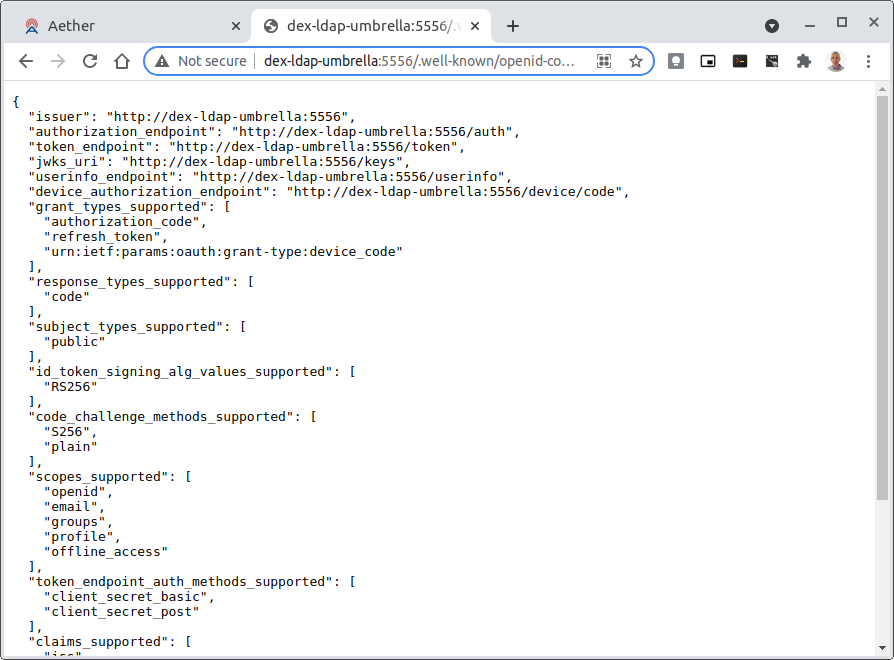
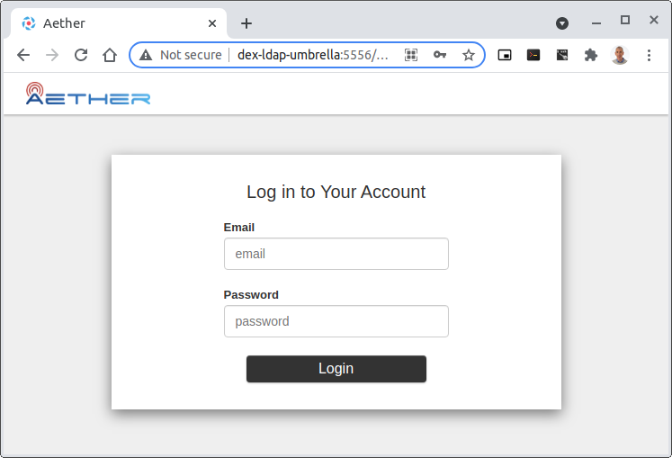

.. vim: syntax=rst

Aether ROC Developer Guide
==========================

Background / Development Environment
------------------------------------

This document assumes familiarity with Kubernetes and Helm, and that a Kubernetes/Helm development
environment has already been deployed in the developer’s work environment.

This development environment can use any of a number of potential mechanisms -- including KinD, kubeadm, etc.

The Aether-in-a-Box script is one potential way to setup a development environment, but not the only way.
As an alternative to the developer’s local machine, a remote environment can be set up, for example on
cloud infrastructure such as Cloudlab.

.. note:: When ROC is deployed it is unsecured by default, with no Authentication or Authorization.
    To secure ROC so that the Authentication and Authorization can be tested, follow the Securing ROC
    guide below :ref:`securing_roc`

Installing Prerequisites
------------------------

Atomix and onos-operator must be installed::

   # create necessary namespaces
   kubectl create namespace micro-onos

   # add repos
   helm repo add atomix https://charts.atomix.io
   helm repo add onosproject https://charts.onosproject.org
   helm repo update

   # install atomix
   export ATOMIX_CONTROLLER_VERSION=0.6.8
   helm -n kube-system install atomix-controller atomix/atomix-controller --version $ATOMIX_CONTROLLER_VERSION
   export ATOMIX_RAFT_VERSION=0.1.9
   helm -n kube-system install atomix-raft-storage atomix/atomix-raft-storage --version $ATOMIX_RAFT_VERSION

   # install the onos operator
   ONOS_OPERATOR_VERSION=0.4.10
   helm install -n kube-system onos-operator onosproject/onos-operator --version $ONOS_OPERATOR_VERSION

.. note:: The ROC is sensitive to the versions of Atomix and onos-operator installed. The values
    shown above are correct for the 1.3.x versions of the *aether-roc-umbrella*.

.. list-table:: ROC support component version matrix
   :widths: 40 20 20 20
   :header-rows: 1

   * - ROC Version
     - Atomix Controller
     - Atomix Raft
     - Onos Operator
   * - 1.2.25-1.2.45
     - 0.6.7
     - 0.1.8
     - 0.4.8
   * - 1.3.0-
     - 0.6.8
     - 0.1.9
     - 0.4.10

Verify that these services were installed properly.
You should see pods for *atomix-controller*, *atomix-raft-storage-controller*,
*onos-operator-config*, and *onos-operator-topo*.
Execute these commands::

   helm -n kube-system list
   kubectl -n kube-system get pods | grep -i atomix
   kubectl -n kube-system get pods | grep -i onos

Create a values-override.yaml
-----------------------------

You’ll want to override several of the defaults in the ROC helm charts::

   cat > values-override.yaml <<EOF
   import:
     onos-gui:
       enabled: true

   onos-gui:
     ingress:
       enabled: false

   aether-roc-gui-v3:
     ingress:
       enabled: false
   EOF

Installing the ``aether-roc-umbrella`` Helm chart
-------------------------------------------------

Add the necessary helm repositories::

   # obtain username and password from Michelle and/or ONF infra team
   export repo_user=<username>
   export repo_password=<password>
   helm repo add aether --username "$repo_user" --password "$repo_password" https://charts.aetherproject.org

``aether-roc-umbrella`` will bring up the ROC and its services::

   helm -n micro-onos install aether-roc-umbrella aether/aether-roc-umbrella -f values-override.yaml

   kubectl wait pod -n micro-onos --for=condition=Ready -l type=config --timeout=300s

.. _posting-the-mega-patch:

Posting the mega-patch
----------------------

The ROC usually comes up in a blank state -- there are no Enterprises, UEs, or other artifacts present in it.
The mega-patch is an example patch that populates the ROC with some sample enterprises, UEs, slices, etc.
Execute the following::

   # launch a port-forward for the API
   # this will continue to run in the background
   kubectl -n micro-onos port-forward service/aether-roc-api   --address 0.0.0.0 8181:8181 &

   git clone https://github.com/onosproject/aether-roc-api.git

   # execute the mega-patch (it will post via CURL to localhost:8181)
   bash ~/path/to/aether-roc-api/examples/MEGA_Patch.curl

You may wish to customize the mega patch.

For example, by default the patch configures the ``sdcore-adapter`` to push to
``sdcore-test-dummy``.

You could configure it to push to a live aether-in-a-box core by doing something like this::

   sed -i 's^http://aether-roc-umbrella-sdcore-test-dummy/v1/config/5g^http://webui.omec.svc.cluster.local:9089/config^g' MEGA_Patch.curl

   #apply the patch
   ./MEGA_Patch.curl

(Note that if your Aether-in-a-Box was installed on a different machine that port-forwarding may be necessary)

Expected CURL output from a successful mega-patch post will be a UUID.

You can also verify that the mega-patch was successful by going into the
``aether-roc-gui`` in a browser (see the section on useful port-forwards
below). The GUI may open to a dashboard that is unpopulated -- you can use the
dropdown menu (upper-right hand corner of the screen) to select an object such
as VCS and you will see a list of VCS.

   |ROCGUI|

Uninstalling the ``aether-roc-umbrella`` Helm chart
---------------------------------------------------

To tear things back down, usually as part of a developer loop prior to redeploying again, do the following::

   helm -n micro-onos del aether-roc-umbrella

If the uninstall hangs or if a subsequent reinstall hangs, it could be an issue with some of the CRDs
not getting cleaned up. The following may be useful::

   # fix stuck finalizers in operator CRDs

   kubectl -n micro-onos patch entities connectivity-service-v2 --type json --patch='[ { "op": "remove", "path": "/metadata/finalizers" } ]'

   kubectl -n micro-onos patch entities connectivity-service-v3 --type json --patch='[ { "op": "remove", "path": "/metadata/finalizers" } ]'

   kubectl -n micro-onos patch kind aether --type json --patch='[ { "op": "remove", "path": "/metadata/finalizers" } ]'

Useful port forwards
--------------------

Port forwarding is often necessary to allow access to ports inside of Kubernetes pods that use ClusterIP addressing.
Note that you typically need to leave a port-forward running (you can put it in the background).
Also, If you redeploy the ROC and/or if a pod crashes then you might have to restart a port-forward.
The following port-forwards may be useful::

   # aether-roc-api

   kubectl -n micro-onos port-forward service/aether-roc-api --address 0.0.0.0 8181:8181

   # aether-roc-gui

   kubectl -n micro-onos port-forward service/aether-roc-gui --address 0.0.0.0 8183:80

   # grafana

   kubectl -n micro-onos port-forward service/aether-roc-umbrella-grafana --address 0.0.0.0 8187:80

   # onos gui

   kubectl -n micro-onos port-forward service/onos-gui --address 0.0.0.0 8182:80

``aether-roc-api`` and ``aether-roc-gui`` are in our experience the most useful two port-forwards.

``aether-roc-api`` is useful to be able to POST REST API requests.

``aether-roc-gui`` is useful to be able to interactively browse the current configuration.

.. note:: Internally the ``aether-roc-gui`` operates a Reverse Proxy on the ``aether-roc-api``. This
    means that if you have done a ``port-forward`` to ``aether-roc-gui`` say on port ``8183`` there's no
    need to do another on the ``aether-roc-api`` instead you can access the API on
    ``http://localhost:8183/aether-roc-api``

Deploying using custom images
-----------------------------

Custom images may be used by editing the values-override.yaml file.
For example, to deploy a custom ``sdcore-adapter``::

   sdcore-adapter-v3:

   prometheusEnabled: false

   image:

   repository: my-private-repo/sdcore-adapter

   tag: my-tag

   pullPolicy: Always

The above example assumes you have published a docker images at ``my-private-repo/sdcore-adapter:my-tag``.
My particular workflow is to deploy a local-docker registry and push my images to that.
Please do not publish ONF images to a public repository unless the image is intended to be public.
Several ONF repositories are private, and therefore their docker artifacts should also be private.

There are alternatives to using a private docker repository.
For example, if you are using kubeadm, then you may be able to simply tag the image locally.
If you’re using KinD, then you can push a local image to into the kind cluster::

   kind load docker-image sdcore-adapter:my-tag

Developing using a custom onos-config
-------------------------------------

The onos-operator is responsible for building model plugins at runtime. To do this, it needs source code
for onos-config that matches the onos-config image that is deployed. One way to do this is to fork the
onos-config repository and commit your onos-config changes to a personal repository, and then reference
that personal repository in the values.yaml. For example::

  onos-config:
    plugin:
      compiler:
        target: "github.com/mygithubaccount/onos-config@mytag"
    image:
      repository: mydockeraccount/onos-config
      tag: mytag
      pullPolicy: Always

In the above example, the operator will pull the image from `mydockeraccount`, and it'll pull the
onos-config code from `mygithubaccount`. Using a personal docker account is not strictly necessary;
images can also be built and tagged entirely locally.

Inspecting logs
---------------

Most of the relevant Kubernetes pods are in the micro-onos namespace.
The names may change from deployment to deployment, so start by getting a list of pods::

   kubectl -n micro-onos get pods

Then you can inspect a specific pod/container::

   kubectl -n micro-onos logs sdcore-adapter-v3-7468cc58dc-ktctz sdcore-adapter-v3

.. _securing_roc:

Securing ROC
------------

When deploying ROC with the ``aether-roc-umbrella`` chart, secure mode can be enabled by
specifying an OpenID Connect (OIDC) issuer like::

    helm -n micro-onos install aether-roc-umbrella aether/aether-roc-umbrella \
        --set onos-config.openidc.issuer=http://dex-ldap-umbrella:5556 \
        --set aether-roc-gui-v3.openidc.issuer=http://dex-ldap-umbrella:5556

The choice of OIDC issuer in this case is ``dex-ldap-umbrella``.

``dex-ldap-umbrella``
"""""""""""""""""""""

Dex is a cloud native OIDC Issuer than can act as a front end to several authentication systems
e.g. LDAP, Crowd, Google, GitHub

``dex-ldap-umbrella`` is a Helm chart that combines a Dex server with an LDAP
installation, and an LDAP administration tool. It can be deployed in to the
same cluster namespace as ``aether-roc-umbrella``.

Its LDAP server is populated with 7 different users in the 2 example enterprises - *starbucks* and *acme*.

When running it should be available at *http://dex-ldap-umbrella:5556/.well-known/openid-configuration*.

See `dex-ldap-umbrella <https://github.com/onosproject/onos-helm-charts/tree/master/dex-ldap-umbrella#readme>`_
for more details.

As an alternative there is a public Dex server connected to the ONF Crowd server, that allows
ONF staff to login with their own credentials:
See `public dex <https://dex.aetherproject.org/dex/.well-known/openid-configuration>`_ for more details.

.. note:: Your RBAC access to ROC will be limited by the groups you belong to in Crowd.

Role Based Access Control
"""""""""""""""""""""""""

When secured, access to the configuration in ROC is limited by the **groups** that a user belongs to.

* **AetherROCAdmin** - users in this group have full read **and** write access to all configuration.
* *<enterprise>* - users in a group the lowercase name of an enterprise, will have **read** access to that enterprise.
* **EnterpriseAdmin** - users in this group will have read **and** write access the enterprise they belong to.

    For example in *dex-ldap-umbrella* the user *Daisy Duke* belongs to *starbucks* **and**
    *EnterpriseAdmin* and so has read **and** write access to items linked with *starbucks* enterprise.

    By comparison the user *Elmer Fudd* belongs only to *starbucks* group and so has only **read** access to items
    linked with the *starbucks* enterprise.

Requests to a Secure System
"""""""""""""""""""""""""""

When configuration is retrieved or updated  through *aether-config*, a Bearer Token in the
form of a JSON Web Token (JWT) issued by the selected OIDC Issuer server must accompany
the request as an Authorization Header.

This applies to both the REST interface of ``aether-roc-api`` **and** the *gnmi* interface of
``aether-rconfig``.

In the Aether ROC, a Bearer Token can be generated by logging in and selecting API Key from the
menu. This pops up a window with a copy button, where the key can be copied.

The key will expire after 24 hours.

.. image:: images/aether-roc-gui-copy-api-key.png
    :width: 580
    :alt: Aether ROC GUI allows copying of API Key to clipboard

Accessing the REST interface from a tool like Postman, should include this Auth token.

.. image:: images/postman-auth-token.png
    :width: 930
    :alt: Postman showing Authentication Token pasted in

Logging
"""""""

The logs of *aether-config* will contain the **username** and **timestamp** of
any **gnmi** call when security is enabled.

.. image:: images/aether-config-log.png
    :width: 887
    :alt: aether-config log message showing username and timestamp

Accessing GUI from an external system
"""""""""""""""""""""""""""""""""""""

To access the ROC GUI from a computer outside the Cluster machine using *port-forwarding* then
it is necessary to:

* Ensure that all *port-forward*'s have **--address=0.0.0.0**
* Add to the IP address of the cluster machine to the **/etc/hosts** of the outside computer as::

    <ip address of cluster> dex-ldap-umbrella aether-roc-gui
* Verify that you can access the Dex server by its name *http://dex-ldap-umbrella:5556/.well-known/openid-configuration*
* Access the GUI through the hostname (rather than ip address) ``http://aether-roc-gui:8183``

Troubleshooting Secure Access
"""""""""""""""""""""""""""""

While every effort has been made to ensure that securing Aether is simple and effective,
some difficulties may arise.

One of the most important steps is to validate that the OIDC Issuer (Dex server) can be reached
from the browser. The **well_known** URL should be available and show the important endpoints are correct.

If logged out of the Browser when accessing the Aether ROC GUI, accessing any page of the application should
redirect to the Dex login page.

When logged in the User details can be seen by clicking the User's name in the drop down menu.
This shows the **groups** that the user belongs to, and can be used to debug RBAC issues.

.. image:: images/aether-roc-gui-user-details.png
    :width: 700
    :alt: User Details page

When you sign out of the ROC GUI, if you are not redirected to the Dex Login Page,
you should check the Developer Console of the browser. The console should show the correct
OIDC issuer (Dex server), and that Auth is enabled.

.. image:: images/aether-roc-gui-console-loggedin.png
    :width: 418
    :alt: Browser Console showing correct configuration

ROC Data Model Conventions and Requirements
-------------------------------------------

The MEGA-Patch described above will bring up a fully compliant sample data model.
However, it may be useful to bring up your own data model, customized to a different
site of sites. This subsection documents conventions and requirements for the Aether
modeling within the ROC.

The ROC models must be configured with the following:

* A default enterprise with the id `defaultent`.
* A default ip-domain with the id `defaultent-defaultip`.
* A default site with the id `defaultent-defaultsite`.
  This site should be linked to the `defaultent` enterprise.
* A default device group with the id `defaultent-defaultsite-default`.
  This device group should be linked to the `defaultent-defaultip` ip-domain
  and the `defaultent-defaultsite` site.

Each Enterprise Site must be configured with a default device group and that default
device group's name must end in the suffix `-default`. For example, `acme-chicago-default`.

Some exercises to get familiar
------------------------------

1. Deploy the ROC and POST the mega-patch, go into the ``aether-roc-gui`` and click
   through the VCS, DeviceGroup, and other objects to see that they were
   created as expected.

2. Examine the log of the ``sdcore-adapter-v3`` container.  It should be
   attempting to push the mega-patch’s changes.  If you don’t have a core
   available, it may be failing the push, but you should see the attempts.

3. Change an object in the GUI.  Watch the ``sdcore-adapter-v3`` log file and
   see that the adapter attempts to push the change.

4. Try POSTing a change via the API.  Observe the ``sdcore-adapter-v3`` log
   file and see that the adapter attempts to push the change.

5. Deploy a 5G Aether-in-a-Box (See :doc:`Setting Up Aether-in-a-Box
   <aiab>`), modify the mega-patch to specify the URL for the Aether-in-a-Box
   ``webui`` container, POST the mega-patch, and observe that the changes were
   correctly pushed via the ``sdcore-adapter-v3`` into the ``sd-core``’s
   ``webui`` container (``webui`` container log will show configuration as it
   is received)

.. |ROCGUI| image:: images/rocgui.png
    :width: 945
    :alt: ROC GUI showing list of VCS
