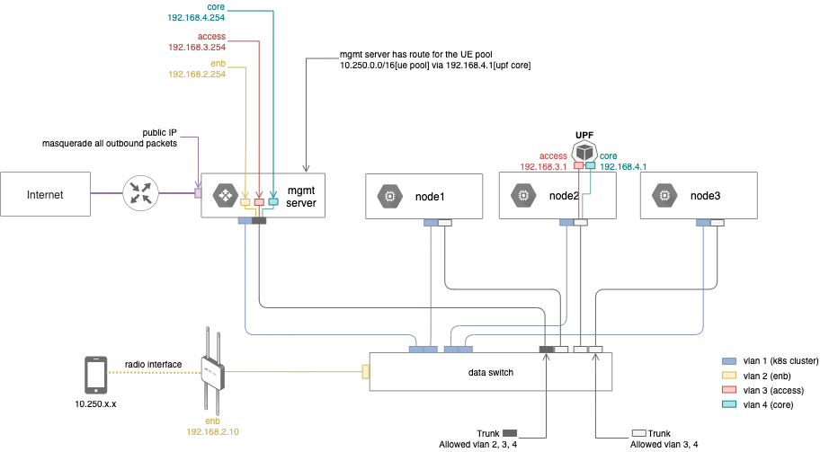

..
   SPDX-FileCopyrightText: © 2021 Open Networking Foundation <support@opennetworking.org>
   SPDX-License-Identifier: Apache-2.0

BESS UPF Deployment
===================

This section describes how to configure and deploy BESS UPF.

Network Settings
----------------

BESS UPF requires three networks, **enb**, **access**, and **core**, and all
three networks must use different subnets. To help your understanding,
the following example ACE environment will be used in the rest of the guide.

+-----------+-----------+------------------------------------+-------------------+---------------+
| Network   | VLAN      | Subnet                             | Interface         | IP address    |
+-----------+-----------+------------------------------------+-------------------+---------------+
| enb       | 2         | 192.168.2.0/24 (gw: 192.168.2.254) | mgmt server vlan2 | 192.168.2.254 |
|           |           |                                    +-------------------+---------------+
|           |           |                                    | enb               | 192.168.2.10  |
+-----------+-----------+------------------------------------+-------------------+---------------+
| access    | 3         | 192.168.3.0/24 (gw: 192.168.3.254) | mgmt server vlan3 | 192.168.3.254 |
|           |           |                                    +-------------------+---------------+
|           |           |                                    | upf access        | 192.168.3.1   |
+-----------+-----------+------------------------------------+-------------------+---------------+
| core      | 4         | 192.168.4.0/24 (gw: 192.168.4.254) | mgmt server vlan4 | 192.168.4.254 |
|           |           |                                    +-------------------+---------------+
|           |           |                                    | upf core          | 192.168.4.1   |
+-----------+-----------+------------------------------------+-------------------+---------------+

.. note::

   Management plane and out-of-band network are not depicted in the diagram.

Note that the management server has the only external routable address and acts as a router for
all networks in the Aether pod.
So in order for UE to access the Internet, two things need to be done in the managmenet server.

* For outgoing traffic, masquerade the internal adddress with the external address of the management server.
* For response traffic to UE, forward them to UPF's **core** interface.

Check Cluster Resources
-----------------------

Before proceeding with the deployment, make sure the cluster has enough resources to run BESS UPF.

* 2 dedicated cores (``"cpu"``)
* 2 1Gi HugePages (``"hugepages-1Gi"``)
* 2 SRIOV Virtual Functions bound to **vfio-pci** driver (``"intel.com/intel_sriov_vfio"``)

In fact, these requirements are not mandatory to run BESS UPF, but are recommended for best performance.
You can use the following command to check allocatable resources in the cluster nodes.

.. code-block:: shell

   $ kubectl get nodes -o json | jq '.items[].status.allocatable'
   {
     "cpu": "95",
     "ephemeral-storage": "1770223432846",
     "hugepages-1Gi": "32Gi",
     "intel.com/intel_sriov_netdevice": "32",
     "intel.com/intel_sriov_vfio": "32",
     "memory": "360749956Ki",
     "pods": "110"
   }

Configure and Deploy
--------------------

Download ``aether-app-configs`` if you don't have it already in your development machine.

.. code-block:: shell

   $ cd $WORKDIR
   $ git clone "ssh://[username]@gerrit.opencord.org:29418/aether-app-configs"

Move the directory to ``apps/bess-upf/upf1`` and create a Helm values file for the new cluster as shown below.
Don't forget to replace the IP addresses in the example configuration with the addresses of the actual cluster.

.. code-block:: yaml

   $ cd $WORKDIR/aether-app-configs/apps/bess-upf/upf1
   $ mkdir overlays/prd-ace-test
   $ vi overlays/prd-ace-test/values.yaml
   # SPDX-FileCopyrightText: 2020-present Open Networking Foundation <info@opennetworking.org>

   config:
     upf:
       enb:
         subnet: "192.168.2.0/24"
       access:
         ip: "192.168.3.1/24"
         gateway: "192.168.3.254"
         vlan: 3
       core:
         ip: "192.168.4.1/24"
         gateway: "192.168.4.254"
         vlan: 4
     # Below is required only when connecting to 5G core
     cfgFiles:
       upf.json:
         cpiface:
           dnn: "8internet"
           hostname: "upf"

Update ``fleet.yaml`` in the same directory to let Fleet use the custom configuration when deploying
BESS UPF to the new cluster.

.. code-block:: yaml

   $ vi fleet.yaml
   # add following block at the end
   - name: prd-ace-test
     clusterSelector:
       matchLabels:
         management.cattle.io/cluster-display-name: ace-test
     helm:
       valuesFiles:
         - overlays/prd-ace-test/values.yaml

Submit your changes.

.. code-block:: shell

   $ cd $WORKDIR/aether-app-configs
   $ git status
   $ git add .
   $ git commit -m "Add BESS UPF configs for test ACE"
   $ git review

Go to Fleet dashboard and wait until the cluster status becomes **Active**.
It can take up to 1 min for Fleet to fetch the configuration updates.
