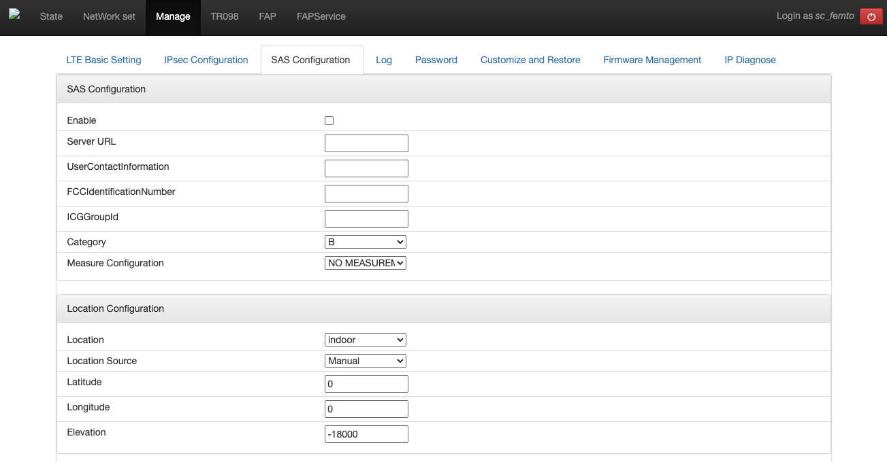
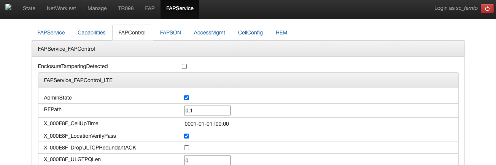

..
   SPDX-FileCopyrightText: © 2020 Open Networking Foundation <support@opennetworking.org>
   SPDX-License-Identifier: Apache-2.0

================
eNB Installation
================
This section describes how to install and configure the Sercomm eNB
which is the default eNB device for Aether/Pronto project.

.. _enb-installation:

Preliminaries
=============
Prepare the following devices:

* Sercomm eNB
* 10GbE SFP+ to 1/10GbE copper media converter
* Workstation to remotely access and configure the eNB

Collect the following information:

* eNB IP address
* MME IP address (10.168.0.6 by default)
* TAC
* Cell ID

.. warning::

  ``Cell ID`` and ``TAC`` are critical parameters and the values must
  be assigned the by OPs team.

Connect the eNB
===============

Connect the eNB to the fabric switch through the media converter and power on,
then it will automatically get pre-configured IP address using DHCP.
Verify that you can access the web-based configuration(`https://<eNB IP>`) from your workstation.
If the eNB address is not directly reachable, use the management server as a jump host.

The default credentials for the Sercomm eNB are:

* Username: ``sc_femto``
* Password: ``scHt3pp`` (or ``sc_femto``)

.. image:: images/enb-sercomm-home.png
  :width: 800

LTE configuration
=================

Go to **Manage > LTE Basic Settings** tab and change the parameters as shown below.
Click ``Save`` at the bottom after making the changes.

.. image:: images/enb-sercomm-lte.png
  :width: 800
  :alt: Sercomm eNB UI LTE configuration page

* Carrier Number: `2`
* Carrier Aggregation: `unchecked`
* BandWidth: `20`
* FrequencyBand: `48,48`
* EARFCN: `55440,55640`
* CellIdentity: `assigned Cell ID`
* PCI: `100,101`
* TxPower: `20`
* Tunnel Type: `IPv4`
* MME IP Address: `10.168.0.6`
* TAC: `assigned TAC`
* PLMNID: `315010`
* Sync Source: `FREE_RUNNING`
* Enable CWMP: `unchecked`

SAS configuration
=================

Go to **Manage > SAS Configuration** tab and change the parameters as shown below.
Click ``Save`` at the bottom after making the changes.

* Location: `Indoor`
* Location Source: `Manual`
* Latitude: `0`
* Longitude: `0`
* Elevation: `-18000`

Other Settings
==============

Go to **TR098 > SysPara** tab and set ``fsminitd`` parameter setting to ``2``.
Click ``Modify`` button right next to the parameter value, and ``Save`` button at the bottom.

.. image:: images/enb-sercomm-syspara.png
  :width: 800

Go to **FAPService > FAPControl** tab and check the box next to the ``AdminState``.
Click ``Save`` button at the bottom after making the change.

Reboot the eNB
==============

Reboot the eNB to make all changes take effect.

Troubleshooting
===============

Connectivity check
^^^^^^^^^^^^^^^^^^
In order to check the connectivity, we can use the Sercomm eNB admin UI.
Go to **Manage > IP Diagnose** tab.

.. image:: images/enb-sercomm-ip-diagnose.png
  :width: 800
  :alt: Sercomm eNB UI IP Diagnose page

In this page, check the ``ping`` menu, put IP address to test in the text box, and click ``Run`` button.
After a few seconds, we can see the ping results.
