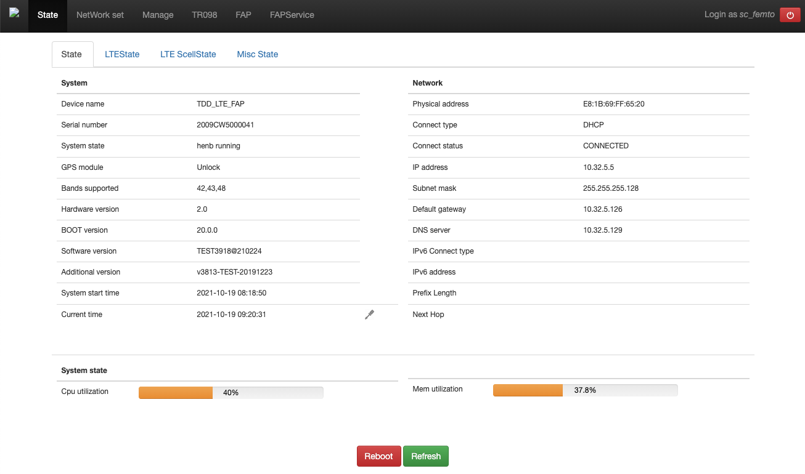
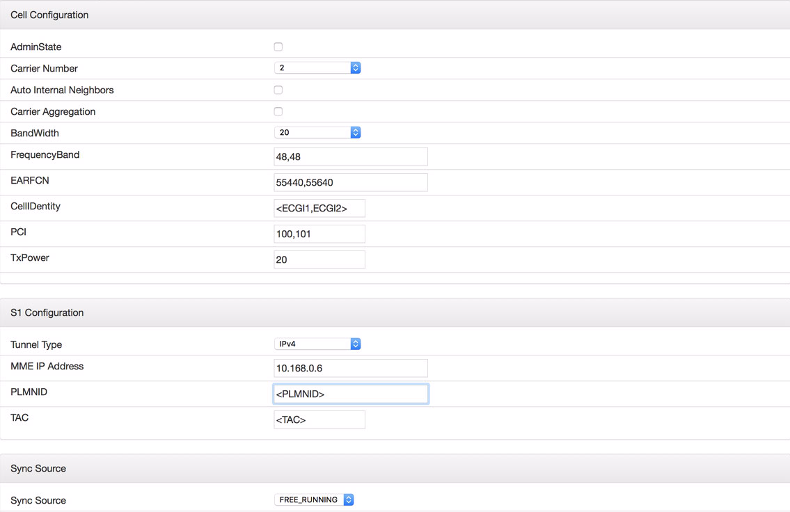
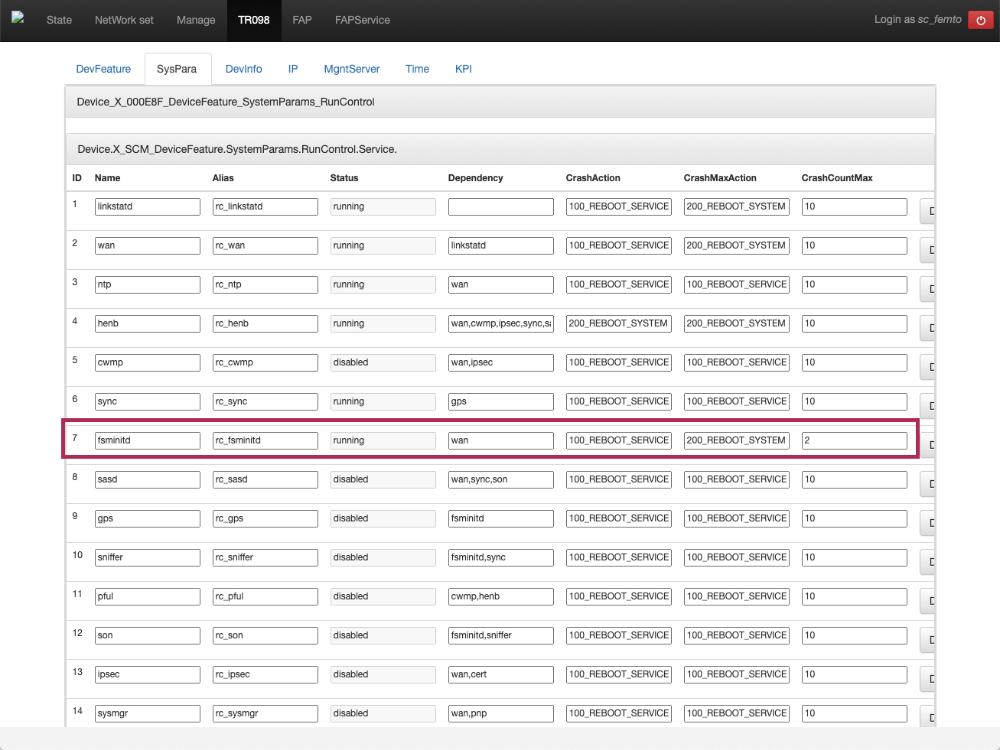
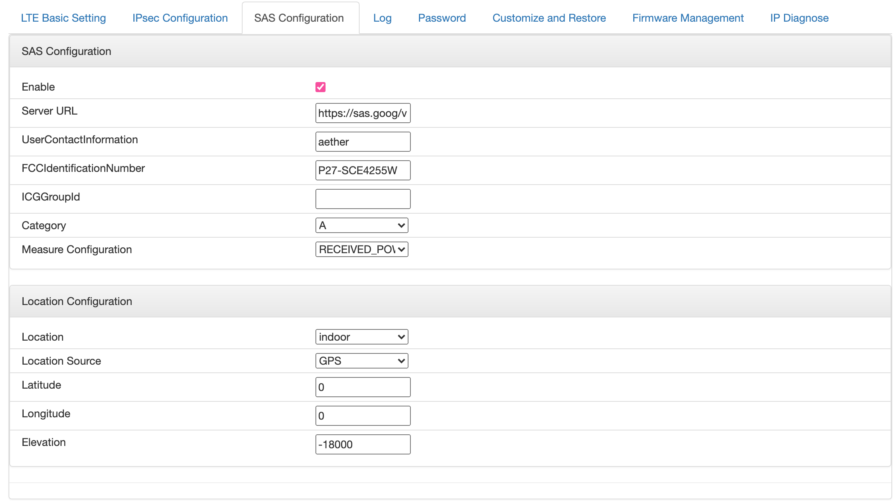
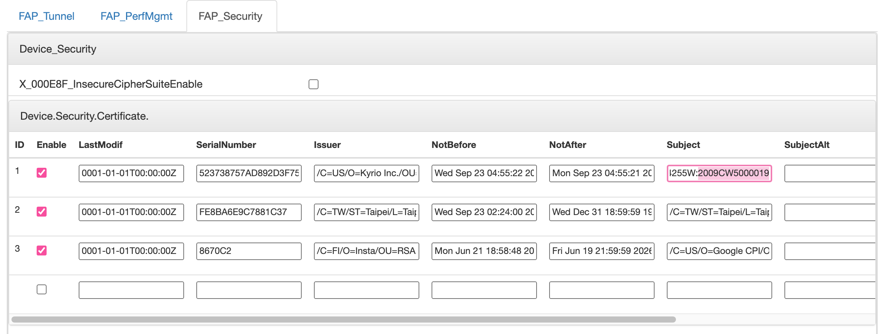
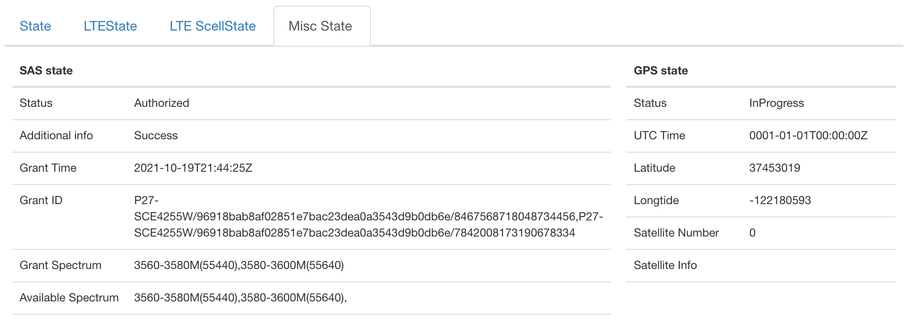
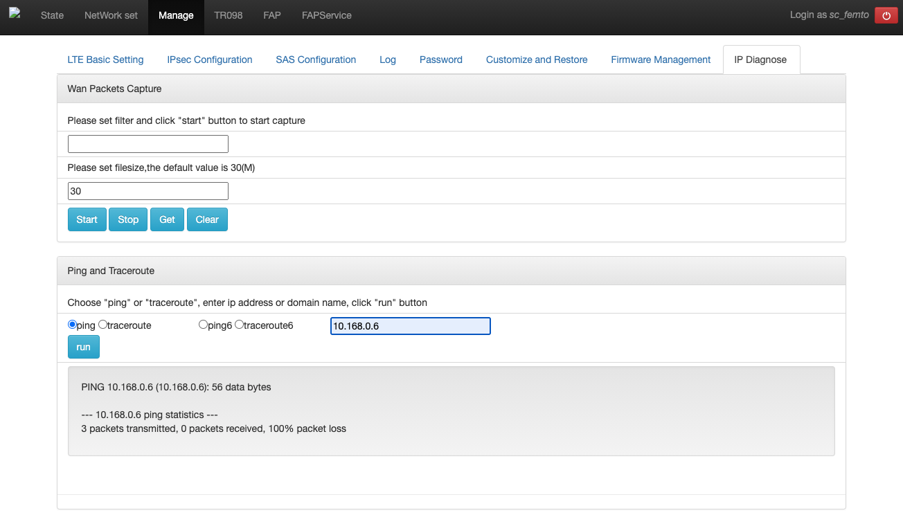

..
   SPDX-FileCopyrightText: © 2020 Open Networking Foundation <support@opennetworking.org>
   SPDX-License-Identifier: Apache-2.0

eNB Installation
================

This section describes how to install and configure the Sercomm eNB which is
the default eNB device in Aether.

.. _enb-installation:

Preliminaries
-------------

Prepare the following devices:

* Sercomm eNB
* GPS Antenna
* 10GbE SFP+ to 1/10GbE copper media converter
* PoE+ Injector
* Workstation to remotely access and configure the eNB

Collect the following information:

* eNB IP address
* MME IP address (10.168.0.6 by default for Aether Central)
* TAC
* Cell ID

.. warning::
  ``Cell ID`` and ``TAC`` are critical parameters and the values must
  be assigned the by OPs team.

Connect the eNB
---------------

The Sercomm eNB has two Ethernet ports (``WAN`` and ``LAN``), one power port,
and one GPS port. The ``WAN`` port support Power over Ethernet (PoE+).

Connect a GPS Antenna to the eNB and place is in a location where it has
visibility to the open sky, such as a window or skylight.

Connect the eNB to the fabric switch through a media converter and PoE+
Injector to the ``WAN`` port of the eNB, then it will automatically get
pre-configured IP address using DHCP.

Verify that you can access the web-based configuration(``https://<eNB IP>``)
from your workstation.  If the eNB address is not directly reachable, use the
management server as a jump host - this can be done using ssh::

  ssh user@jumphost -L 8443:<eNB IP>:443

then visiting ``https://localhost:8443``

The default credentials for the Sercomm eNB are:

* Username: ``sc_femto``
* Password: ``scHt3pp`` (may also be ``sc_femto``)

LTE configuration
-----------------

Go to **Manage > LTE Basic Settings** tab and change the parameters as shown below.

Click ``Save`` at the bottom after making the changes.

* Carrier Number: ``2``
* Carrier Aggregation: ``unchecked``
* BandWidth: ``20``
* FrequencyBand: ``48,48``
* EARFCN: ``55440,55640``
* CellIdentity: ``assigned Cell ID``
* PCI: ``100,101``
* TxPower: ``20``
* Tunnel Type: ``IPv4``
* MME IP Address: ``10.168.0.6``
* TAC: ``assigned TAC``
* PLMNID: ``315010``
* Sync Source: ``FREE_RUNNING``
* Enable CWMP: ``unchecked``

Other Settings
--------------

Go to **TR098 > SysPara** tab and set ``fsminitd`` parameter setting to ``2``.
Click ``Modify`` button right next to the parameter value, and ``Save`` button at the bottom.

Connect the Sercomm eNB to the Google SAS
-----------------------------------------

Configure the SAS parameters by going to the **Manage > SAS Configuration**
tab.  Configure the following parameters:

* Enable: checked
* Server URL: ``https://sas.goog/v1.2/``
* UserContactInformation: ``aether``
* FCCID: ``P27-SCE4255W`` (It can be find on the device)
* Category: ``A``
* Measure Configuration: ``RECEIVED_POWER_WITHOUT_GRANT``

Make a note of the eNB's GPS coordinates, as they are used later

.. note::
   The Sercomm eNB multiplies the GPS coordinates by 1000000, and the height in
   meters by 1000 in it's UI.

Next, go to the **FAP > FAP_Security** section.  This will list security
certificates installed on the eNB, and will provide both the device Serial
Number and the certificate subject.  On the first line copy the ``Subject``
field, which should have content similar to ``/C=TW/O=Sercomm/OU=WInnForum CBSD
Certificate/CN=P27-SCE4255W:2009CW5000019``.

For the SAS to trust the CBSD, it must receive signed CPI data specific to the
device.  To create this data, duplicate the ``example.json`` as
``DEVICE_SERIAL_NUMBER.json``, and update the content to match eNB's settings.

The signing tool `cbrstools/cpisign.py
<https://gerrit.opencord.org/plugins/gitiles/cbrstools/+/refs/heads/master/cpisign.py>`_
script will sign CPI data.

This script requires a CBRS CPI key (``.p12`` format) and associated password
to be run - an example invocation::

   $ python cpisign.py -k YOUR_CPI_KEY.p12 DEVICE_SERIAL_NUMBER.json

It will prompt for your CPI key password when run, and will generate a signed
file in ``output/`` folder, named with the serial number.

Next, go to the **FAPService > FAPControl** tab , and in the
**FAPService_FAPControl_LTE** section set these fields:

* AdminState: checked

In the **FAPService_FAPControl_LTE_X_000E8F_SAS** section, configure the
following information in fields:

* CPIEnable: checked
* Enable: checked
* ManufacturerPrefixEnable: checked
* Server: <should have the SAS URL filled in>
* CPIId: <CPI_ID_from_certificate>
* CPIName: <CPI_name>
* HeightType: ``AGL``
* CPISignatureData: <generated_output_from_python_script>
* Location: ``indoor``
* AntennaAzimuth, AntennaDowntilt, AntennaGain, AntennaBeamwidth: same as
  SERIAL_NUMBER.json

* CertSubject: ``/C=TW/O=Sercomm/OU=WInnForum CBSD
  Certificate/CN=P27-SCE4255W:2009CW50000...`` (from previous step)

Then click ``Save``, and go to the power icon at top right and tell the eNB to restart.

Once restarted, check the **State > Misc State** tab to verify that the device
is registered with SAS.

Verify that the eNB is correctly registered on the SAS website.

Troubleshooting
---------------

Connectivity check
""""""""""""""""""

In order to check the connectivity, we can use the Sercomm eNB admin UI.

Go to **Manage > IP Diagnose** tab

In this page, check the ``ping`` menu, put an IP address to test in the text
box, and click ``Run`` button.

After a few seconds the ping results will be displayed.

eNB SAS log shows failed state
""""""""""""""""""""""""""""""

Usually this is because of a configuration mismatch between the eNB config and
CPI signature data. Check in **Manage > Log > sas.log** and look for
information returned by the SAS.

eNB SAS log disappears
""""""""""""""""""""""

When the eNB runs out of space due to log messages, the sas daemon will not
run. Clear the log by clicking ``ClearLog`` at the bottom of the log page.

eNB SAS log shows errors
""""""""""""""""""""""""

If the sas.log shows a message like ``failed to open file
/var/conf/sas/cpi.key`` there is likely something wrong with the configuration.
Check the following:

* ``CPISignatureData`` field - data is larger than the field size, could be
  entered twice.

* Check that the location and other data that is signed by the CPI key matches
  the data in the eNB UI.
