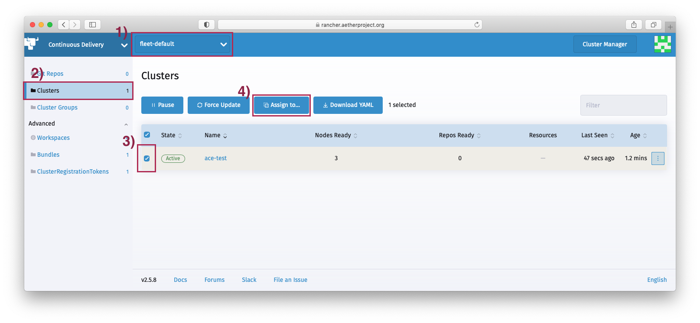

..
   SPDX-FileCopyrightText: © 2020 Open Networking Foundation <support@opennetworking.org>
   SPDX-License-Identifier: Apache-2.0

Runtime Deployment
==================

This section describes how to install and configure Aether Edge Runtime including Kubernetes
and system level applications listed below.

* ``sealed-secrets``
* ``rancher-monitoring``
* ``fluent-bit``
* ``opendistro-es``
* ``hostpath-provisioner``
* ``edge-maintenance-agent``
* ``sriov-device-plugin``
* ``uedns``

For this, we will be using GitOps based CI/CD systems and what you will need to do is
create patches in Aether GitOps repositories, **aether-pod-configs** and **aether-app-configs**,
to provide cluster and application configurations to the CI/CD systems.

.. attention::

   If you skipped VPN bootstrap step and didn't add the deployment jobs for the new edge,
   go to :ref:`Add deployment jobs <add_deployment_jobs>` step and finish it first
   before proceeding.

K8S cluster deployment
----------------------

Download ``aether-pod-configs`` repository if you don't have it already in
your development machine.

.. code-block:: shell

   $ cd $WORKDIR
   $ git clone "ssh://[username]@gerrit.opencord.org:29418/aether-pod-configs"

.. attention::

   If you skipped VPN bootstrap step and didn't update global resource maps for the new edge,
   go to :ref:`Update global resource maps <update_global_resource>` step and
   finish ``cluster_map.tfvars`` and ``user_map.tfvars`` update first before proceeding.

Run the following commands to automatically generate Terraform configurations needed to
create a new cluster in `Rancher <https://rancher.aetherproject.org>`_ and add the servers
and switches to the cluster.

.. code-block:: shell

   # Create ace_cofig.yaml file if you haven't yet
   $ cd $WORKDIR/aether-pod-configs/tools
   $ cp ace_config.yaml.example ace_config.yaml
   $ vi ace_config.yaml
   # Set all values

   $ make runtime
   Created ../production/ace-test/provider.tf
   Created ../production/ace-test/cluster.tf
   Created ../production/ace-test/rke-bare-metal.tf
   Created ../production/ace-test/addon-manifests.yml.tpl
   Created ../production/ace-test/project.tf
   Created ../production/ace-test/member.tf
   Created ../production/ace-test/backend.tf
   Created ../production/ace-test/cluster_val.tfvars

.. attention::

  If the cluster has an even number of compute nodes, edit **cluster_val.tfvars**
  file so that only the odd number of nodes have **etcd** and **controlplane**
  roles.

Create a review request.

.. code-block:: shell

   $ cd $WORKDIR/aether-pod-configs
   $ git add .
   $ git commit -m "Add test ACE runtime configs"
   $ git review

Once your review request is accepted and merged, Aether CI/CD system starts to deploy K8S.
Wait until the cluster status changes to **Active** in `Rancher <https://rancher.aetherproject.org>`_.
It normally takes 10 - 15 minutes depending on the speed of the container images
download at the edge.

It is also a good idea to check the system pod status after successful K8S deployment.
To do so, login to Rancher, open the cluster that you just deployed in the **Global** view, and click
**Launch kubectl** button. You can interact with the cluster using the window that opens.
Run the following commands and make sure all pods are ``Running``.

.. code-block:: shell

  # Run kubectl commands inside here
  # e.g. kubectl get all
  > kubectl get po -A

System Application Deployment
-----------------------------

For the system application deployment, we will be using Rancher's built-in GitOps tool, **Fleet**.
Fleet uses a git repository as a single source of truth to manage applications in the clusters.
For Aether, **aether-app-configs** is the repository where all Aether applications
are defined.

Most of the Aether system applications do not require cluster specific configurations,
except **rancher-monitoring** and **uedns**.
For these applications, you will have to manually create custom configurations and
commit them to aether-app-configs.

First, download ``aether-app-configs`` if you don't have it already in your development machine.

.. code-block:: shell

   $ cd $WORKDIR
   $ git clone "ssh://[username]@gerrit.opencord.org:29418/aether-app-configs"

Configure rancher-monitoring
""""""""""""""""""""""""""""

Open ``fleet.yaml`` under ``infrastructure/rancher-monitoring``, add a custom target
with the new cluster name as a selector, and provide cluster specific Helm values and
kustomize overlay directory path like below.

.. code-block:: yaml

   $ cd $WORKDIR/aether-app-configs/infrastructure/rancher-monitoring
   $ vi fleet.yaml
   # add following block at the end
   - name: ace-test
     clusterSelector:
       matchLabels:
         management.cattle.io/cluster-display-name: ace-test
     helm:
       values:
         prometheus:
           prometheusSpec:
             additionalAlertRelabelConfigs:
               - source_labels: [__address__]
                 target_label: cluster
                 replacement: ace-test
     kustomize:
       dir: overlays/prd-ace

.. note::

   Above step will not be required in Rancher v2.6 as it supports using cluster labels as helm values in a list.

Configure ``ue-dns``
""""""""""""""""""""

For UE-DNS, it is required to create a Helm values file for the new cluster.
You'll need cluster domain and ``kube-dns`` ClusterIP. Both can be found in
``aether-pod-configs/production/cluster_map.tfvars``.
Be sure to replace ``[ ]`` in the example configuration below to the actual cluster values.

.. code-block:: yaml

   $ cd $WORKDIR/aether-app-configs/infrastructure/coredns
   $ mkdir overlays/prd-ace-test
   $ vi overlays/prd-ace-test/values.yaml
   # SPDX-FileCopyrightText: 2021-present Open Networking Foundation <info@opennetworking.org>

   serviceType: ClusterIP
   service:
     clusterIP: [next address of the kube-dns ip]
   servers:
     - zones:
         - zone: .
       port: 53
       plugins:
         - name: errors
         - name: health
           configBlock: |-
             lameduck 5s
         - name: ready
         - name: prometheus
           parameters: 0.0.0.0:9153
         - name: forward
           parameters: . /etc/resolv.conf
         - name: cache
           parameters: 30
         - name: loop
         - name: reload
         - name: loadbalance
     - zones:
         - zone: aetherproject.net
       port: 53
       plugins:
         - name: errors
         - name: rewrite continue
           configBlock: |-
             name regex (.*)\.aetherproject.net {1}.svc.[cluster domain]
             answer name (.*)\.svc\.[cluster domain] {1}.aetherproject.net
         - name: forward
           parameters: . [kube-dns ip]
           configBlock: |-
             except kube-system.svc.[cluster domain] aether-sdcore.svc.[cluster domain] tost.svc.[cluster domain]
         - name: cache
           parameters: 30

Next, update ``fleet.yaml`` under ``infrastructure/coredns`` so that Fleet can use the custom configuration
you just created when deploying UE-DNS to the cluster.

.. code-block:: yaml

   $ cd $WORKDIR/aether-app-configs/infrastructure/coredns
   $ vi fleet.yaml
   # add following block at the end
   - name: prd-ace-test
     clusterSelector:
       matchLabels:
         management.cattle.io/cluster-display-name: ace-test
     helm:
       valuesFiles:
         - overlays/prd-ace-test/values.yaml

Submit your changes.

.. code-block:: shell

   $ cd $WORKDIR/aether-app-configs
   $ git status
   $ git add .
   $ git commit -m "Add test ACE application configs"
   $ git review

Assign Fleet workspace
""""""""""""""""""""""

By default, all new clusters are assigned to a default Fleet workspace called **fleet-default**.
To make a cluster part of Aether and have the applications defined in aether-app-configs deployed,
you must assign the cluster to either **aether-stable** or **aether-alpha** workspace.
For clusters expecting minimal downtime, assign to **aether-stable**.
For clusters for development or previewing upcoming release, assign to **aether-alpha**.

Workspace assignment can be done from Fleet dashboard.

To access Fleet dashboard, log in to `Rancher <https://rancher.aetherproject.org>`_ as
``admin`` or ``onfadmin`` user, go to the **Cluster Explorer**,
and click **Cluster Explorer > Continuous Delivery** in the top left dropdown menu.
Now, perform the following steps to assign the new cluster to one of the Aether workspaces.

1) Click the second dropdown menu from the left at the top and switch the current workspace
   to **fleet-default**.
2) Click **Clusters** on the left menu.
3) Select the cluster.
4) Click **Assign to...** button and choose **aether-stable** or **aether-alpha**
   in from the popup menu.

To verify, switch the current workspace to the workspace the cluster is assigned to,
click **Clusters** in the left menu, and check if the cluster exists.
Wait for the system application deployment to complete and the cluster state
to become **Active**.

.. attention::

   Ignore BESS UPF failure at this point if BESS UPF is enabled.
