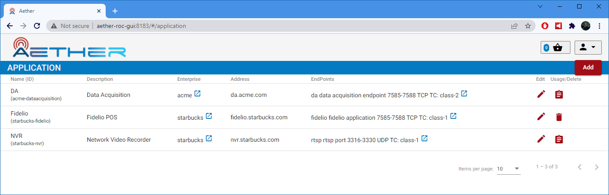
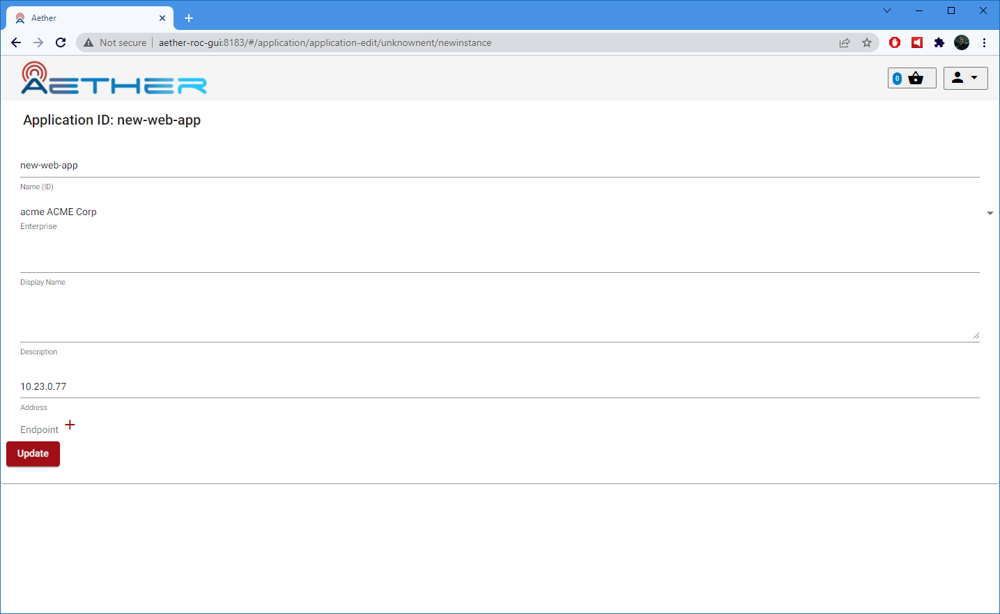
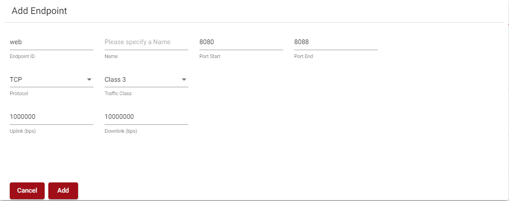
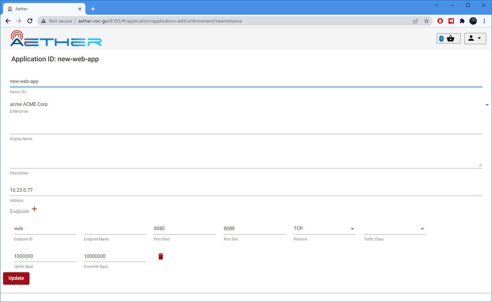
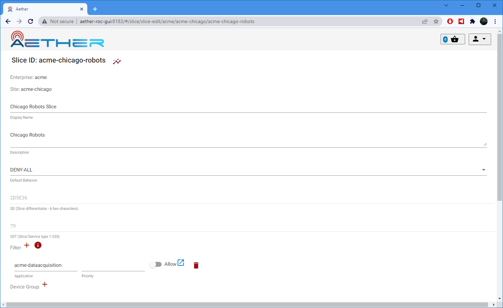
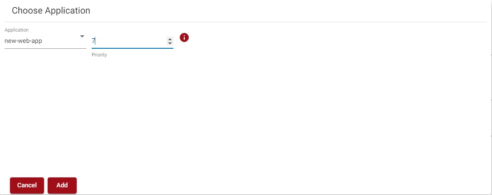

..
   SPDX-FileCopyrightText: © 2020 Open Networking Foundation <support@opennetworking.org>
   SPDX-License-Identifier: Apache-2.0

.. _application:

Application Management
======================

Aether allows configuration of the application endpoints that a
device is allowed to connect to. Configuration is possible of not only whether an
application endpoint is reachable or not, but also what maximum bitrate and traffic
class should be associated with that endpoint.

A Slice may have a total of five user-defined application endpoints associated with it. Logically
this could be one application with five endpoints, five applications with one endpoint
each, or any other combination that is less than or equal to five endpoints total.

Each application has an address field which may be
set to an IPv4 address or an IPv4 subnet, which may in turn match several IPv4
addresses. This address is common to all endpoints for the application.
Each endpoint is a port range, specified by its start and end port. A range of
exactly one port is also acceptable. The protocol may be set to either TCP or UDP. Each
endpoint may also have associated with it a maximum bitrate and a traffic-class. The
maximum bitrate (MBR) is per-device to the application; it is not the sum of all devices to the
application. For more information see the section on :ref:`metering`.

In addition to
these five user configurable endpoints, the default behavior can be set to either
ALLOW-ALL, DENY-ALL, or ALLOW-PUBLIC. ALLOW-PUBLIC is a special rule that denies traffic
to private IPv4 networks (as per RFC1918) and then allows everything else.

Creating Applications
---------------------

Begin by creating Applications. Start by going to the application page, and
clicking the add button.

|app-list|

This will open a page where application details may be specified:

|app-add|

Set the address and then move on to creating endpoints. Press the *+*
button to add an endpoint.

|app-add-endpoint|

Specify the port range, protocol, and optionally the MBR and traffic class for the
endpoint.

Once all endpoints have been added, they will be summarized on the application page. Update
and commit the changes.

|app-add-update|

Adding Applications to Slices
-----------------------------

Each Slice has an application filter, which is a list of applications. Each entry
in this list has a priority and an allow|deny setting. Keep in mind that the total
number of endpoints for all applications attached to the Slice must be less than or
equal to five. Start by opening up the slice and clicking the plus button next to the
Filter list.

|app-filter-slice-edit-filter-plus|

Choose an application and select a priority for it.

|slice-filter-popup|

Also configurable for the Slice is the default-behavior, which will automatically
be evaluated at the lowest priority, only taking effect if no other rule matches.
The default behavior does not count against the 5-endpoint limit.

How Application Filtering is Evaluated
--------------------------------------

Application filtering is evaluated from highest priority (0) to the lowest
priority (250). The first rule to match will have its action applied. Subsequent
rules after a match are not evaluated.

For example, assume the following filter is configured:

* Priority=0, Address=10.0.0.1, Protocol=TCP, Port=8000, Action=Allow
* Priority=1, Address=10.0.0.0/24, Action=Deny
* Default_Behavior = Allow All

The above rule would allow traffic to 10.0.0.1 on TCP port 8000, but deny
traffic to all other hosts on the IPv4 subnet 10.0.0.0/24. Ports other than
8000 on 10.0.0.1 would be denied, as would protocols other than TCP. Traffic to
subnets other than 10.0.0.0/24 would be allowed.

