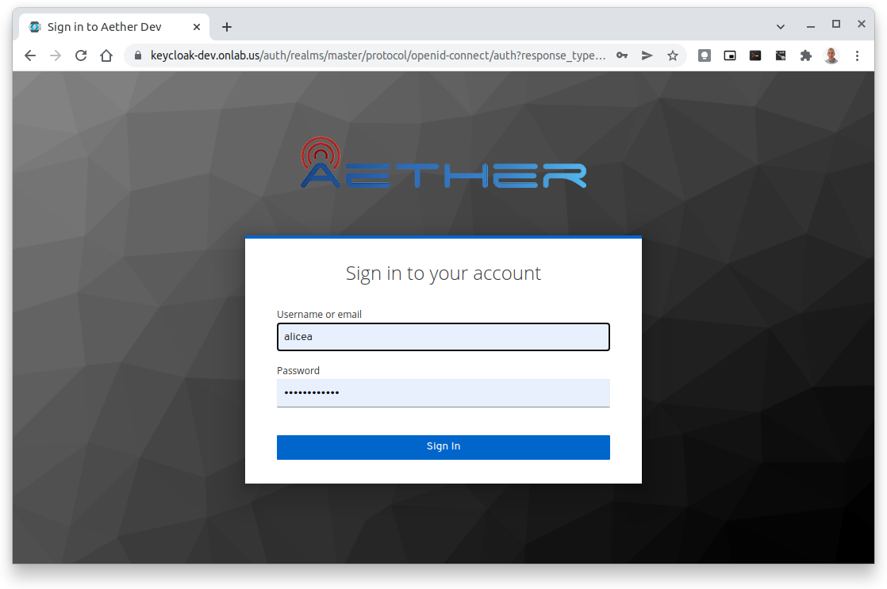
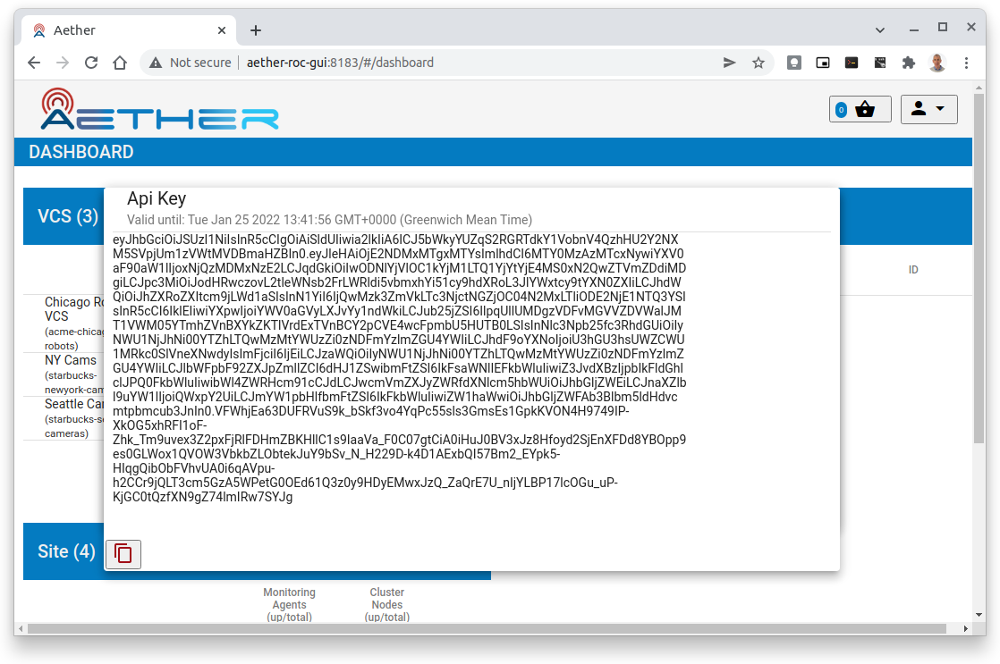

..
   SPDX-FileCopyrightText: © 2020 Open Networking Foundation <support@opennetworking.org>
   SPDX-License-Identifier: Apache-2.0

Aether ROC GUI Basics
=====================

This section documents common aspects and features of the GUI.

.. _committing:

Committing
**********
To commit the changes

#. Click on the **Basket** icon (2nd icon from top right) to see the Basket view
#. Inspect the changes to be committed (optional)
#. Click **Commit** to perform the commit
#. Observe the response that's temporarily displayed that shows the success or failure of the commit

|BASKETVIEW-NEWRANGE|

History
*******
If you are an Aether ROC Administrator, you will be able to see the History of changes, from the *Basket View* by
clicking on the **History** button.

|BASKETVIEW-HISTORY|

.. note:: The *History* button will only be visible if you are in the **AetherROCAdmin** group.

Logging in to the portal
************************
Navigating to the portal URL e.g. ``https://roc.<cluster-ingress-hostname>`` will briefly show
an empty dashboard, before temporarily redirecting to the Authentication server's login
page e.g. ``https://keycloak.ananki.io``

.. note:: The username and password are your Keycloak credentials - if you have forgotten
    your password, please contact the system administrator.

On entering the "username" and "password" you will be redirected to the dashboard.

Clicking the user name in the drop down menu will display your name and the groups you belong to:

.. image:: images/ops-portal-login-details.png
    :width: 800

.. note:: Click on the panel to dismiss it

Clicking on the API Key, shows your Session API Key, along with the time it
expires (in 24 hours time).

Logging out of the portal
*************************

To log out of the portal click the "Sign Out" button at the end of the drop down menu.
This releases all resources and redirects you to the Keycloak Account Management page,
where you will have to click **Sign Out** to terminate the Keycloak session.

.. image:: images/keycloak-account-management.png
    :width: 800

Before you "Sign Out", while still in this screen, it is possible to:

* inspect your **Personal Info**,
* configure ways to sign in
* set up 2 factor authentication
* change your password if required.
* see your device activity

.. note:: To return to the Operations Portal you can simply browse to the Portal's URL, or use the
    browser's back button to return to the dashboard.

.. |BASKETVIEW-NEWRANGE| image:: images/aether-roc-gui-basket-view-new-range.png
    :width: 635
    :alt: Basket View with some changes ready to be committed

.. |BASKETVIEW-HISTORY| image:: images/aether-roc-gui-basket-view-history.png
    :width: 800
    :alt: Basket View with history of last changes
