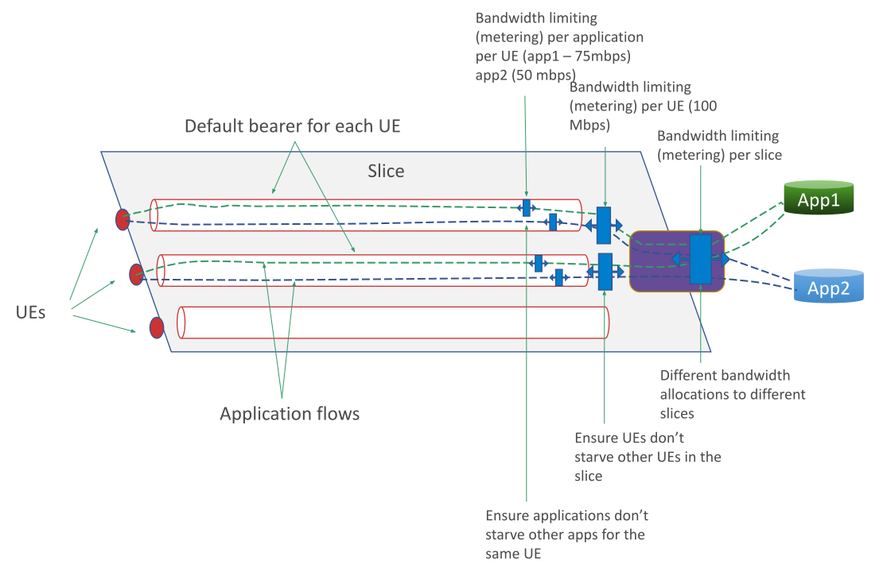

..
   SPDX-FileCopyrightText: © 2020 Open Networking Foundation <support@opennetworking.org>
   SPDX-License-Identifier: Apache-2.0

.. _metering:

QoS Metering
============

Recommendations
---------------

Metering is fully supported, though it is recommended that changes to metering
be avoided unless necessary to meet a specific need. Metering can sometimes lead
to counter-intuitive behavior, such as unexpected limitations in network performance.

Description
-----------

Aether Supports three levels of QoS metering:

* Per-Device-Per-Application. These meters apply to specific flows between devices
  and applications. As a device may connect to many applications, it may have many
  flows, and therefore many different meters may be specified. These meters are
  configured in the Application page of the GUI.

* Per-Device. These meters apply to the aggregate of all flows from a device,
  regardless of the application the device is connecting to. These meters are
  configured in the Device-Group page of the GUI.

* Per-Slice. These meters apply to the aggregate of all flows from all devices to
  all applications within the slice. These meters are configured in the Slice page of the GUI.

These three levels of metering are depicted below:

