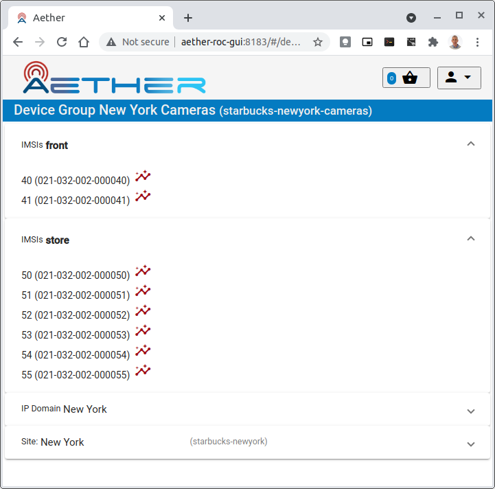
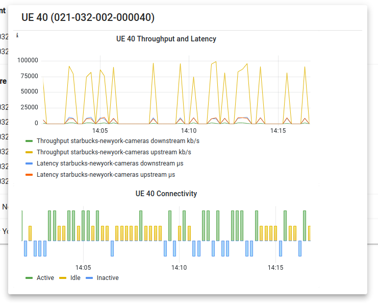
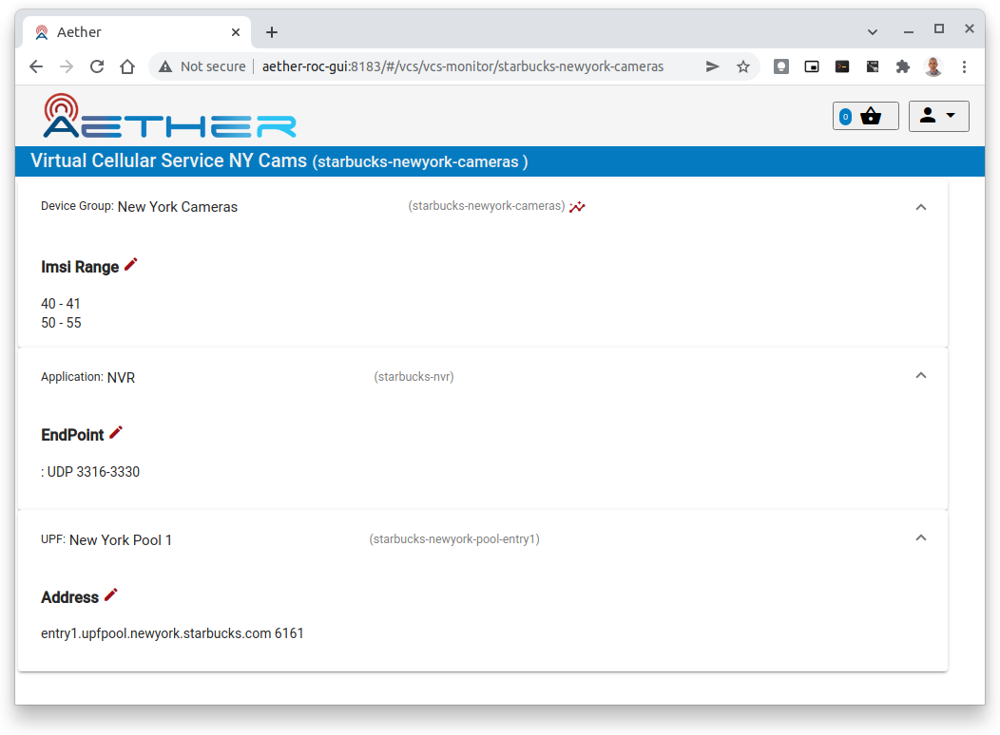

..
   SPDX-FileCopyrightText: © 2020 Open Networking Foundation <support@opennetworking.org>
   SPDX-License-Identifier: Apache-2.0

Monitoring using the GUI
========================

This section documents features built-in to the GUI for monitoring.

.. note:: This section is included because monitoring icons are
  visible in the GUI, but the monitoring feature is not
  currently supported.

.. _monitor_device_group:

Monitoring a DeviceGroup
------------------------

The performance of a Device Group can be monitored in many ways, by clicking its |monitor| (**monitor**) icon:

* From the *Slice Monitor* page, which shows all DeviceGroup's belonging to an Slice.
* From the DeviceGroup List Page - click the |monitor| icon for the DeviceGroup.
* When editing an existing DeviceGroup - in the Edit page, the |monitor| is next to the *id*.

The *monitor* page itself shows:

* An information Panel for each *IMSI Range* in the *DeviceGroup*

    * Each Device has a |monitor| button that allows further drill down
    * Each Device is shown with its fully expanded IMSI number (a combination of *IMSI ID* and *Site* parameters)
* An information panel for the *Site* and *IP Domain* of the *DeviceGroup*

    * Clicking on the down arrow expands each panel

The per Device Monitor panel contains:

* a graph of the Device's Throughput and Latency over the last 15 minutes
* a graph of the Device's connectivity over the last 15 minutes

Monitoring a Slice
------------------

The performance of a Slice can be monitored in many ways, by clicking its |monitor| (**monitor**) icon:

* From the **Dashboard** page, which shows all Slice's belonging to an Enterprise.
* From the Slice List Page - click the |monitor| icon for the Slice.
* When editing an existing Slice - in the Edit page, the |monitor| is next to the *id*

The *monitor* page itself shows:

* A link to the Monitoring page of each Device Group. See :ref:`monitor_device_group`.
* Information panels for each sub-object of the Slice

    * Clicking on the down arrow expands each panel

.. |monitor| image:: images/monitor-icon.png
    :width: 28
    :alt: Monitor icon
