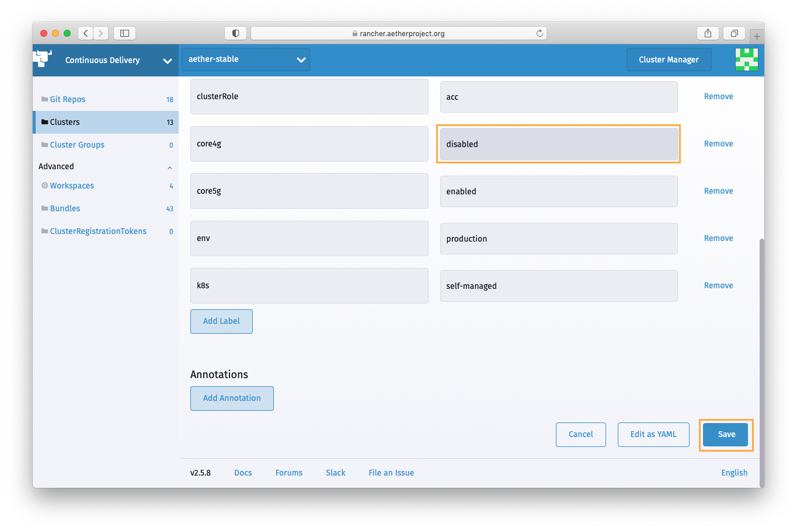

..
   SPDX-FileCopyrightText: © 2020 Open Networking Foundation <support@opennetworking.org>
   SPDX-License-Identifier: Apache-2.0

Other Procedures
================

Edge shutdown procedure
-----------------------

To gracefully shutdown an Aether Edge Pod, follow the following steps:

1. Shutdown the fabric switches using ``shutdown -h now``

2. Shutdown the compute servers using ``shutdown -h now``

3. Shutdown the management server using ``shutdown -h now``

4. The management switch and eNB aren't capable of a graceful shutdown, so no
   steps need to be taken for that hardware.

5. Remove power from the pod.

.. note::

   The shutdown steps can be automated with an :doc:`ad-hoc ansible command
   <ansible:user_guide/intro_adhoc>` and you have an ansible inventory of all
   the systems::

      ansible -i inventory/sitename.ini -b -m shutdown -a "delay=60" all

   The ``delay=60`` argument is to allow hosts behind the management server to
   be reached before the management server shuts down.

Edge power up procedure
-----------------------

1. Restore power to the pod equipment.  The fabric and management switches will
   power on automatically.

2. Turn on the management server using the front panel power button

3. Turn on the compute servers using the front panel power buttons

Restore stateful application procedure
--------------------------------------

.. note::

   PersistentVolumeClaim/PersistentVolume backup and restore is currently only available for ACC and AMP clusters.

1. Download and install Velero CLI following the `official guide <https://velero.io/docs/v1.7/basic-install/#install-the-cli>`_.
   You'll also need ``kubectl`` and ``helm`` command line tools.

2. Download the K8S config of the target cluster from Rancher to your workstation.

3. Open Rancher **Continuous Delivery** > **Clusters** dashboard,
   find the cluster the target application is running on,
   and temporarily update the cluster label used as the target application's cluster selector
   to uninstall the application and prevent it from being reinstalled during the restore process.
   Refer to the table below for the cluster selector labels for the Aether applications.
   It may take several minutes for the application uninstalled.

   +-------------+-----------------+------------------+
   | Application | Original Label  | Temporary Label  |
   +-------------+-----------------+------------------+
   | cassandra   | core4g=enabled  | core4g=disabled  |
   +-------------+-----------------+------------------+
   | mongodb     | core5g=enabled  | core5g=disabled  |
   +-------------+-----------------+------------------+
   | roc         | roc=enabled     | roc=disabled     |
   +-------------+-----------------+------------------+

.. image:: images/rancher-fleet-cluster-label-edit1.png
    :width: 753

4. Clean up existing PVC and PV for the application. In this guide, Cassandra is used as an example.

.. code-block:: shell

   # Assume that we lost all HSSDB data
   $ kubectl exec cassandra-0 -n aether-sdcore-4g -- cqlsh $cassandra_ip -e 'select * from vhss.users_imsi'
   <stdin>:1:InvalidRequest: code=2200 [Invalid query] message="Keyspace vhss does not exist"

   # Confirm the application is uninstalled after updating the cluster label
   $ helm list -n aether-sdcore-4g
   (no result)

   # Clean up any remaining resources including PVC
   $ kubectl delete ns aether-sdcore-4g

   # Clean up released PVs if exists
   $ kubectl delete pv $(kubectl get pv | grep cassandra | grep Released | awk '$1 {print$1}')

5. Find a backup to restore.

.. code-block:: shell

   # Find the relevant backup schedule name
   $ velero schedule get
   NAME                          STATUS    CREATED             SCHEDULE    BACKUP      TTL          LAST BACKUP   SELECTOR
   velero-daily-cassandra        Enabled   2021-10-11 15:33:30 -0700 PDT   0 7 * * *   720h0m0s     11h ago       app=cassandra
   velero-daily-mongodb          Enabled   2021-10-11 15:33:30 -0700 PDT   0 7 * * *   720h0m0s     11h ago       app.kubernetes.io/name=mongodb
   velero-daily-opendistro-es    Enabled   2021-10-11 15:33:30 -0700 PDT   0 7 * * *   720h0m0s     11h ago       app=opendistro-es
   velero-daily-prometheus       Enabled   2021-10-11 15:33:30 -0700 PDT   0 7 * * *   720h0m0s     11h ago       app=prometheus

   # List the backups
   $ velero backup get --selector velero.io/schedule-name=velero-daily-cassandra
   NAME                                    STATUS      ERRORS   WARNINGS   CREATED                         EXPIRES   STORAGE LOCATION   SELECTOR
   velero-daily-cassandra-20211012070020   Completed   0        0          2021-10-12 00:00:41 -0700 PDT   29d       default            app=cassandra
   velero-daily-cassandra-20211011070019   Completed   0        0          2021-10-11 00:00:26 -0700 PDT   28d       default            app=cassandra
   ...

   # Confirm the backup includes all the necessary resources
   $ velero backup describe velero-daily-cassandra-20211012070020 --details
   ...
   Resource List:
     v1/PersistentVolume:
       - pvc-50ccd76e-3808-432b-882f-8858ecebf25b
       - pvc-67f82bc9-14f3-4faf-bf24-a2a3d6ccc411
     v1/PersistentVolumeClaim:
       - aether-sdcore-4g/data-cassandra-0
       - aether-sdcore-4g/data-cassandra-1
       - aether-sdcore-4g/data-cassandra-2

6. Update the backup storage location to read-only mode to prevent backup object from being created or
   deleted in the backup location during the restore process.

.. code-block:: shell

   $ kubectl patch backupstoragelocations default \
       --namespace velero \
       --type merge \
       --patch '{"spec":{"accessMode":"ReadOnly"}}'

7. Create a restore with the most recent backup.

.. code-block:: shell

   # Create restore
   $ velero restore create --from-backup velero-daily-cassandra-20211012070020

   # Wait STATUS become Completed
   $ velero restore get
   NAME                                                     BACKUP                                 STATUS       STARTED                         COMPLETED   ERRORS   WARNINGS   CREATED                         SELECTOR
   velero-daily-cassandra-20211012070020-20211012141850     velero-daily-cassandra-20211012070020  Completed    2021-10-12 13:11:20 -0700 PDT   <nil>       0        0          2021-10-12 13:11:20 -0700 PDT   <none>

8. Confirm that PVCs are restored and "Bound" to the restored PV successfully.

.. code-block:: shell

   $ kubectl get pvc -n aether-sdcore
   NAME                STATUS   VOLUME                                     CAPACITY   ACCESS MODES   STORAGECLASS   AGE
   data-cassandra-0    Bound    pvc-50ccd76e-3808-432b-882f-8858ecebf25b   10Gi       RWO            standard       45s
   data-cassandra-1    Bound    pvc-67f82bc9-14f3-4faf-bf24-a2a3d6ccc411   10Gi       RWO            standard       45s
   data-cassandra-2    Bound    pvc-a7f055b2-aab1-41ce-b3f4-c4bcb83b0232   10Gi       RWO            standard       45s

9. Revert the backup storage location to read-write mode.

.. code-block:: shell

   kubectl patch backupstoragelocation default \
     --namespace velero \
     --type merge \
     --patch '{"spec":{"accessMode":"ReadWrite"}}'

10. Revert the cluster label to the original and wait Fleet to reinstall the application.
    It may take several minutes.

.. code-block:: shell

   # Confirm the application is installed
   $$ kubectl get po -n aether-sdcore-4g -l app=cassandra
   NAME          READY   STATUS    RESTARTS   AGE
   cassandra-0   1/1     Running   0          1h
   cassandra-1   1/1     Running   0          1h
   cassandra-2   1/1     Running   0          1h

   # Confirm the data is restored
   $ kubectl exec cassandra-0 -n aether-sdcore -- cqlsh $cassandra_ip -e 'select * from vhss.users_imsi'
   ...
   (10227 rows)
