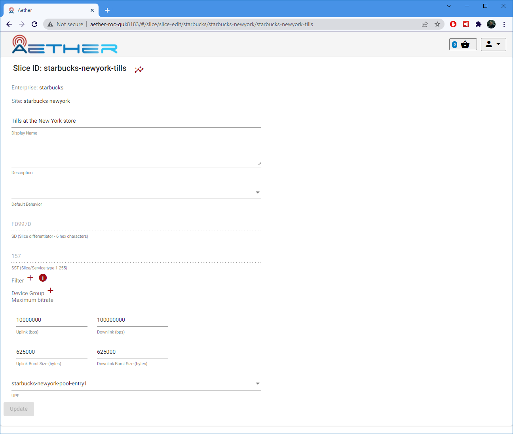
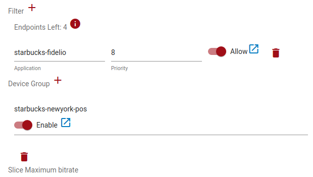

..
   SPDX-FileCopyrightText: © 2020 Open Networking Foundation <support@opennetworking.org>
   SPDX-License-Identifier: Apache-2.0

Slice Management
================

A **Slice** is a unit of network access for a set of UEs with a defined set of
QOS parameters. The following properties are important to the definition of a slice:

* An **Enterprise** and **Site**. Slices always exist within a site
  and an individual slice never spans more than one site.

* One or more **Filter** (Application). See :ref:`application` for
  more information on application filtering.

* One or more **DeviceGroup**. See :ref:`subscriber_device_management`
  for more information on DeviceGroups.

* A User Plane Function (**UPF**). UPFs are provisioned by Aether
  Operations.

* **SD** (slice differentiator) and **SST** (slice/service
  type). These are assigned by Aether Operations.

* **Default Behavior** (for Application Filtering). The default
  behavior is used when no application filtering rules match.

* **Uplink** and **Downlink** maximum bitrate (data rate in
  bps). Slice MBRs are the aggregate of all traffic within the slice
  and may represent the traffic of multiple devices.  For more
  information, see :ref:`metering`.

Provisioning a New Slice
------------------------

This procedure assumes you have already set up one or more
DeviceGroups, containing configuration for a number of UEs. Follow the
procedure in :ref:`configure_device_group` to configure DeviceGroups.

To add a new Slice, click the **Add** button in the Slice List View.

|Slice-LIST|

In the resulting Slice edit page:

#. Enter a Slice ID (this must be unique across the whole system).
#. Enter a Display Name (optional).
#. Enter a Description (optional).
#. Choose an Enterprise (may already have been selected).
#. Choose a Site.
#. Choose a Template.

    * This will copy over values from that template, which may be edited individually at this create stage.
    * They will not be editable afterwards.
#. Accept the Default Behavior, SD and SST or change them.
#. Accept the Maximum Bitrate (MBR) Uplink and Downlink values or change them.
#. Choose a *UPF* from the drop down list.

    * UPFs will previously have been added to a pool - those remaining unused will appear for selection.

|SLICE-ADD|

One or more Filters (Applications) and/or DeviceGroups can be associated with the Slice at this
stage or later, by clicking on the *+* icon.

When chosen, they appear as a list in the Slice edit page, and are automatically enabled/allowed:

|SLICE-EDIT-APP-DG|

Click on the "Update" to add these changes to the *Basket*.

Click the **Commit** in the *Basket View* to commit the changes. See :ref:`committing`.

Editing an Existing Slice
-------------------------
When editing an existing Slice, it will not be possible to change:

* The **id**.
* The **template** or the *SD* or *SST* parameters beneath it.

Existing *Filters* or *DeviceGroups* can be removed by clicking the *trash can* icon next to it.

Alternatively, existing *Filters* or *DeviceGroups* can be *disabled/disallowed* by clicking the slider
next to it. This will have the same effect as disabling it.

.. note:: The *DeviceGroup* or *Filter* and *UPF* here are *references*. If the underlying object is modified, then
    the changes on the Slice will take effect whenever changes to those objects are committed.

Removing a Slice
----------------
Removing a Slice can be achieved by clicking the *trash can* icon next to the Slice in the
Slice List page

|SLICE-LIST|

.. |SLICE-LIST| image:: images/aether-roc-gui-slice-list.png
    :width: 920
    :alt: Slice List View in Aether ROC GUI
