..
   SPDX-FileCopyrightText: © 2020 Open Networking Foundation <support@opennetworking.org>
   SPDX-License-Identifier: Apache-2.0

.. _subscriber_device_management:

Subscriber and Device Management
================================

Subscriber management includes workflows associated with provisioning new subscribers, removing
existing subscribers, and associating subscribers with slices.

.. note:: This section refers to a fully installed Aether GUI,
    properly secured and with Enterprises, Connectivity Services, and
    Sites already configured by a ROC Administrator. The examples
    shown below are taken from an example configuration (the so-called
    MEGA Patch, see :ref:`posting-the-mega-patch`) shipped with the
    ROC.

Provisioning a New Device
-------------------------

Before a Device can be granted connectivity service, it must first be
provisioned. This step is normally performed by your Aether Operations
team.

Each Device is assigned a PLMN and a set of security keys. Depending
on the deployment scenario, these keys might be shared by several
Devices, or they might be unique to each Device. The allocation of
PLMNs and keys is currently performed manually by the Aether
Operations team. This subscriber-related detail is configured via the
SIM Management application, ``simapp``.

As described in the `OnRamp Guide
<https://docs.aetherproject.org/onramp/gnb.html#prepare-ues>`__,
the ``subscribers`` section of the values file needs to be edited to
include the new Device IMSIs:

.. code-block::

   simapp:
    ...
      subscribers:
      - ueId-start: 123456789123458
         ueId-end: 123456789123458
         plmnId: 20893
         opc: 8e27b6af0e692e750f32667a3b14605d
         key: 8baf473f2f8fd09487cccbd7097c6862
         sequenceNumber: 16f3b3f70fc2
      - ueId-start: 123456789123460
         ueId-end: 123456789123465
         plmnId: 20893
         opc: 8e27b6af0e692e750f32667a3b14605d
         key: 8baf473f2f8fd09487cccbd7097c6862
         sequenceNumber: 16f3b3f70fc2

.. _configure_device_group:

Configure Connectivity Service for a New Device
-----------------------------------------------

To activate connectivity service, the following steps are necessary:

1. The Sim-Card for the Device must be created.
2. The Device must be created and associated with the Sim-Card.
3. The Device must be added to a Device-Group.

Create the Sim-Card
"""""""""""""""""""

.. note::
    If Simapp integration has been enabled on the site, then new
    Sim-Cards will automatically be added to the Site as the
    operations staff provisions the SIM Cards. In that case, the
    Sim-Card object will already be present, and this section may be
    skipped.

Start by bringing up the Sim-Card list:

|SIMCARD-LIST|

Click the add button to add a new Sim-Card:

|SIMCARD-ADD|

Select an Enterprise and Site where the Sim-Card will belong.  Give
the Sim-Card a unique ID. You must also set the IMSI for the Sim-Card,
which should have been provided by the operations team. All other
fields, including the ICCID, are optional.  Update and Commit the
changes when you are finished.

Creating the Device
"""""""""""""""""""

To create the Device, start by navigating to the Device list:

|DEVICE-LIST|

Click the add button to add a new Device:

|DEVICE-ADD|

Select an Enterprise and Site where the Device will belong.  Give the
Device a unique ID and select a Sim-Card to associate with the
Device. It is allowed to create the Device with no Sim-Card, in case
you want to associate the Sim-Card at a later date. All other fields,
including the IMEI, are optional.  Update and Commit the changes when
you are finished.

Adding the Device to the Device-Group
"""""""""""""""""""""""""""""""""""""

An Enterprise is typically organized into one or more Sites, and each
Site may contain one or more DeviceGroups. Navigate to the appropriate
DeviceGroup associated with the Site you wish to deploy on, and add
the Device's IMSI to the DeviceGroup.

The Site details can be seen by navigating to the Site list view.

|SITE-LIST|

Navigate to the Device Groups list view to see the list of Device
Groups and their association to Sites.

|DEVICEGROUP-LIST|

In the Device-Group *New York POS* example above lists two devices:
*till-pos-1* and *till-pos-2*.

.. note::
    A Device may participate in at most one DeviceGroup, and that DeviceGroup may
    participate in at most one Slice.

Editing
*******

Edit the DeviceGroup by clicking on the Edit icon, and in the List
page, adjust an existing Device ID range or create a new range (by
clicking on the `+` icon).

|DEVICEGROUP-EDIT|

The Device-Group page includes a list of devices that comprises the
group. Each one may be individually enabled or disabled. Enable or
disable is intended to temporarily limit connectivity; the device can
also be permanently deleted. To add a device to the group, click the
plus symbol next to the device, and then select an available device.

.. note::
   While you are allowed to add a device to multiple device groups, this is not recommended.

When the entries on the DeviceGroup edit page are valid the **Update**
will become available

* Click this to add the changes to the **Basket** of configuration changes.
* Observe that the **Basket** icon (2nd icon from top right) displays the number of changes.

.. note::
    The changes are not committed to **aether-config** until the **Basket** is committed.
    This allows several changes to be gathered together in one transaction and checked before committing.

Remove Connectivity Service from an Existing Device
---------------------------------------------------

Navigate to the DeviceGroup that contains the Device, then remove that
Device from the list. Once finished editing, proceed to the *Basket
View*, inspect the changes, and Commit.

|DEVICEGROUP-EDIT|

.. note::
    The Device may continue to have connectivity until its next detach/attach cycle.

Create a New DeviceGroup
------------------------

DeviceGroups allow Devices to be grouped and configured together. Each
site comes preconfigured with a default DeviceGroup, but additional
DeviceGroups may be created. For example, placing all IP Cameras in an
"my-site-ip-cameras" DeviceGroup would allow you to manage all IP
Cameras as an aggregate.

To add a DeviceGroup, navigate to the list of DeviceGroups and click
`Add` in the upper right.  (This will be grayed out if you do not have
appropriate permissions.)

* Specify a unique **id** for the DeviceGroup. 40 characters max and
  only alphanumeric and `-`, `_` and `.` allowed.

* Choose an *Enterprise* and *Site* from the preconfigured list. It
  will not be possible to add Devices until the Site is chosen.

* Devices can be added at this stage or later.

* As part of the DeviceGroup, you may select a maximum bitrate (MBR)
  that will be used for the devices in the group. This bitrate is
  applied separately to each device within the group; it is not an
  aggregate of all devices within the group. For more information see
  the section on :ref:`metering`.

|DEVICEGROUP-ADD|

Delete a DeviceGroup
--------------------

If a DeviceGroup is no longer needed, it can be deleted. Deleting a
DeviceGroup will not cause the Devices participating in the group to
automatically be moved elsewhere.

.. note::
    If a Device Group is being used by an existing Slice, then it cannot be removed.
    Delete the Slice first, and then the DeviceGroup.

A DeviceGroup can be deleted from the DeviceGroup list view, by
clicking the *trash can* icon next to it. The deletion is added to the
**Basket** directly. Navigate to the *Basket View* to commit the
change.

|DEVICEGROUP-LIST|

Add a DeviceGroup to a Slice
----------------------------

To participate in the connectivity service, a DeviceGroup must be
associated with a Slice.

Navigate to the *Slice* list view to see the list of Slice's and their
associations to DeviceGroups.

|SLICE-LIST|

To edit a *Slice* click on the *edit* button next to it in this list.

This brings up the Slice edit page where (among many other things)
zero, one or many DeviceGroups can be associated with it.

* Click the *trash can* symbol to remove a DeviceGroup from the Slice.

* Click the *+* icon to add a DeviceGroup.

* Click the *Enable* slider to Enable or Disable the
  DeviceGroup. (This is a way of disabling or reenabling the
  DeviceGroup within a Slice without having to remove it.)

|SLICE-EDIT|

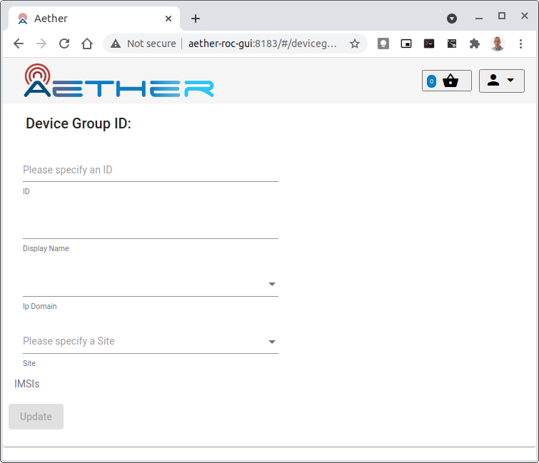

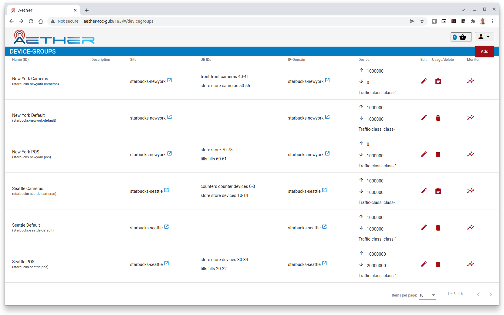

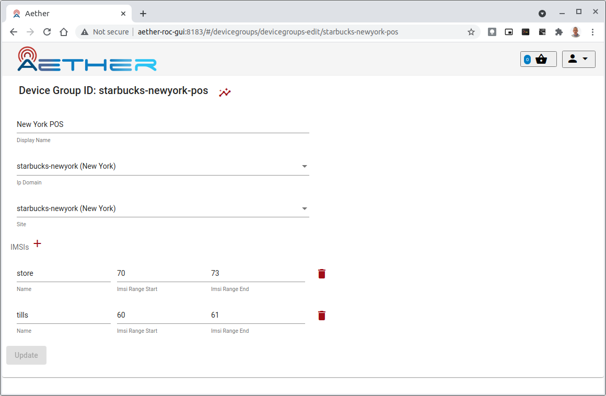

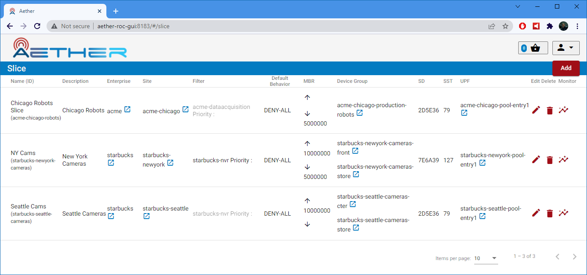

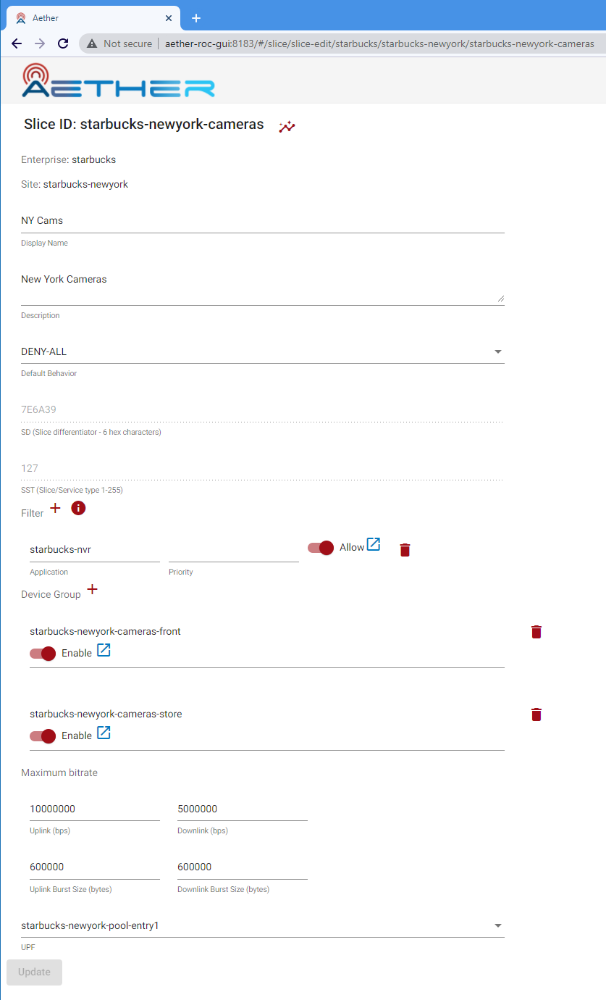

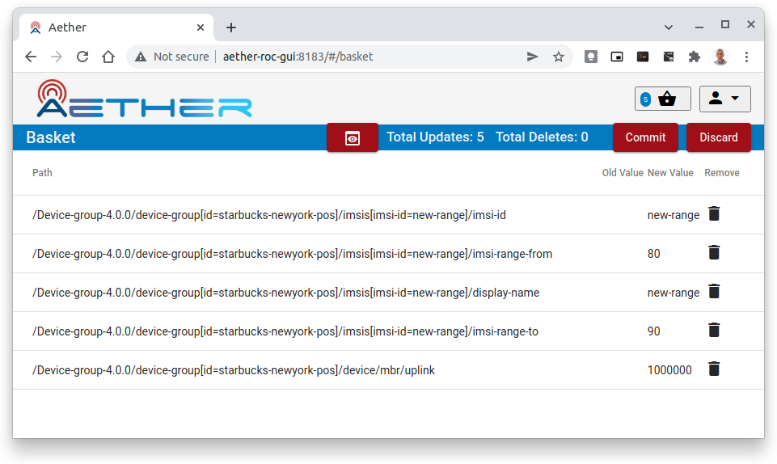

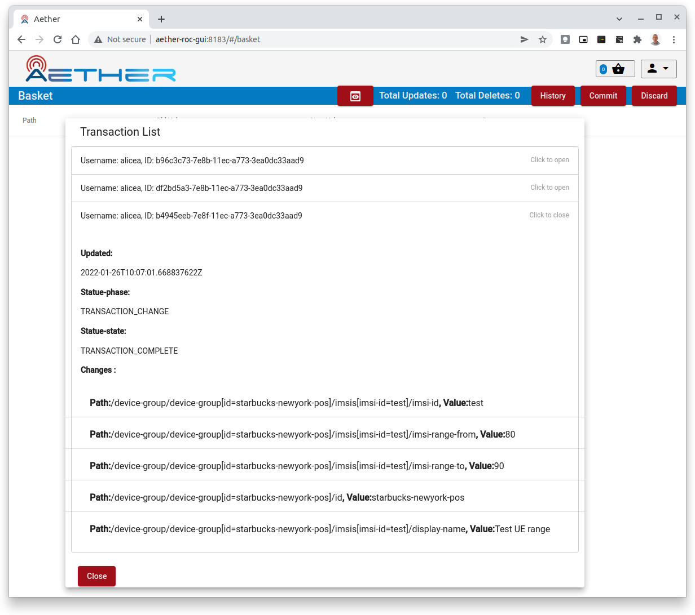

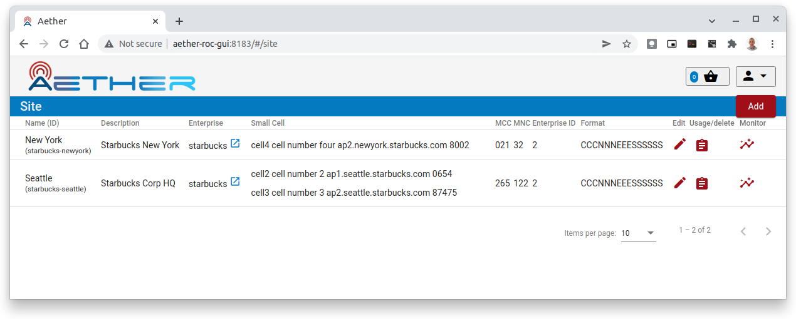

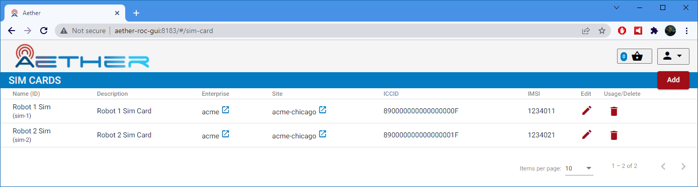

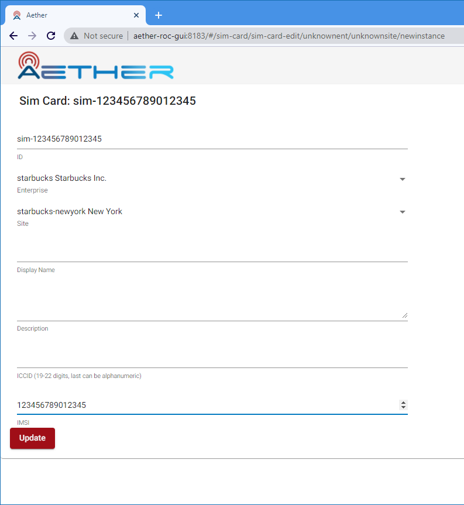

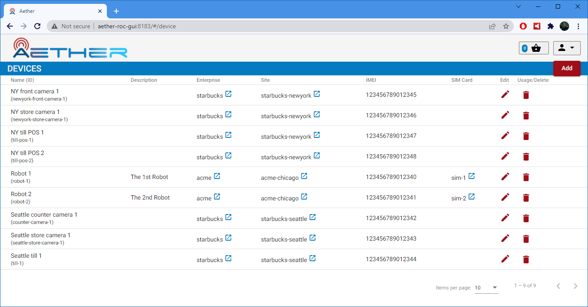

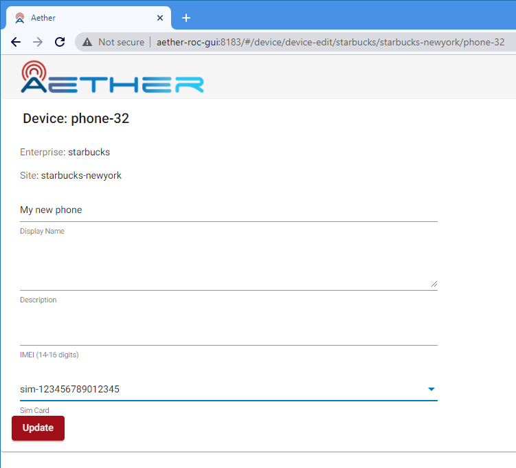
