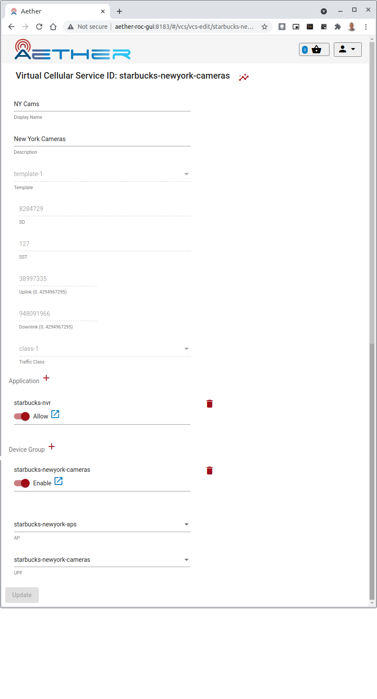

..
   SPDX-FileCopyrightText: © 2020 Open Networking Foundation <support@opennetworking.org>
   SPDX-License-Identifier: Apache-2.0

Subscriber and Connectivity Management
======================================

Subscriber management includes workflows associated with provisioning new subscribers, removing
existing subscribers, and associating subscribers with virtual connectivity services.

.. note::
    This section refers to a fully installed ROC GUI, properly secured and with Enterprises, Connectivity Services
    and Sites already configured by a ROC Administrator. The examples shown below are taken from an example
    configuration shipped with the ROC - the "MEGA Patch" (see :ref:`posting-the-mega-patch`)

Provisioning a new UE
---------------------

Before a UE can be granted connectivity service, it must first be provisioned. This step is normally
performed by Aether Operations.

Each UE is assigned a PLMN and a set of security keys. Depending on the deployment scenario, these
keys might be shared by several UEs, or they might be unique to each UE. The allocation of PLMNs and
keys is currently performed manually by the Aether Operations team. This subscriber-related
detail is configured via the SIM Management application, Simapp.

`simapp.yaml` needs to be adjusted to include the new UE IMSIs to the subscriber list. For example::

    # simapp.yaml
    # ...
    simapp.yaml:
        info:
          version: 1.0.0
          description: SIMAPP initial local configuration
        logger:
          # network function
          APP:
            debugLevel: info
            ReportCaller: false
        configuration:
          provision-network-slice: false
          subscribers:
          - ueId-start: 123456789123458
            ueId-end: 123456789123458
            plmnId: 20893
            opc: 8e27b6af0e692e750f32667a3b14605d
            key: 8baf473f2f8fd09487cccbd7097c6862
            sequenceNumber: 16f3b3f70fc2
          - ueId-start: 123456789123460
            ueId-end: 123456789123465
            plmnId: 20893
            opc: 8e27b6af0e692e750f32667a3b14605d
            key: 8baf473f2f8fd09487cccbd7097c6862
            sequenceNumber: 16f3b3f70fc2

TODO: This file will probably be placed under gitops control once the 5G ROC is deployed. Document
the new location of the file.

Configure Connectivity Service for a new UE
-------------------------------------------

To receive connectivity service, a UE must be added to a DeviceGroup. An Enterprise is typically
organized into one or more Sites, each Site which may contain one or more DeviceGroups. Navigate
to the appropriate DeviceGroup which is associated with the Site you wish to deploy on, and add
the UE's IMSI to the DeviceGroup.

The Site details can be seen by navigating to the Site list view.

.. image:: images/aether-roc-gui-sites-list.png
    :width: 755
    :alt: Sites List View in Aether ROC GUI showing site details

In the ROC GUI, navigate to the Device Groups list view, to see the list of
Device Groups and their association to Sites.

    |DEVICEGROUP-LIST|

In the DeviceGroup *New York POS* example above an Imsi Range **store** of **70-73** will mean the set of Imsi
IDs (when the *format* specifier of the *starbucks-newyork* Site are applied to
its *MCC*, *MNC* and *Enterprise*) of

* 021032002000070 (021-032-002-000070)
* 021032002000071
* 021032002000072
* 021032002000073

.. note::
    For 4G service, a UE may participate in at most one DeviceGroup, and that DeviceGroup may
    participate in at most one VCS. For 5G service, a UE can participate in many DeviceGroups, and each
    DeviceGroup may participate in many VCSes.

Editing
*******
Edit the DeviceGroup by clicking on the Edit icon, and in the Edit page,
adjust an existing range or create a new range (by clicking on the `+` icon).

    |DEVICEGROUP-EDIT|

The following restrictions apply

#. The Imsi ID specified in "from" or "to" is relative to *MCC*, *MNC* and *Enterprise* of the Site.
#. The maximum value of an Imsi ID is defined by the number of **S** characters in the `format` specifier of the Site.
#. Imsi Ranges are contiguous ranges of Imsi IDs. To accommodate non contiguous Imsi IDs, add extra Ranges.
#. Imsi Ranges can have a maximum span of 100 between "from" and "to" Imsi IDs. Break bigger spans in to many ranges.
#. Imsi ranges within a DeviceGroup cannot not overlap.

When the entries on the DeviceGroup edit page are valid the **Update** will become available

* Click this to add the changes to the **Basket** of configuration changes
* Observe that the **Basket** icon (2nd icon from top right) displays the number of changes

.. note::
    The changes are not committed to **aether-config** until the **Basket** is committed.
    This allows several changes to be gathered together in one transaction and checked before committing.

Committing
**********
To commit the changes

#. click on the **Basket** icon (2nd icon from top right) to see the Basket view
#. inspect the changes to be committed (optional)
#. click **commit** to perform the commit
#. observe the response that's temporarily displayed that shows the success or failure of the commit

.. image:: images/aether-roc-gui-basket-view-new-range.png
    :width: 635
    :alt: Basket View with some changes ready to be committed

Remove Connectivity Service from an existing UE
-----------------------------------------------

Using the ROC GUI, navigate to the DeviceGroup that contains the UE,
then remove that UE's IMSI from the list. If you are removing a single UE, and the
DeviceGroup is configured with a range specifier that includes several IMSIs,
then it might be necessary to split that range into multiple ranges.

* If the UE to be removed has an Imsi ID in the middle of an existing Imsi Range:
    click the *trash can* icon next to that *Imsi Range* and
    use the *+* icon to add new Ranges for the remaining Imsi IDs.
* Alternatively if the UE to be removed has an Imsi ID at the start or end of an existing Imsi Range:
    then adjust the *from* or *to* value accordingly.

    |DEVICEGROUP-EDIT|

.. note::
    The UE may continue to have connectivity until its next detach/attach cycle.

Create a new DeviceGroup
------------------------

DeviceGroups allow UEs to be grouped and configured together. Each site comes preconfigured with
a default DeviceGroup, but additional DeviceGroups may be created. For example, placing all IP
Cameras in an my-site-ip-cameras DeviceGroup would allow you to group IP Cameras together.

To add a DeviceGroup, navigate to the list of DeviceGroups and click `Add` in the upper right.
(This may be greyed out if you do not have appropriate permissions).

* Specify a unique **id** for the DeviceGroup
    40 characters max and only alphanumeric and `-`, `_` and `.` allowed
* Choose a *Site* from the list of preconfigured list
    It will not be possible to add Imsi Ranges until the Site is chosen
* Imsi Ranges can be added at this stage or later

.. image:: images/aether-roc-gui-devicegroup-add.png
    :width: 490
    :alt: Adding a new Device Group requires an *id* and choosing a Site

Delete a DeviceGroup
--------------------

If a DeviceGroup is no longer needed, it can be deleted. Deleting a DeviceGroup will not cause
the UEs participating in the group to automatically be moved elsewhere.

.. note::
    If a Device Group is being used by an existing VCS, then it cannot be removed.
    Delete the VCS first, and then the DeviceGroup.

A DeviceGroup can be deleted from the DeviceGroup list view, by clicking the *trash can* icon
next to it. The deletion is added to the **Basket** directly. Navigate to the *Basket View*
to commit the change.

    |DEVICEGROUP-LIST|

Add a DeviceGroup to a Virtual Connectivity Service (VCS)
---------------------------------------------------------

In order to participate in the connectivity service, a DeviceGroup must be associated with
a Virtual Connectivity Service (VCS).

Navigate to the *VCS* list view to see the list of VCS's and their associations to DeviceGroups.

.. image:: images/aether-roc-gui-vcs-list.png
    :width: 920
    :alt: VCS List View in Aether ROC GUI showing DeviceGroup association

To edit a *VCS* click on the *edit* button next to it in this list.

This brings up the VCS edit page where (among many other things) zero, one or many
DeviceGroups can be associated with it.

* Click the *trash can* symbol to remove a DeviceGroup from the VCS
* Click the *+* icon to add a DeviceGroup
* Click the *Allow* slider to Allow or Disallow the DeviceGroup
    This is a way of disabling or reenabling the DeviceGroup within a VCS without having to remove it

Remove a DeviceGroup from a Virtual Connectivity Service (VCS)
--------------------------------------------------------------

The procedure is covered in the above section.

.. |DEVICEGROUP-LIST| image:: images/aether-roc-gui-devicegroups-list.png
    :width: 755
    :alt: Device Groups List View in Aether ROC GUI showing Site association and Imsi Range of all DeviceGroups

.. |DEVICEGROUP-EDIT| image:: images/aether-roc-gui-devicegroup-edit.png
    :width: 755
    :alt: Device Groups Edit View in Aether ROC GUI showing Imsi Range
