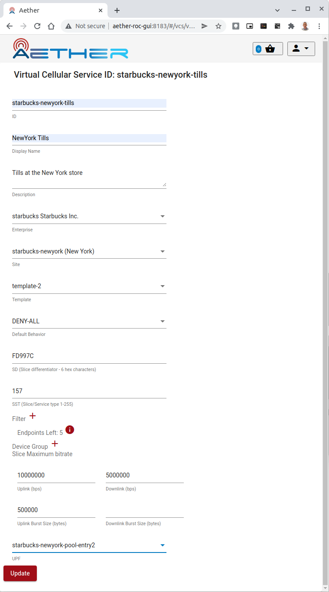
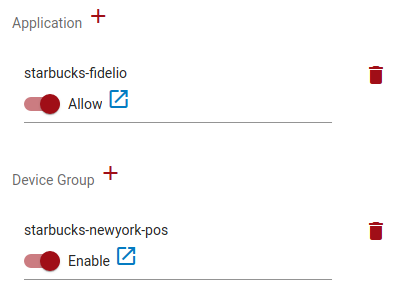
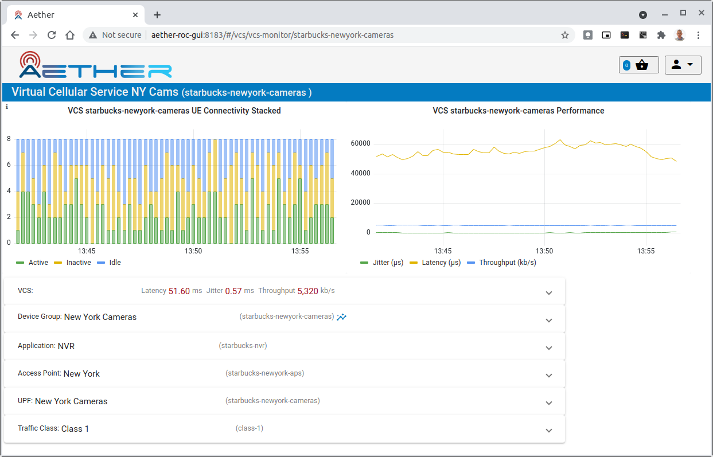
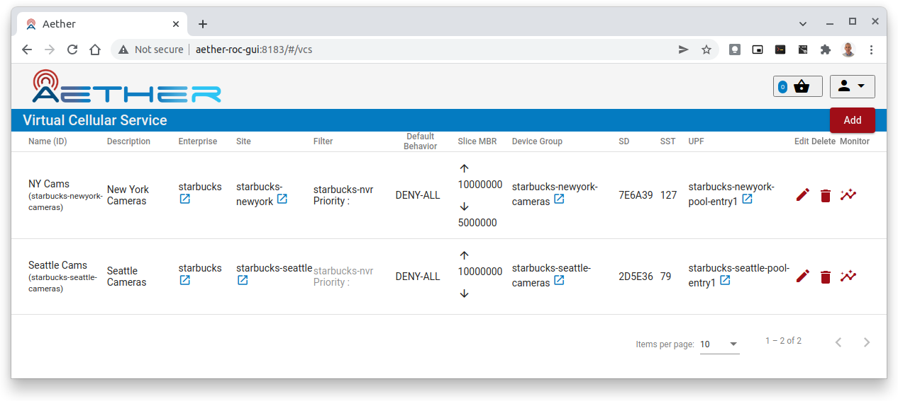

..
   SPDX-FileCopyrightText: © 2020 Open Networking Foundation <support@opennetworking.org>
   SPDX-License-Identifier: Apache-2.0

VCS Management
==============

A **VCS** (Virtual Cellular Service) is a slice of network access for a set of UEs with a defined set of
QOS parameters.

To define a VCS requires it to be associated with:

* one or more **Application**
* one or more **DeviceGroup**
* an **AccessPointList**
* a **UPF**
* a **TrafficClass**

and must also be created with attributes like:

* **SD** (slice differentiator)
* **SST** (slice/service type)
* **Uplink** (data rate in mbps)
* **Downlink** (data rate in mbps)

Provisioning a new VCS
----------------------

.. note::
    This section refers to a fully installed ROC GUI, properly secured and with Enterprises, Connectivity Services
    Applications, and Sites already configured by a ROC Administrator. The examples shown below are taken from an example
    configuration shipped with the ROC - the "MEGA Patch" (see :ref:`posting-the-mega-patch`)

This procedure assumes you have already set up one or more DeviceGroups, containing
configuration for a number of UEs. Follow the procedure in :ref:`configure_device_group`
to configure DeviceGroups.

To add a new VCS, click the **Add** button in the VCS List View.

    |VCS-LIST|

In the resulting VCS edit page:

#. enter a VCS ID (this must be unique across the whole system).
#. enter a Display Name (optional).
#. enter a Description (optional).
#. Choose a template

    * this will copy over values from that template, which may be edited individually at this create stage
    * they will not be editable afterwards.
#. Choose an *Access Point List* from the drop down list.
#. Choose a *UPF* from the drop down list.

One or more Applications and or DeviceGroups can be associated with the VCS at this
stage or later, by clicking on the *+* icon.

When chosen, they appear as a list in the VCS edit page, and are automatically enabled/allowed:

Click on the "Update" to add these changes to the *Basket*.

Click the **Commit** in the *Basket View* to commit the changes. See :ref:`committing`.

Editing an existing VCS
-----------------------
When editing an existing VCS, it will not be possible to change:

* the **id**
* the **template** or any of the parameters beneath it

Existing *Applications* or *DeviceGroups* can be removed by clicking the *trash can* icon next to it.

Alternatively existing *Applications* or *DeviceGroups* can be *disabled/disallowed* by clicking the slider
next to it. This will have the same effect as disabling it.

If one of the *DeviceGroup*s or *Application*s, *Access Point List*, *Traffic Class* or *UPF*
itself is modified, then the changes on the VCS will take effect whenever changes to those
objects are committed.

Removing a VCS
--------------
Removing a VCS can be achieved by clicking the *trash can* icon next to the VCS in the
VCS List page

   |VCS-LIST|

Monitoring a VCS
----------------

The performance of a VCS can be monitored in many ways, by clicking its |monitor| (**monitor**) icon:

* From the **Dashboard** page, which shows all VCS's belonging to an Enterprise.
* From the VCS List Page - click the |monitor| icon for the VCS.
* When editing an existing VCS - in the Edit page, the |monitor| is next to the *id*

The *monitor* page itself shows:

* A stacked bar graph of the Connectivity count of UEs over the last 15 minutes

    * This shows the count of UE in the 3 different states - Active, Inactive and Idle
* A line graph of the Throughput, Latency and Jitter of the VCS over the last 15 minutes
* The live Throughput, Latency and Jitter values
* Information panels for each sub-object of the VCS

    * Clicking on the down arrow expands each panel

The DeviceGroup(s) associated with the VCS has itself a |monitor| button that allows
monitoring of each DeviceGroup. See :ref:`monitor_device_group`.

.. |monitor| image:: images/monitor-icon.png
    :width: 28
    :alt: Monitor icon
