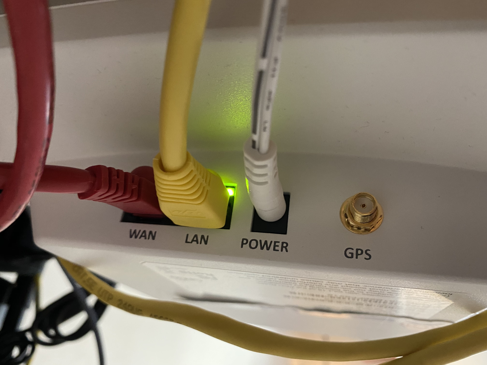
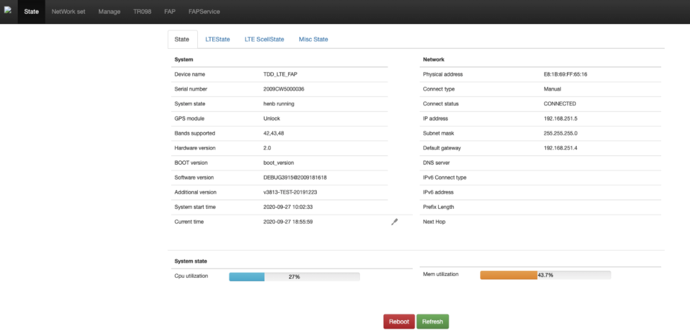
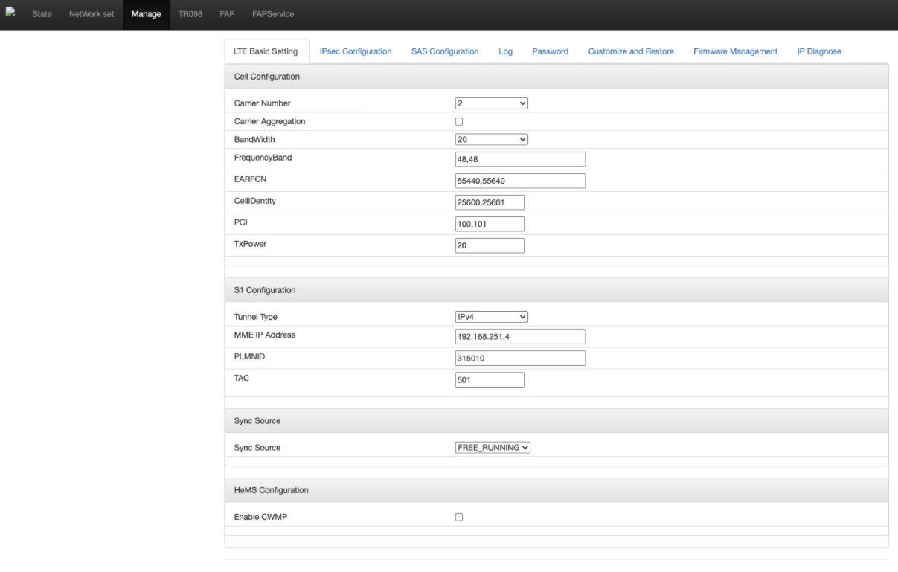
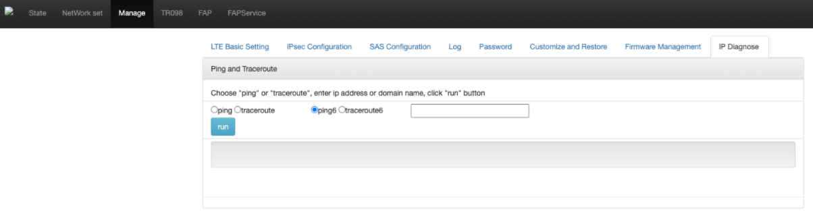

..
   SPDX-FileCopyrightText: © 2020 Open Networking Foundation <support@opennetworking.org>
   SPDX-License-Identifier: Apache-2.0

.. _enb-installation:

eNB Installation
================

This section describes how to install and configure the Sercomm eNB
which is the default eNB device for Aether/Pronto project.

Preliminaries
=============
In order to install and configure the Sercomm eNB, we should prepare following device:

* Laptop or PC
* USB-Ethernet adapter or Ethernet port on Laptop/PC
* CAT5/6/7 cable
* Sercomm eNB
* 1G-10G converter

Also, we should know the below information:

* MME IP address (10.168.0.6 by default)
* TAC
* Cell ID

How to access the Sercomm eNB admin UI?
=======================================
The default Sercomm eNB has default configuration values which are not working within the Aether/Pronto edge.
In order to configure the Sercomm eNB, we need to access the Sercomm eNB admin web UI.
We can initially access the UI through the LAN port on the Sercomm eNB device.

The above figure depicts the Sercomm eNB port panel which has two Ethernet ports, one power port, and one GPS port.
We should make a physical link between the laptop/PC and LAN port on the Sercomm eNB.
In the above figure, the yellow cable should be connected to the laptop/PC.
Once the physical link is established,
the Ethernet interface on the laptop/PC should have an IP address in 11.11.11.0/24 subnet.
The Sercomm eNB will automatically assign the IP address to the Ethernet interface on the laptop/PC,
since the eNB is working as a DHCP server.
Of course, the interface should be set to DHCP, not static.

.. note::

   If the Sercomm eNB does not assign the IP address on the laptop/PC's Ethernet interface, please double-check the physical link.
   Or, it is possible to assign the static IP address on the laptop/PC's Ethernet interface. Aforementioned before, the IP address should be in 11.11.11.0/24 subnet.

After the Ethernet interface on the laptop/PC has the IP address in 11.11.11.0/24 subnet,
we can access the Sercomm eNB.
We can open the Web browser (e.g., Chrome, Firefox, etc.), and go to `https://11.11.11.188`. Then, we can see the below login page on the Web browser.

.. image:: images/enb-ser-2.png
  :alt: Sercomm eNB UI login pae

With the below credentials, we can log in the UI:

* ID: ``sc_femto``
* Password: ``scHt3pp`` (or ``sc_femto``)

After log-in, we can see the state page.

Network configuration
=====================
We should then configure the IP address on the WAN port which will be connected to the Tofino switch.
The network configuration page shows up when we click `NetWork set` button on the top menu bar.

.. image:: images/enb-ser-4.png
  :alt: Sercomm eNB UI network configuration page

In this page, we should change four values in the `IP Address section`.

* Connected type: Static IP
* IP Address: 192.168.251.5
* Network mask: 255.255.255.0
* Gateway address: 192.168.251.1

The IP address in this menu is the IP address for the WAN port.
The Gateway address is the TOST IP address.
After pushing those values on the network configuration page, click the `Save` button at the bottom.

.. note::
   No need to touch any other parameters in this configuration page.

LTE configuration
=================
Next, we should configure the LTE parameters.
Click the `Manage` button on the top menu bar and then go to the `LTE Basic Setting` tab.

In this page, we should change below parameters:

* Carrier Number: `2`
* Carrier Aggregation: `unchecked`
* BandWidth: `20`
* FrequencyBand: `48,48`
* EARFCN: `55440,55640`
* CellIdentity: `assigned Cell ID`
* PCI: `100,101`
* TxPower: `20`
* Tunnel Type: `IPv4`
* MME IP Address: `10.168.0.6`
* TAC: `assigned TAC`
* PLMNID: `315010`
* Sync Source: `FREE_RUNNING`
* Enable CWMP: `unchecked`

Among those parameters, we should carefully set values to CellIdentity and TAC.
Those parameters are the preliminaries which ONF OPs team will assign to each site.
Likewise, after pushing those parameters, click the `Save` button at the bottom.

Then, click `SAS Configuration` tab in the same page.

.. image:: images/enb-ser-6.png
  :alt: Sercomm eNB UI SAS configuration page

In this page, we should change five values in the `Location Configuration` section as follows:

* Location: `Indoor`
* Location Source: `Manual`
* Latitude: `0`
* Longitude: `0`
* Elevation: `-18000`

Do not forget to click the save button at the bottom after pushing values.

Last, click `FAPService` menu at the top menu bar and go to `FAPControl` tab.

.. image:: images/enb-ser-7.png
  :alt: Sercomm eNB UI FAP Control page

In this page, we have to check a single radio box, `AdminState` in the `FAPService_FAPControl_LTE` section.
Then, click the `Save` button at the bottom.

This is the all steps to configure the Sercomm eNB.

Connect the Sercomm eNB to the fabric switch
============================================
After the above configuration, we should power off the Sercomm eNB and connect the eNB WAN port to the fabric switch.
The Sercomm eNB is actually has 1G WAN port, although the fabric switch has 40G interfaces.
Therefore, we should use the 1G-10G converter in which the 1G port is connected with the Sercomm eNB
whereas the 10G port is connected to 10G-40G breakout cable linked to the fabric switch.

.. note::
   Alternatively, we can use an any 1G/10G switch, if we do not have a 1G-10G converter.

Then, power on the Sercomm eNB device and get rid of the LAN port cable.

.. note::
   Without the LAN port cable, we can access the Sercomm eNB admin UI through
   `https://192.168.251.5` URL, if the laptop/PC is connected to the same
   network via the fabric switch.

   For our convenience, we can optionally add forwarding rules into the
   firewall configuration on the management node to access the Sercomm eNB
   admin UI from outside the network.

Troubleshooting
===============

Connectivity check
^^^^^^^^^^^^^^^^^^
In order to check the connectivity, we can use the Sercomm eNB admin UI.
Open the web browser and go to `https://192.168.251.5` and log in.
Then, click the `Manage` menu and go to the `IP Diagnose` tab.

In this page, check the ping menu and write down the IP address `192.168.251.1` in the white box.
Then, click the `Run` button.

After a few seconds, we can see the ping results.
If there is no results, the connectivity between the eNB and the fabric switch has a problem.
Otherwise, the fabric switch is not up and running correctly.
