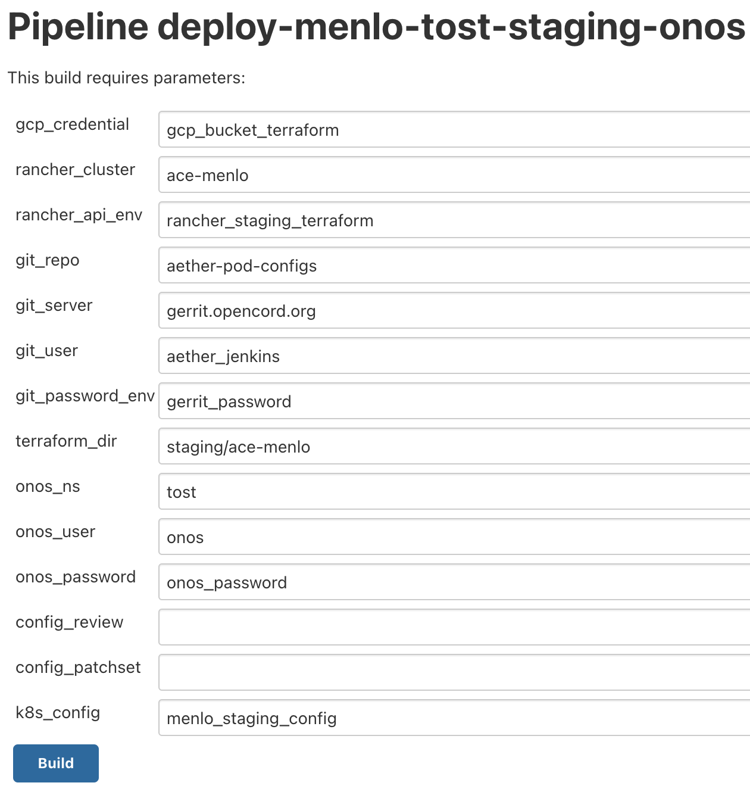

..
   SPDX-FileCopyrightText: © 2020 Open Networking Foundation <support@opennetworking.org>
   SPDX-License-Identifier: Apache-2.0

===============
TOST Deployment
===============

Update aether-pod-config
========================

Aether-pod-configs is a git project hosted on **gerrit.opencord.org** and we placed the following materials in it.

- Terraform scripts to install TOST applications on Rancher, including ONOS, Stratum and Telegraf.
- Customized configuration for each application (helm values).
- Application specific configuration files, including ONOS network configuration and Stratum chassis config.

Here is an example folder structure:

.. code-block:: console

   ╰─$ tree staging/ace-menlo/tost
   staging/ace-menlo/tost
   ├── app_map.tfvars
   ├── backend.tf
   ├── deepinsight
   │   ├── README.md
   │   ├── deepinsight-topo.json
   │   └── deepinsight-topo.json.license
   ├── main.tf -> ../../../common/tost/main.tf
   ├── onos
   │   ├── app_map.tfvars
   │   ├── backend.tf
   │   ├── main.tf -> ../../../../common/tost/apps/onos/main.tf
   │   ├── onos-netcfg.json
   │   ├── onos-netcfg.json.license
   │   ├── onos.yaml
   │   └── variables.tf -> ../../../../common/tost/apps/onos/variables.tf
   ├── stratum
   │   ├── app_map.tfvars
   │   ├── backend.tf
   │   ├── main.tf -> ../../../../common/tost/apps/stratum/main.tf
   │   ├── menlo-staging-leaf-1-chassis-config.pb.txt
   │   ├── menlo-staging-leaf-2-chassis-config.pb.txt
   │   ├── menlo-staging-spine-1-chassis-config.pb.txt
   │   ├── menlo-staging-spine-2-chassis-config.pb.txt
   │   ├── stratum.yaml
   │   ├── tost-dev-chassis-config.pb.txt
   │   └── variables.tf -> ../../../../common/tost/apps/stratum/variables.tf
   ├── telegraf
   │   ├── app_map.tfvars
   │   ├── backend.tf
   │   ├── main.tf -> ../../../../common/tost/apps/telegraf/main.tf
   │   ├── telegraf.yaml
   │   └── variables.tf -> ../../../../common/tost/apps/telegraf/variables.tf
   └── variables.tf -> ../../../common/tost/variables.tf

There are four Terraform scripts inside **tost** directory and are responsible for managing each service.

Root folder
^^^^^^^^^^^
Terraform reads **app_map.tfvars** to know which application will be installed on Rancher
and which version and customized values need to apply to.

Here is the example of **app_map.tfvars** which defines prerequisite apps for TOST
as well as project and namespace in which TOST apps will be provisioned.
Note that currently we don't have any prerequisite so we left this blank intentionally.
It can be used to specify prerequisites in the future.

.. code-block::

   project_name     = "tost"
   namespace_name   = "tost"

   app_map = {}

ONOS folder
^^^^^^^^^^^
All files under **onos** directory are related to ONOS application.
The **app_map.tfvars** in this folder describes the information about ONOS helm chart.

In this example, we specify the **onos-tost** helm chart version to **0.1.18** and load **onos.yaml**
as custom value files.

.. code-block::

   apps = ["onos"]

   app_map = {
      onos = {
         app_name         = "onos-tost"
         project_name     = "tost"
         target_namespace = "onos-tost"
         catalog_name     = "onos"
         template_name    = "onos-tost"
         template_version = "0.1.18"
         values_yaml      = ["onos.yaml"]
      }
   }

**onos.yaml** used to custom your ONOS-tost Helm chart values and please pay attention to the last section, config.

.. code-block:: yaml

   onos-classic:
      image:
         tag: master
         pullPolicy: Always
      replicas: 1
      atomix:
         replicas: 1
      logging:
         config: |
            # Common pattern layout for appenders
            log4j2.stdout.pattern = %d{RFC3339} %-5level [%c{1}] %msg%n%throwable

            # Root logger
            log4j2.rootLogger.level = INFO

            # OSGi appender
            log4j2.rootLogger.appenderRef.PaxOsgi.ref = PaxOsgi
            log4j2.appender.osgi.type = PaxOsgi
            log4j2.appender.osgi.name = PaxOsgi
            log4j2.appender.osgi.filter = *

            # stdout appender
            log4j2.rootLogger.appenderRef.Console.ref = Console
            log4j2.appender.console.type = Console
            log4j2.appender.console.name = Console
            log4j2.appender.console.layout.type = PatternLayout
            log4j2.appender.console.layout.pattern = ${log4j2.stdout.pattern}

            # SSHD logger
            log4j2.logger.sshd.name = org.apache.sshd
            log4j2.logger.sshd.level = INFO

            # Spifly logger
            log4j2.logger.spifly.name = org.apache.aries.spifly
            log4j2.logger.spifly.level = WARN

            # SegmentRouting logger
            log4j2.logger.segmentrouting.name = org.onosproject.segmentrouting
            log4j2.logger.segmentrouting.level = DEBUG

      config:
         server: gerrit.opencord.org
         repo: aether-pod-configs
         folder: staging/ace-menlo/tost/onos
         file: onos-netcfg.json
         netcfgUrl: http://onos-tost-onos-classic-hs.tost.svc:8181/onos/v1/network/configuration
         clusterUrl: http://onos-tost-onos-classic-hs.tost.svc:8181/onos/v1/cluster

Once the **onos-tost** containers are deployed into Kubernetes,
it will read **onos-netcfg.json** file from the **aether-pod-config** and please change the folder name to different location if necessary.

**onos-netcfg.json** is environment dependent and please change it to fit your environment.

..
   TODO: Add an example based on the recommended topology

Stratum folder
^^^^^^^^^^^^^^
Stratum uses a similar directory structure as ONOS for Terraform and its configuration files.

The customize value file is named **stratum.yaml**

.. code-block::

   app_map = {
      stratum= {
         app_name         = "stratum"
         project_name     = "tost"
         target_namespace = "stratum"
         catalog_name     = "stratum"
         template_name    = "stratum"
         template_version = "0.1.9"
         values_yaml      = ["stratum.yaml"]
      }
   }

Like ONOS, **stratum.yaml** used to customize Stratum Helm Chart and please pay attention to the config section.

.. code-block:: yaml

   image:
      registry: registry.aetherproject.org
      repository: tost/stratum-bfrt
      tag: 9.2.0-4.14.49
      pullPolicy: Always
      pullSecrets:
         - aether-registry-credential

   extraParams:
      - "-max_log_size=0"
      - '-write_req_log_file=""'
      - '-read_req_log_file=""'
      - "-v=0"
      - "-stderrthreshold=0"
      - "-bf_switchd_background=false"

   nodeSelector:
   node-role.aetherproject.org: switch

   tolerations:
      - effect: NoSchedule
         value: switch
         key: node-role.aetherproject.org

   config:
      server: gerrit.opencord.org
      repo: aether-pod-configs
      folder: staging/ace-onf-menlo/tost/stratum

Stratum has the same deployment workflow as ONOS.
Once it is deployed to Kubernetes, it will read switch-dependent config files from the aether-pod-configs repo.
The key folder indicates that relative path of configs.

.. attention::

   The switch-dependent config file should be named as **${hostname}-chassis-config.pb.txt**.
   For example, if the host name of your Tofino switch is **my-leaf**, please name config file **my-leaf-config.pb.txt**.

..
   TODO: Add an example based on the recommended topology

Telegraf folder
^^^^^^^^^^^^^^^

The app_map.tfvars specify the Helm Chart version and the filename of the custom Helm value file.

.. code-block::

   apps=["telegraf"]

   app_map = {
      telegraf= {
         app_name         = "telegraf"
         project_name     = "tost"
         target_namespace = "telegraf"
         catalog_name     = "influxdata"
         template_name    = "telegraf"
         template_version = "1.7.23"
         values_yaml      = ["telegraf.yaml"]
      }
   }

The **telegraf.yaml** used to override the Telegraf Helm Chart and its environment-dependent.
Please pay attention to the **inputs.addresses** section.
Telegraf will read data from stratum so we need to specify all Tofino switch’s IP addresses here.
Taking Menlo staging pod as example, there are four switches so we fill out 4 IP addresses.

.. code-block:: yaml

   podAnnotations:
      field.cattle.io/workloadMetrics: '[{"path":"/metrics","port":9273,"schema":"HTTP"}]'

   config:
      outputs:
         - prometheus_client:
            metric_version: 2
            listen: ":9273"
   inputs:
      - cisco_telemetry_gnmi:
         addresses:
            - 10.92.1.81:9339
            - 10.92.1.82:9339
            - 10.92.1.83:9339
            - 10.92.1.84:9339
         redial: 10s
      - cisco_telemetry_gnmi.subscription:
         name: stratum_counters
         origin: openconfig-interfaces
         path: /interfaces/interface[name=*]/state/counters
         sample_interval: 5000ns
         subscription_mode: sample

Create Your Own Configs
^^^^^^^^^^^^^^^^^^^^^^^

The easiest way to create your own configs is running the template script.

Assumed we would like to set up the **ace-example** pod in the production environment.

1. open the **tools/ace_env**
2. fill out all required variables
3. import the environment variables from **tools/ace_env**
4. perform the makefile command to generate configuration and directory for TOST
5. update **onos-netcfg.json** for ONOS
6. update **${hostname}-chassis-config.pb.txt** for Stratum
7. update all switch IPs in **telegraf.yaml**
8. commit your change and open the Gerrit patch

.. code-block:: console

  vim tools/ace_env
  source tools/ace_env
  make -C tools/  tost
  vim production/ace-example/tost/onos/onos-netcfg.json
  vim production/ace-example/tost/stratum/*${hostname}-chassis-config.pb.txt**
  vim production/ace-example/tost/telegraf/telegraf.yam
  git add commit
  git review

Quick recap
^^^^^^^^^^^

To recap, most of the files in **tost** folder can be copied from existing examples.
However, there are a few files we need to pay extra attentions to.

- **onos-netcfg.json** in **onos** folder
- Chassis config in **stratum** folder
  There should be one chassis config for each switch. The file name needs to be **${hostname}-chassis-config.pb.txt**
- **telegraf.yaml** in **telegraf** folder need to be updated with all switch IP addresses

Double check these files and make sure they have been updated accordingly.

Create a review request
^^^^^^^^^^^^^^^^^^^^^^^
We also need to create a gerrit review request, similar to what we have done in the **Aether Run-Time Deployment**.
Please refer to :doc:`Aether Run-Time Deployment <run_time_deployment>` to create a review request.

Create TOST deployment job in Jenkins
=====================================
There are three major components in the Jenkins system, the Jenkins pipeline and Jenkins Job Builder and Jenkins Job.

We follow the Infrastructure as Code principle to place three major components in a Git repo, **aether-ci-management**
Download **aether-ci-management** repository .

.. code-block:: shell

   $ cd $WORKDIR
   $ git clone "ssh://[username]@gerrit.opencord.org:29418/aether-ci-management"

Here is the example of folder structure, we put everything related to three major components under the jjb folder.

.. code-block:: console

   $ tree -d jjb
   jjb
   ├── ci-management
   ├── global
   │   ├── jenkins-admin -> ../../global-jjb/jenkins-admin
   │   ├── jenkins-init-scripts -> ../../global-jjb/jenkins-init-scripts
   │   ├── jjb -> ../../global-jjb/jjb
   │   └── shell -> ../../global-jjb/shell
   ├── pipeline
   ├── repos
   ├── shell
   └── templates

Jenkins pipeline
^^^^^^^^^^^^^^^^
Jenkins pipeline runs the Terraform scripts to install desired applications into the specified Kubernetes cluster.

Both ONOS and Stratum will read configuration files (network config, chassis config) from aether-pod-config.
The default git branch is master.
For testing purpose, we also provide two parameters to specify the number of reviews and patchset.
We will explain more in the next section.

.. note::

   Currently, we don’t perform the incremental upgrade for TOST application.
   Instead, we perform the clean installation.
   In the pipeline script, Terraform will destroy all existing resources and then create them again.

We put all pipeline scripts under the pipeline directory, the language of the pipeline script is groovy.

.. code-block:: console

   $ tree pipeline
   pipeline
   ├── aether-in-a-box.groovy
   ├── artifact-release.groovy
   ├── cd-pipeline-charts-postrelease.groovy
   ├── cd-pipeline-dockerhub-postrelease.groovy
   ├── cd-pipeline-postrelease.groovy
   ├── cd-pipeline-terraform.groovy
   ├── docker-publish.groovy
   ├── ng40-func.groovy
   ├── ng40-scale.groovy
   ├── reuse-scan-gerrit.groovy
   ├── reuse-scan-github.groovy
   ├── tost-onos.groovy
   ├── tost-stratum.groovy
   ├── tost-telegraf.groovy
   └── tost.groovy

Currently, we had four pipeline scripts for TOST deployment.

1. tost-onos.groovy
2. tost-stratum.groovy
3. tost-telegraf.groovy
4. tost.groovy

tost-[onos/stratum/telegraf].groovy are used to deploy the individual application respectively,
and tost.groovy is a high level script, used to deploy the TOST application, it will execute
the above three scripts in its pipeline script.

Jenkins jobs
^^^^^^^^^^^^

Jenkins job is the task unit in the Jenkins system. A Jenkins job contains the following information:

- Jenkins pipeline
- Parameters for Jenkins pipeline
- Build trigger
- Source code management

We created one Jenkins job for each TOST component, per Aether edge.
We have four Jenkins jobs (HostPath provisioner, ONOS, Stratum and Telegraf) for each edge as of today.

There are 10+ parameters in Jenkins jobs and they can be divided into two parts, cluster-level and application-level.
Here is an example of supported parameters.

Application level
"""""""""""""""""

- **GERRIT_CHANGE_NUMBER/GERRIT_PATCHSET_NUMBER**: tell the pipeline script to read
  the config for aether-pod-configs repo from a specified gerrit review, instead of the
  HEAD branch. It’s good for developer to test its change before merge.
- **onos_user**: used to login ONOS controller
- **git_repo/git_server/git_user/git_password_env**: information of git repository, **git_password_env** is a key for
  Jenkins Credential system.

Cluster level
"""""""""""""
- **gcp_credential**: Google Cloud Platform credential for remote storage, used by Terraform.
- **terraform_dir**: The root directory of the TOST directory.
- **rancher_cluster**: target Rancher cluster name.
- **rancher_api_env**: Rancher credential to access Rancher, used by Terraform.

.. note::

   Typically, developer only focus on **GERRIT_CHANGE_NUMBER** and **GERRIT_PATCHSET_NUMBER**. The rest of them are managed by OPs.

Jenkins Job Builder (JJB)
^^^^^^^^^^^^^^^^^^^^^^^^^

We prefer to apply the IaC (Infrastructure as Code) for everything.
We use the JJB (Jenkins Job Builder) to create new Jenkins Job, including the Jenkins pipeline.
We need to clone a set of Jenkins jobs when a new edge is deployed.

In order to provide the flexibility and avoid re-inventing the wheel, we used the job template to declare your job.
Thanks to the JJB, we can use the parameters in the job template to render different kinds of jobs easily.

All the template files are placed under templates directory.

.. code-block:: console

   ╰─$ tree templates
   templates
   ├── aether-in-a-box.yaml
   ├── archive-artifacts.yaml
   ├── artifact-release.yml
   ├── cd-pipeline-terraform.yaml
   ├── docker-publish-github.yaml
   ├── docker-publish.yaml
   ├── helm-lint.yaml
   ├── make-test.yaml
   ├── ng40-nightly.yaml
   ├── ng40-test.yaml
   ├── private-docker-publish.yaml
   ├── private-make-test.yaml
   ├── publish-helm-repo.yaml
   ├── reuse-gerrit.yaml
   ├── reuse-github.yaml
   ├── sync-dir.yaml
   ├── tost.yaml
   ├── verify-licensed.yaml
   └── versioning.yaml

we defined all TOST required job templates in tost.yaml and here is its partial content.

.. code-block:: yaml

   - job-template:
      name: "{name}-onos"
      id: "deploy-onos"
      project-type: pipeline
      dsl: !include-raw-escape: jjb/pipeline/tost-onos.groovy
      triggers:
        - onf-infra-tost-gerrit-trigger:
           gerrit-server-name: '{gerrit-server-name}'
           trigger_command: "apply"
           pattern: "{terraform_dir}/tost/onos/.*"
      logrotate:
          daysToKeep: 7
          numToKeep: 10
          artifactDaysToKeep: 7
          artifactNumToKeep: 10
      parameters:
          - string:
                name: gcp_credential
                default: "{google_bucket_access}"
          - string:
                name: rancher_cluster
                default: "{rancher_cluster}"
          - string:
                name: rancher_api_env
                default: "{rancher_api}"
          - string:
                name: git_repo
                default: "aether-pod-configs"
          - string:
                name: git_server
                default: "gerrit.opencord.org"
          - string:
                name: git_ssh_user
                default: "jenkins"

Once we have the job template, we need to tell the JJB, we want to use the job template to create our own jobs.
Here comes the concept of project, you need to define job templates you want to use and the values of all parameters.

We put all project yaml files under the repo directory and here is the example

.. code-block:: console

   ╰─$ tree repos                                                                                                                                   130 ↵
   repos
   ├── aether-helm-charts.yaml
   ├── aether-in-a-box.yaml
   ├── cd-pipeline-terraform.yaml
   ├── ng40-test.yaml
   ├── spgw.yaml
   └── tost.yaml

Following is the example of tost projects, we defined three projects here, and each project has different
parameters and Jenkins jobs it wants to use.

.. code-block:: yaml

   - project:
         name: deploy-menlo-tost-dev
         rancher_cluster: "menlo-tost-dev"
         terraform_dir: "testing/menlo-tost"
         rancher_api: "{rancher_testing_access}"
         jobs:
            - "deploy"
            - "deploy-onos"
            - "deploy-stratum"
            - "deploy-telegraf"
   - project:
         name: deploy-menlo-tost-staging
         rancher_cluster: "ace-menlo"
         terraform_dir: "staging/ace-menlo"
         rancher_api: "{rancher_staging_access}"
         jobs:
            - "deploy"
            - "deploy-onos"
            - "deploy-stratum"
            - "deploy-telegraf"
   - project:
         name: deploy-menlo-production
         rancher_cluster: "ace-menlo"
         terraform_dir: "production/ace-menlo"
         rancher_api: "{rancher_production_access}"
         jobs:
            - "deploy"
            - "deploy-onos"
            - "deploy-stratum"
            - "deploy-telegraf"

Create Your Own Jenkins Job
^^^^^^^^^^^^^^^^^^^^^^^^^^^

Basically, if you don't need to customize the Jenkins pipeline script and the job configuration, the only thing
you need to do is modify the repos/tost.yaml to add your project.

For example, we would like to deploy the TOST to our production pod, let's assume it named "tost-example".
Add the following content into repos/tost.yaml

.. code-block:: yaml

   - project:
         name: deploy-tost-example-production
         rancher_cluster: "ace-test-example"
         terraform_dir: "production/tost-example"
         rancher_api: "{rancher_production_access}"
         jobs:
            - "deploy"
            - "deploy-onos"
            - "deploy-stratum"
            - "deploy-telegraf"

.. note::

   The **terraform_dir** indicates the directory location in aether-pod-configs repo, please ensure your Terraform scripts
   already there before running the Jenkins job.

Trigger TOST deployment in Jenkins
==================================
Whenever a change is merged into **aether-pod-config**,
the Jenkins job should be triggered automatically to (re)deploy TOST.

You can also type the comment **apply** in the Gerrit patch, it will trigger Jenkins jobs to deploy TOST for you.

Troubleshooting
===============

The deployment process involves the following steps:

1. Jenkins Job
2. Jenkins Pipeline
3. Clone Git Repository
4. Execute Terraform scripts
5. Rancher start to install applications
6. Applications be deployed into Kubernetes cluster
7. ONOS/Stratum will read the configuration (network config, chassis config)
8. Pod become running

Taking ONOS as an example, here's what you can do to troubleshoot.

You can see the log message of the first 4 steps in Jenkins console.
If something goes wrong, the status of the Jenkins job will be in red.
If Jenkins doesn't report any error message, the next step is going to Rancher's portal
to ensure the Answers is same as the *onos.yaml* in *aether-pod-configs*.
